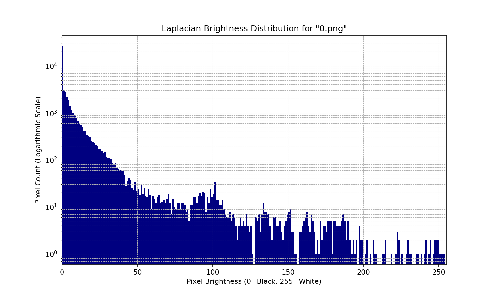
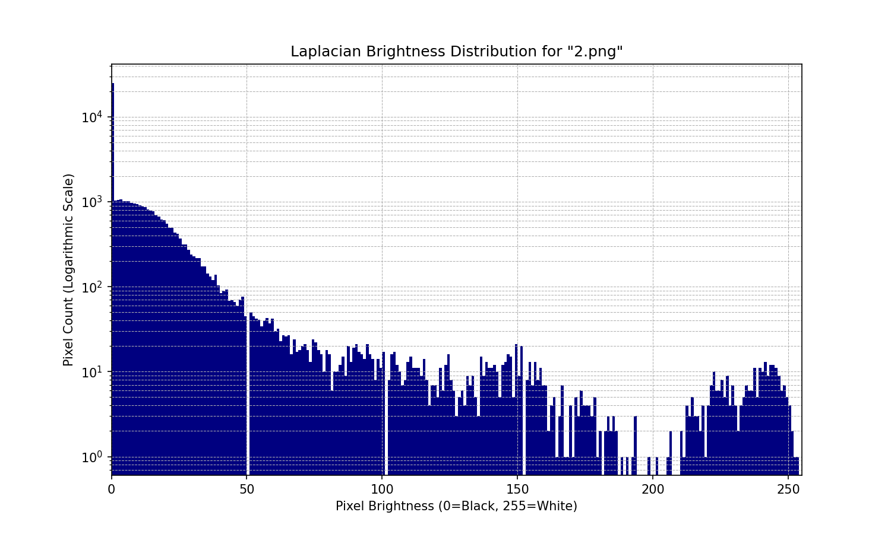

# [Algorithm] 高级剪切几何

- 命题人：LZDQ
- The Truth：150 分
- The Kernel：400 分

## 题目描述

<blockquote>

（有一个选修高级剪切几何课程的同学前来买哈基米数据集。）

出题人：（对另外两题的出题人）生意行啊，你们哥几个……哥俩。这小子，啊？

刘华强：哥们儿，这哈基米数据集多少钱一张呐？

出题人：0.002174 个 flag 一张。

刘华强：这哈基米是金子做的还是狗是金子做的？

出题人：你瞧瞧这现在哪有数据集呀？这都是从镜像站下载的，你嫌贵我还嫌贵呢。

刘华强：（微笑）给我挑 2760 张。

出题人：行。

（出题人拿出 2760 张图片。）

出题人：这些怎么样？

刘华强：嗯（回过神），这哈基米数据集保真吗？

出题人：（笑）我做 dataset 的，能卖给你 poisoned data？

刘华强：（挑衅地）我问你这哈基米数据集保真吗？

出题人：你是故意 integrity testing 是不是？你要不要吧！

刘华强：（笑）你这数据集要是真我肯定要啊。那它要是 <strong>poisoned</strong> 怎么办呀？

出题人：要是 poisoned，我自己把哈基米喝了。满意了吧？

（刘华强看着出题人<strong>用 CLIP 识别图片</strong>。）

出题人：2760 张图片，1542 只哈基米。

刘华强：（眉头一皱）你这哪儿有 1542 只哈基米啊？你这 CLIP 有 false positive 呀。

出题人：（起身）（怒）你TM故意 integrity testing 是不是？

出题人：（把数据集放在刘华强面前随后用手指图片）你要不要吧！你要不要？

</blockquote>

此时，刘华强已经发现，出题人提供的数据集<strong>遭受了攻击</strong>，导致部分图片<strong>识别结果出错</strong>。那么，究竟是哪些图片不保真呢？

<strong>补充说明：</strong>

<ul>
<li>请先用附件 <code>clip_classifier.py</code> 中的 <code>Classifier</code> 使用默认参数识别每张图片，<strong>每张图片会提供 hint 的一个 bit</strong>，<strong>cat 为 0</strong>，<strong>dog 为 1</strong>，将所有 bit 拼接起来（LSB-first，先放低位再放高位）可以拿到 hint。</li>
<li>根据 hint 的指示，可以再<strong>从每张图片获取到 flag 的一个 bit</strong>。为了提供一定的容错，拼接起来后可以得到<strong>将 flag 重复 3 遍的字符串</strong>。</li>
<li>如果无法访问 HuggingFace 可<a target="_blank" rel="noopener noreferrer" href="https://hf-mirror.com/">使用镜像</a>。建议在有 CUDA 的环境解题，如 Out of Memory 可以降低 batch size。</li>
</ul>

<strong>第二阶段提示：</strong>

<ul>
<li>flag1：可以了解一下 attack transferability。由于攻击是针对特定模型完成的，该攻击对于其他模型仅仅是加入了噪音，所以可以使用其他模型拿到 ground truth。CLIP 家族有不止一个模型，用另外一个模型识别即可。</li>
<li>flag2：先试着人肉识别一些图片是否被攻击过，可以发现在一块颜色差不多的区域，被攻击的图片有明显的噪音。预期解使用了 laplacian kernel 作为放大噪音的手段。</li>
<li>请注意 flag2 和 flag1 的表示是一样的，请不要提交 flag2 中的 hint。如果难以恢复 flag，建议提高识别准确率。</li>
<li>如果拿不到 hint，请确保使用的是<strong>默认参数</strong>。hint 中有部分 bit 错误，但不影响阅读。由于 hint 本身是 flag1 的第一步，在这里不直接给出 hint。</li>
</ul>

**【网页链接：访问清华云盘下载题目附件（239MB）】**

## 预期解法

### 前置知识

CLIP 是一种较为特殊的图片分类器，可以处理文本和图片。torchattacks 是一个 python 库，包含了很多攻击方法，这题随便选了一个 PGD。其原理是把图片当作被训练的参数，固定模型参数，算出 target 的概率，然后使用 pytorch 的 back propagation 得到图片每个像素对于 target 的斜率，按照这个方向优化到错误的 target。这样出来的结果是，人眼乍一看看不出来任何问题，但是用被攻击的模型识别会出错。

`attack.py` 中的 mean 和 std 参数可以在 [preprocessor_config.json](https://huggingface.co/openai/clip-vit-base-patch16/blob/main/preprocessor_config.json) 找到，或者直接问 AI 也可以出。

### Hint

按照指示识别图片即可。hint 说明了 flag 的格式是 0=unattacked / 1=attacked，相当于我们要识别哪些图片被攻击过。

这部分的代码在 [`solve_flag1.py`](./solve_flag1.py) 中。

### Flag 1

第一题是简单题，直接将题目给 ChatGPT 之类的就可以得到预期做法。首先我们已经拿到了被攻击的模型识别的结果，其次这些图片都是猫或者狗的图片，如果能够拿到人眼识别的数据 ground truth，就可以异或出是否被攻击，最后用 flag 重复三次来投票容错一下。拿到 ground truth 非常简单：由于攻击是针对一个模型的，这个攻击对于另一个模型等于是加入了噪音，只需要将 `Classifier` 的 `model` 参数改成 CLIP 家族中的另一个即可，比如 `openai/clip-vit-base-patch32`。

### Flag 2

第二题预期是八仙过海题。由于萌新出题人尝试了大概三四天才找到一个适合 CTF 的题目和解法，这题定位为（半）压轴题。从第一阶段通过数来看难度把控还不错，虽然可能比较 guessy，但是很贴合现实场景，要求选手具备强大的瞪眼法和极致的观察能力，并且最后微调 flag 也很贴近 AI 炼丹的感觉。

通过瞪眼，我们可以发现被攻击的模型在颜色差不多的区域（比如纯白色背景）有肉眼可见的噪音。将此信息喂给 Gemini，并且加上提示“使用某种方法将这些噪音可视化”，或者加上“kernel”的提示（flag 2 的名字），可以得到 Laplacian Kernel 的做法。使用 [`plot_laplacian.py`](plot_laplacian.py) 可以得到这个可视化的结果，并且被攻击的图片存在大量颜色较暗但不全黑的像素点。

图片 0 是没有被攻击的

图片 2 是被攻击的

接下来对亮度进行统计并 plot 出图表，可以惊人地发现被攻击的图片在 [1, 20] 这段存在明显的上凸包，而正常图片在这一段基本是快速往下掉。观察到这一点后，随便 vibe code 斜率检查然后调一下 flag 就完成了。

#### 尝试了但失败的方法

* 虽然攻击的库非常好用，但 detection 的库却没有。按照 AI 的指示用 `adversarial-robustness-toolbox` 的 Feature Squeezing 试了一下确实没什么用。阅读其他论文发现要么不开源要么需要花很多时间 setup，不符合 CTF 的题目风格。
* 针对模型输出层进行观察。这个方法其实在攻击参数比较强的时候是有用的，如果 `step=3`，可以观测到被攻击的模型对于原本正确的 target 会算出非常低的 logits。猜测是因为高维向量存在大量 cosine similarity 低的向量，但是相反的很少，所以攻击会倾向于降低正确的概率而提高错误的概率。见课程 计算机与人工智能应用数学。为了防止这种简单的做法，攻击参数从最小的 step 开始，如果两次攻击还是失败就逐渐增加强度。
* 对图片加入高斯模糊或其他模糊方式，对比模糊前和模糊后的 logits，变化大的是被攻击的。实测这个方法没做出来，因为图片本身差异过大，没有一个定量的分析。
* 交叉对比另一个模型的 logits 差异，差太多的是被攻击的。事实上为了出 flag 2 只能把 ground truth 删掉，而对于一个 ground truth 不在 target 里的图片，识别出来的 logits 除了能够保证数值较低之外，不同模型之间并没有可解释的关系，所以这种方法也没看出来什么。

#### 没有尝试但预料可以过的方法

* JPEG Compression 之后识别，与前面高斯模糊的方法思路差不多，并且好像有选手是这样做的。
* 训练 CNN 模型。一开始考虑到完成训练需要收集数据+攻击+训练，这一套流程走下来比较花时间，不太符合 CTF 的题目风格。但实际上收集数据+攻击是可以被跳过的，直接用 flag1 的数据就可以了，并且这个数据量是够的。另一方面 Laplacian Kernel 本身是一种卷积，画出亮度图之后显然可以再用一次卷积或者矩阵，只要数据足够就可以训练出对应的 CNN。于是就有了两个小时一次性过 flag2 的选手。

## 写在最后

选择用 CLIP 一开始是为了利用它能同时处理文本和图片的特性，但可惜最终没能把这个特性出成有趣的题目。

~~做出来的人可以考虑发论文了~~

