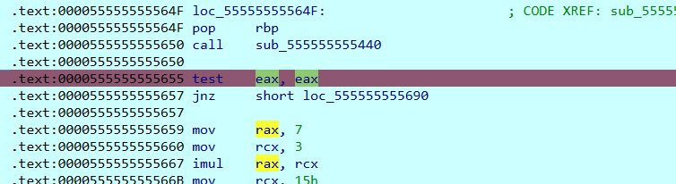

# [Binary] 枚举高手的 bomblab 审判

- 命题人：crazyman
- 第一案：250 分
- 第二案：250 分

## 题目描述

<div class="yuri-container">
<p>这、这……！</p>
<div class="yuri-asker">
<span>出示 Flag</span><span class="selected">目前没有 Flag</span><span>重新看题</span>
</div>
<p>Flag……现在不在我这里。</p>
<p>这是……</p>
<div class="yuri-asker">
<span>不存在 Flag</span><span>提出有 Flag 的地点</span><span class="selected">提出知道 Flag 的人物</span>
</div>
<p>我不知道 Flag 在哪里。……但是知道 Flag 在哪里的……就是这个人！</p>
<div class="yuri-asker">
<span>出题人</span><span>IDA</span><span>pwntools</span><span>余胜军</span><span>D 指导</span><span class="selected yuri-myself">我自己</span>
</div>
<p><b style="font-size: 2.5em"><em>我 应 该 知 道 Flag 在 哪 里！</em></b>
</p>
</div>
<hr>
<p>喜欢枚举代替推理的小朋友们你们好啊，我是猫头鹰。本题给大伙准备了一款枚举高手都喜欢的全新 bomblab。你输入一个字符串，它输出这是不是 Flag，就这么简单。因为<strong>再调试一点就会融化</strong>，所以只能枚举了。</p>
<p>但与 bomblab 不同，这一回，Your instructor won't be notified!</p>
<div class="well">
<p><strong>第二阶段提示：</strong></p>
<ul>
<li>程序的反调试机制会检测 <code>/proc/self/status</code> 的 <code>TracerPid</code> 字段。可考虑用 <code>LD_PRELOAD</code> 劫持文件操作、用 <code>ptrace</code> 篡改内存、或静态修改检测函数。</li>
<li>Flag 1：密钥是在初始化阶段生成的，初始化阶段会修改程序自身的代码。</li>
<li>Flag 2：别被 VM 吓到，其实整个算法就是个流加密。</li>
<li>听说有的 AI 能秒？</li>
</ul>
</div>

**[【附件：下载题目附件（binary-ffi）】](attachment/binary-ffi)**

## 预期解法

（这原本是一道赞助商启明星辰提供的题目，但是被crazyman改得面目全非了。赞助商提供的原始Writeup参见[old_wp_from_sponsor.pdf](old_wp_from_sponsor.pdf)）

首先利用die查壳后，得知为64位程序


main函数如下:

一共有两个check函数分别对两个flag进行校验

```c
__int64 __fastcall main(int a1, char **a2, char **a3)
{
  size_t v3; // rax
  _BOOL4 v4; // ebx
  __int64 v5; // rdx
  const char *Correct_; // rdi

  puts("Enter your flag:");
  fflush(stdout);
  if ( fgets(s_0, 256, stdin) )
  {
    v3 = strlen(s_0);
    if ( v3 && s_0[v3 - 1] == 10 )
      s_0[v3 - 1] = 0;
    __rdtsc();
    __rdtsc();
    v4 = check_1(s_0, 256);
    Correct_ = "Correct!";
    if ( !((unsigned int)check_2(s_0, 256, v5, 21) | v4) )
      Correct_ = "Incorrect!";
    puts(Correct_);
  }
  return 0;
}
```

check_1函数就是一个简单的rot8变换+异或，其实也是一个自解密的过程,看起来我们需要得到key是从哪里得到的，但是交叉引用并没有看到东西

```c
_BOOL8 __fastcall check_1(char *s, int n256)
{
  size_t key_len; // rdi
  char v3; // cl
  unsigned __int64 i; // rsi
  char output[120]; // [rsp+0h] [rbp-8B8h] BYREF
  char s1[1024]; // [rsp+78h] [rbp-840h] BYREF
  char s2[1032]; // [rsp+478h] [rbp-440h] BYREF
  unsigned __int64 v9; // [rsp+888h] [rbp-30h]

  v9 = __readfsqword(0x28u);
  __rdtsc();
  key_len = strlen(key);
  v3 = -76;
  for ( i = 0; ; v3 = byte_21A0[i] )
  {
    output[i] = __ROL1__(v3 ^ key[i % key_len] ^ 0x3C, (i & 3) + 1) ^ 0xA5;
    if ( ++i == 45 )
      break;
  }
  output[45] = 0;
  bytes_to_hex(output, s1);
  bytes_to_hex(input, s2);
  return strcmp(s1, s2) == 0;
}
```

这个时候我们可以在`init_array`里面


sub_16B0这里是经过了一个SMC操作(即自修改)，对loc_1550处代码进行了异或操作

```c
int sub_16B0()
{
  int result; // eax
  char *v1; // rdx

  __rdtsc();
  result = mprotect(
             (void *)((unsigned __int64)&loc_1550 & 0xFFFFFFFFFFFFF000LL),
             (size_t)&qword_1560[40] - ((unsigned __int64)&loc_1550 & 0xFFFFFFFFFFFFF000LL) + 3,
             7);
  if ( !result )
  {
    v1 = (char *)&loc_1550;
    do
    {
      *v1 ^= 0x42 - (unsigned __int8)&loc_1550 + (_BYTE)v1;
      ++v1;
    }
    while ( v1 != (char *)&qword_1560[40] + 3 );
    __rdtsc();
    mprotect(
      (void *)((unsigned __int64)&loc_1550 & 0xFFFFFFFFFFFFF000LL),
      (size_t)&qword_1560[40] - ((unsigned __int64)&loc_1550 & 0xFFFFFFFFFFFFF000LL) + 3,
      5);
    JUMPOUT(0x1550);
  }
  return result;
}
```

我们可以利用idapython手动修复一下

```python
import idc
start_ea = 0x1550
end_ea = 0x16B0
for i, ea in enumerate(range(start_ea, end_ea)):
    val = idc.get_wide_byte(ea)
    val ^= (0x42+(i & 0xFF))
    idc.patch_byte(ea, val)
```

恢复效果如下,我们可以得到我们初始化的key是先经过了一个异或，并且还有一个反调试sub_1440

```c
// positive sp value has been detected, the output may be wrong!
__int64 __fastcall sub_1550(__int64 a1)
{
  __int64 i; // rdx
  __int64 v2; // rax
  signed __int64 v9; // rax
  __int64 v10; // [rsp-18h] [rbp-40h]

  __rdtsc();
  for ( i = 0; i != 21; ++i )
  {
    key[i] = byte_21D0[i] ^ 0x25;
    v2 = i + v10;
    v10 = v2;
  }
  key[21] = 0;
  __rdtsc();
  _RAX = 0;
  __asm { cpuid }
  if ( sub_1440() )
  {
    v9 = sys_exit(0);
    _exit(0);
  }
  return 21;
}
```

编写代码恢复key

```python
key_enc = [0x4C, 0x4B, 0x14, 0x71, 0x7A, 0x64, 0x57, 0x57, 0x65, 0x5C, 0x7A, 0x14, 0x76, 0x7A, 0x56, 0x15, 0x7A, 0x60, 0x65, 0x56, 0x5C]

decrypted = [chr(byte ^ 0x25) for byte in key_enc]
print(''.join(decrypted))
#in1T_Arr@y_1S_s0_E@sy
```

check_1函数解密脚本如下:

```python
def rot8(value, idx):
    return ((value << idx) | (value >> (8 - idx))) & 0xff

key_enc = [0x4C, 0x4B, 0x14, 0x71, 0x7A, 0x64, 0x57, 0x57, 0x65, 0x5C, 0x7A, 0x14, 0x76, 0x7A, 0x56, 0x15, 0x7A, 0x60, 0x65, 0x56, 0x5C]

key = [byte ^ 0x25 for byte in key_enc]
key_str = ''.join(chr(byte) for byte in key)  
print('Key:', key_str)

enc = [0xB4, 0x20, 0x95, 0x44, 0x0C, 0x4E, 0x37, 0x07, 0x94, 0xFB, 0xFB, 0x70, 0x94, 0x1A, 0xD0, 0xA3, 
       0x1A, 0x5C, 0x42, 0x91, 0x38, 0xE0, 0x4B, 0x61, 0x15, 0x1A, 0x04, 0x51, 0x28, 0xC2, 0x79, 0x1D, 
       0x7C, 0xD1, 0xF1, 0x22, 0x71, 0xDE, 0xCB, 0xD3, 0x2F, 0x3C, 0x8F, 0x9D, 0x61]

key_len = len(key)

flag1 = ''.join(chr(rot8(enc[i] ^ key[i % key_len] ^ 0x3C, (i & 3) + 1) ^ 0xA5) for i in range(len(enc)))
print('Flag1:', flag1)
#Key: in1T_Arr@y_1S_s0_E@sy
#Flag1: flag{in1t_arR@Y_W1TH_smc_@nTi_DBG_1s_S0_e@sY}
```

check_2函数我们可以先调试一下，不过要改变前面反调试的返回值,需要在此处patch eax为0，然后单步调试直接F9会有异常不过也可以pass这个异常



然后我们就可以调试到main函数


check_2函数我们可以先不用管这个VM，先可以通过动态调试定位到memcmp，发现它可能是个流加密，我们尝试在check2的地方将input改为密文,然后就得到第二个flag了


