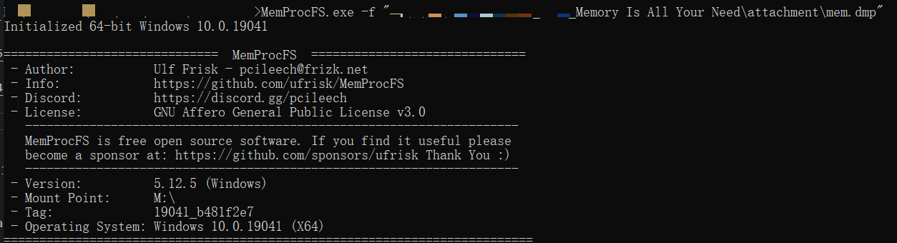
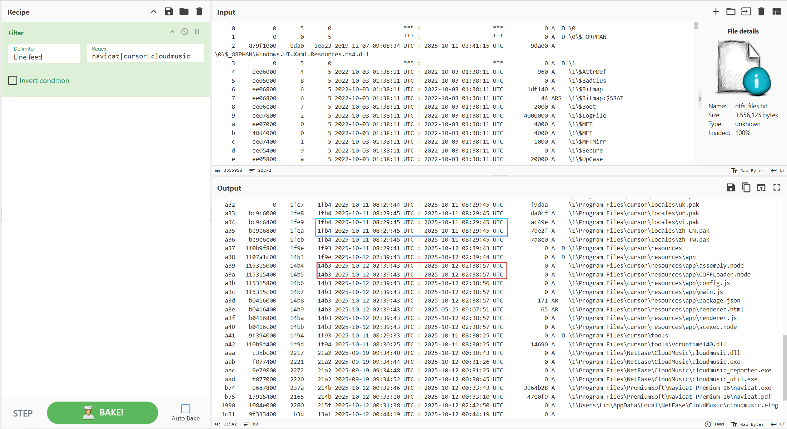
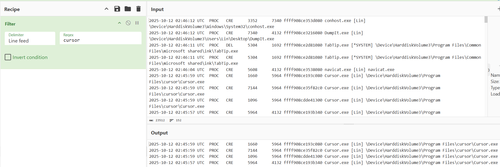
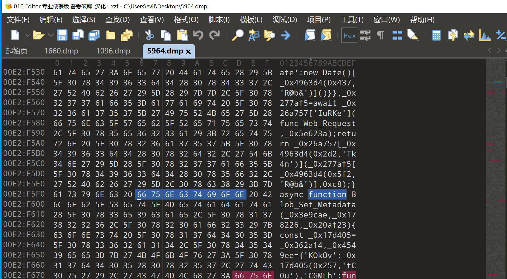
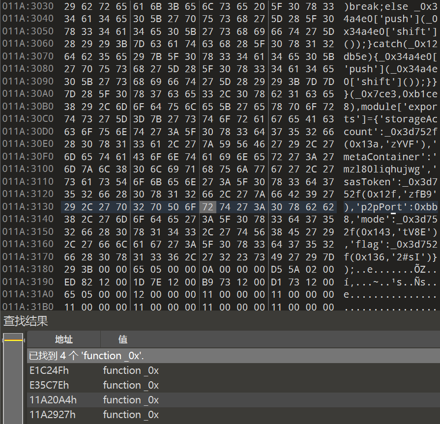
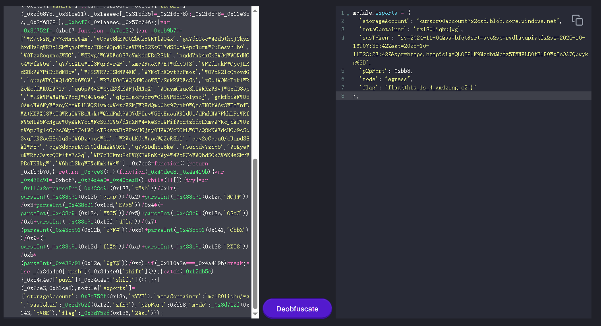
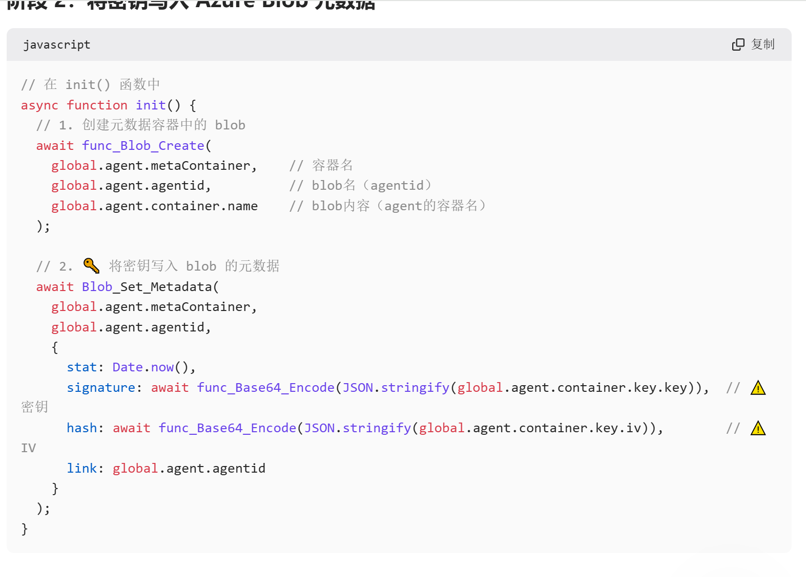
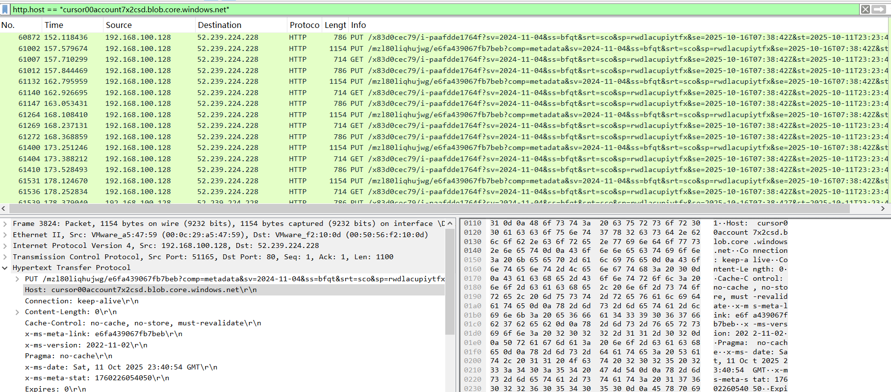
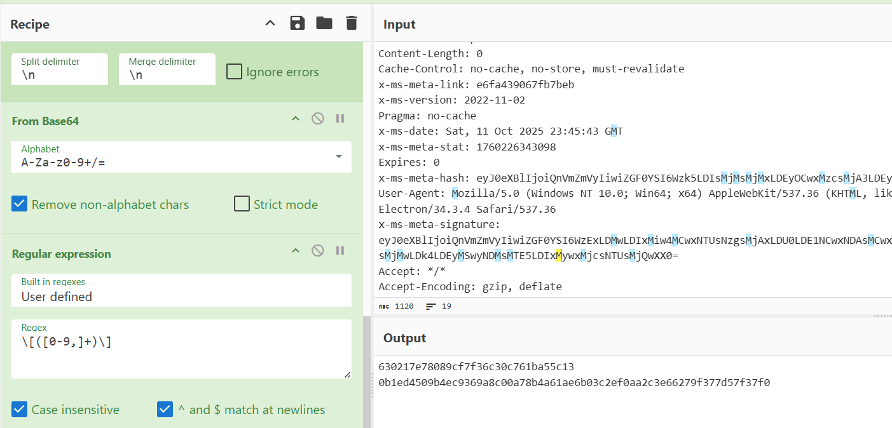
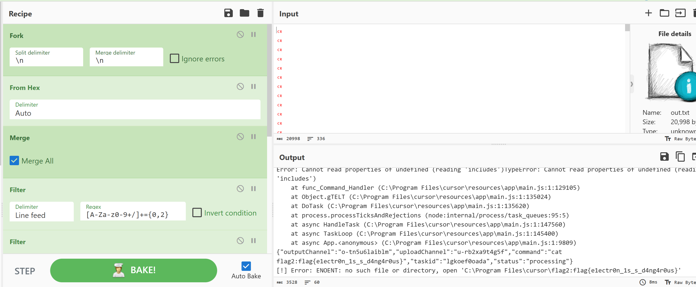

# [Misc] 取证大师

- 命题人：crazyman
- Flag 1：250 分
- Flag 2：250 分

## 题目描述

<p>你室友的电脑好像中病毒了。自从他上周花 18 元购买并安装了百度搜来的正版 Cursor，系统就开始变得奇奇怪怪，原本正常的应用现在都启动不起来了。</p>
<p>“嗯嗯，嘿客入侵，很常见的。安卓电脑就是这样的，没办法，下次换苹果。” 你敷衍了几句，但是实际上对嘿客干了什么很感兴趣。作为<ruby>村子<rp>（</rp><rt>中关村</rt><rp>）</rp></ruby>里数一数二的取证大师，你给中病毒的电脑<strong>创建了一个内存转储</strong>，然后<strong>抓了几分钟的网络流量</strong>。</p>
<p>抓都抓了，那就……看看吧？</p>
<p><strong>补充说明：</strong></p>
<ul>
<li>Flag 1 在被内存转储记录的被感染程序中，Flag 2 在此程序产生的流量中。</li>
</ul>
<div class="well">
<p><strong>第二阶段提示：</strong></p>
<ul>
<li>Flag 1：代码在内存中是分片存储的，而且被混淆过。混淆后的代码包含了 Flag。</li>
<li>Flag 2：嘿客利用 <a target="_blank" rel="noopener noreferrer" href="https://github.com/boku7/Loki">Loki</a> 在 Cursor 中添加了后门程序。它的通信数据里有解密数据所需的秘钥。</li>
</ul>
</div>

**【网页链接：访问北大网盘下载题目附件（720MB）】**

## 预期解法

首先根据题面“原本正常的应用启动不起来”，我们自然对用户会有什么程序感兴趣,并且这个程序大概率不会是系统应用。

使用MemProcFS挂载内存镜像并启用取证模式`MemProcFS.exe -f [Path of Mem Dump] -forenisc 1`



检查timeline_process.txt，用户程序发现只有navicat、cursor和cloudmusic，并且路径没有可疑之处。


不妨挨个进行目录检查，通过ntfs/ntfs_files.txt可以获取目录信息，这里我使用cyberchef对文件条目进行了过滤

在cursor路径下，我们发现app目录下文件有缺失，并且js文件被修改/添加过，而其他资源文件并没有同步修改，说明并非可能并非是正常更新。



不妨对相关进程进行分析，首先通过timeline/timeline_process.txt获取我们关注的程序对应PID：1660、7144、1096、5964



由于被修改的是js文件，而程序执行时js文件会被读进内存，然后被执行，所以我们关心的是进程内存空间中的js代码。

`M:\pid\[PID]\minidump\minidump.dmp`文件提取出来，在进程5964，我们发现了被加密的js代码。



我们可以通过混淆特征进一步搜索加密js代码片段



提取后，使用https://obf-io.deobfuscate.io/进行去混淆



我们得到了flag1:`flag{th1s_1s_4_am4z1ng_c2!}`

并且获知远程通信地址为："cursor00account7x2csd.blob.core.windows.net"

将源码进行分析，可以得知这是基于 Electron 的 C2（Command and Control）远控框架，使用 Azure Blob Storage 作为通信信道

使用的加密算法是aes-cbc，通讯密钥在metaContainer容器中，使用头部字段x-ms-meta-signature和x-ms-meta-hash传输。



接下来是对流量的分析，首先过滤出通信流量`http.host == "cursor00account7x2csd.blob.core.windows.net"`



我们观察到目的ip均为52.239.224.228

提取http数据`tshark -r traffic.pcapng -Y "http and ip.addr == 52.239.224.228" -T fields -e http.file_data > out.txt`

根据对源码的分析，我们解析头部，获取key和iv

```
Filter('Line feed','x-ms-meta-hash|x-ms-meta-signature',false)
Regular_expression('User defined',': ([0-9a-zA-Z+]+={0,2})',true,true,false,false,false,false,'List capture groups')
Fork('\\n','\\n',false)
From_Base64('A-Za-z0-9+/=',true,false)
Regular_expression('User defined','\\[([0-9,]+)\\]',true,true,false,false,false,false,'List capture groups')
From_Decimal('Comma',false)
To_Hex('None',0)
```




根据前面的分析，我们写出解密脚本

```
Fork('\\n','\\n',false)
From_Hex('Auto')
Merge(true)
Filter('Line feed','[A-Za-z0-9+/]+={0,2}',false)
Filter('Line feed','<|>|\\?|-',true)
Fork('\\n','\\n',false)
From_Base64('A-Za-z0-9+/=',true,false)
AES_Decrypt({'option':'Hex','string':'0b1ed4509b4ec9369a8c00a78b4a61ae6b03c2ef0aa2c3e66279f377d57f37f0'},{'option':'Hex','string':'630217e78089cf7f36c30c761ba55c13'},'CBC','Hex','Raw',{'option':'Hex','string':''},{'option':'Hex','string':''})
```

将导出的数据使用cyberchef批量解密通讯数据



由此得到flag2：flag{e1ectr0n_1s_s_d4ng4r0us}