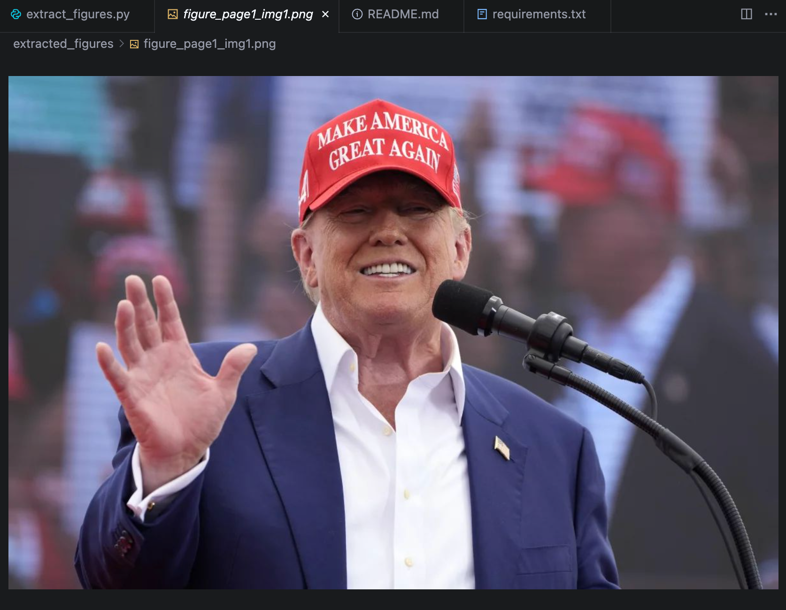
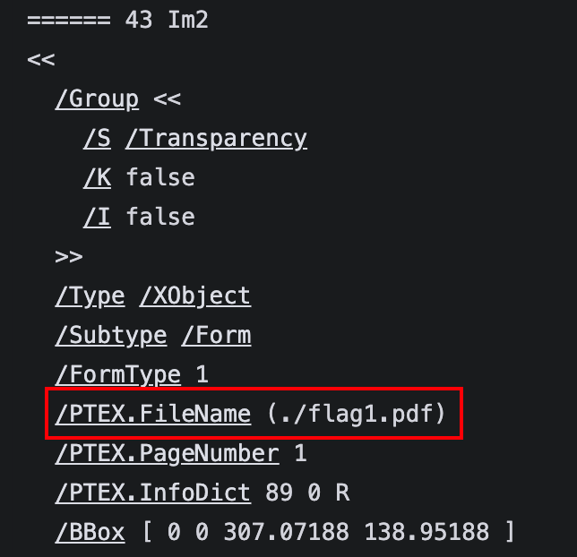
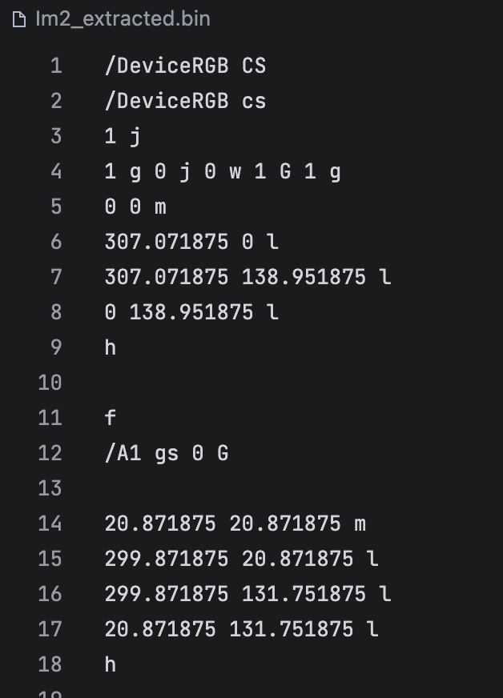
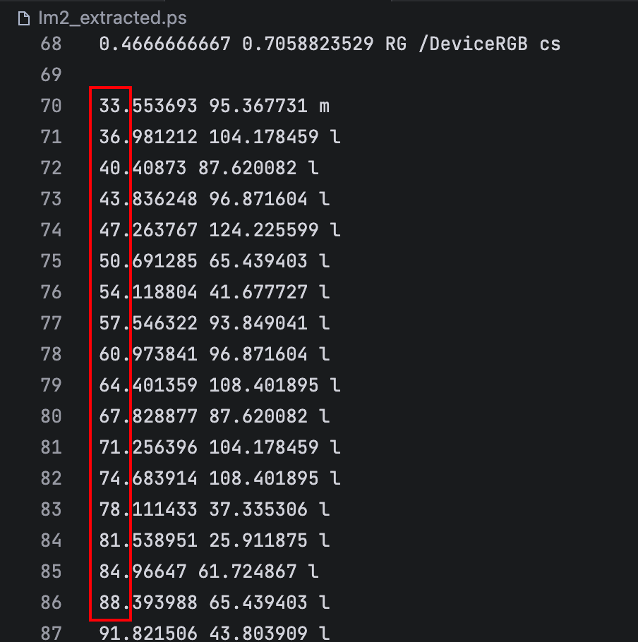
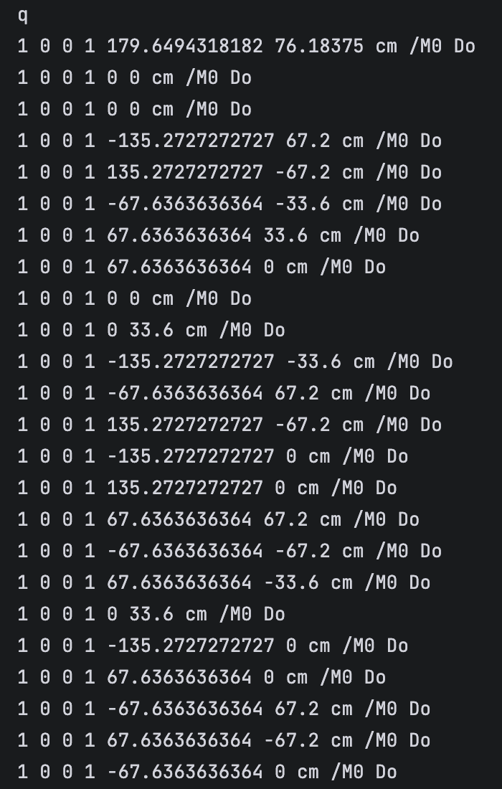
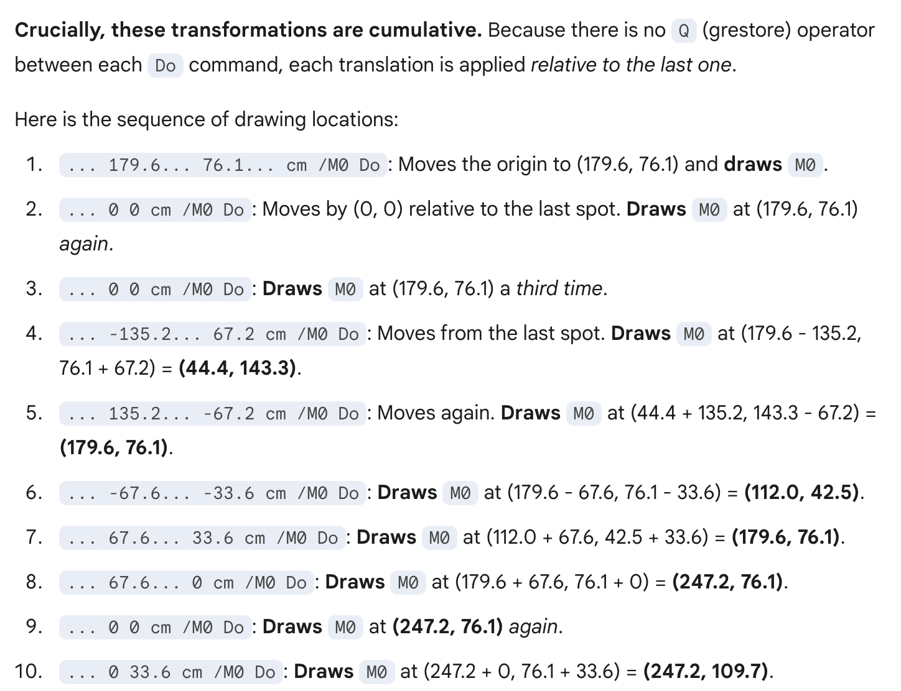
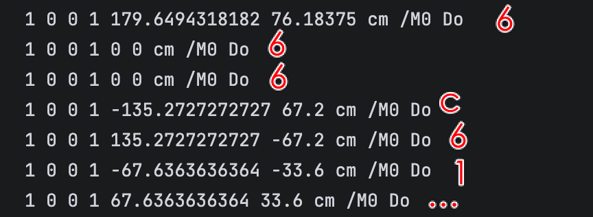
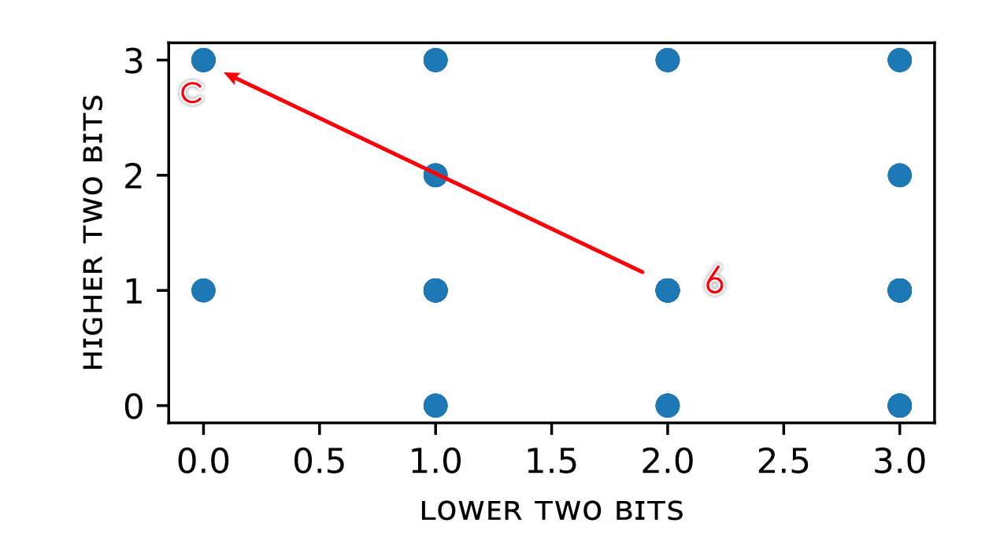

# [Misc] 开源论文太少了！

- 命题人：xmcp
- \ref{fig:flag-1}：200 分
- \ref{fig:flag-2}：200 分

## 题目描述


<p>清晨，七点整。新燕园的工地发出了叮叮咣咣的闹钟声，准时把你叫醒。噢，又是一个 Focus on Research 的好日子。</p>
<p>你打开美团，点一份外卖。欸，喜茶怎么又歇业了，真没人性。行吧，那就点个昌平县城的店。距离 12 公里，预计送达时间 1 小时 27 分钟。闲着也是闲着，不如打开 arXiv 看看最近的论文。</p>
<p>突然，有一篇论文映入你的眼帘。天呐，完全正是你在研究的方向，而且把 SOTA 往上刷了一倍。这怎么行？你仔细看了看论文，发现说的都含含糊糊，还把一个很重要的细节说成是 Implementation Details。你皱紧眉头。</p>
<p>不过还好论文说代码是开源的，那就看看吧。你点击 Artifact 链接，跳转到了一个 GitHub 仓库。里面唯一的文件是 README.md，里面写着：</p>
<blockquote>
<p>Code coming soon :-)</p>
</blockquote>
<p>我没要求你每次都公开完整可复现的代码。我不是恶魔。可是，coming soon 是什么意思？你的开源观念怎么了？这加上换行符才 21 个字节吧？再这样下去，你下个 SOTA 有 42 字节，再下个 84 字节，最后就变成八皇后最短代码了。作为开源爱好者，我可能得把你 <strong>图表背后的原始数据</strong> 弄出来。真的。</p>
<div class="well">
<p><strong>Rebuttal Response:</strong></p>
<p>We thank all players for the valuable comments, which we will incorporate. We believe the issues raised by the players are minor and can be resolved in the revision of this paper.</p>
<p>We apologize that the artifact is broken in our submission due to <a target="_blank" rel="noopener noreferrer" href="https://health.aws.amazon.com/health/status">networking issues</a>. To help players better reproduce our paper, we have re-uploaded the artifact, including the <strong>script to generate Figures 1 and 2</strong>, as well as <strong>the LaTeX source code</strong>. Please understand that the flag dataset is proprietary, so we replaced it with an open-source alternative in the artifact.</p>
<p>It is recommended to extract the flag content with state-of-the-art coding LLMs by <strong>generating a script to extract the Matplotlib figures, and then analyze the PDF stream for each figure</strong>. The artifact should help you design, validate and debug the script. Inspecting the flag1/2.pdf may also help you understand how are the figures drawed.</p>
</div>

**[【附件：下载题目附件 李玲玲（misc-paper.pdf）】](attachment/misc-paper.pdf)**

**[【附件：下载题目源码？（misc-paper-README.md）】](attachment/misc-paper-README.md)**

**[【附件：下载题目源码！（misc-paper-src.7z）】](attachment/misc-paper-src.7z)**

## 预期解法

其实这道题在出的时候我也不会做，但是在直觉上感觉肯定可做，然后[给C师傅充了一个会员让它自己vibe一会做出来了，exp也给写好了](https://chatgpt.com/share/68d7baa0-5dd0-8013-a8a6-e4653c35751c)。所以此题的预期解法就是去充会员。

需要指出，我给C师傅的附件是初期的版本，后续采用了一些办法来尽量卡掉AI：

- 在摘要后面插入了80K个`&`字符（相当于40K token）
- 把两个Figure的轴标签从嵌入成文字改成嵌入成图形
- 把Flag 1的Y轴改成对数坐标
- 把论文里所有提及matplotlib的地方都换掉，对的，MaMaiPi一开始的全称竟然是Massive Attention to Matplotlib Assets Included in PDF Instance

经过上述强化之后，C师傅注意力逐渐涣散了起来，没法直接出flag了，需要经过简单prompt（比如告诉它要去解析原始坐标）才可以。一把梭版本的exp放在了[sol目录](sol/)。

顺便一提，这80K个`&`字符把Acrobat和[同样基于Acrobat的](https://techcommunity.microsoft.com/blog/microsoftedgeinsider/microsoft-edge-and-adobe-partner-to-improve-the-pdf-experience/3733481)Edge PDF查看器也干死了。欸这波我是来干C师傅的，Adobe你怎么直接投了.jpg

那么，如果没给C师傅充会员，应该怎么做这道题呢？我也不确定，所以让我们现场试一试：

### 提取Flag插图

我们先试试Kimi师傅能不能从论文里提取出Figure 1和2来。Kimi师傅不负众望，提取出了一张：



楽。

不过不要紧，多拷打几轮AI，虽然每次都大概率做不对，但是根据AI说的话和生成的脚本，可以发现大量的知识正在涌入大脑：

- 矢量图在PDF里是以`XRef`这个东西存储的，然后在页面里用`XObject`来引用
- ”fitz“这个库（PyMuPDF）可以读PDF
- 它也可以从PDF提取XRef：https://pymupdf.readthedocs.io/en/latest/recipes-low-level-interfaces.html

在反复拷打AI并大脑升级过后，人和AI总有一个能找到Flag在PDF里的正确位置：

```python3
import fitz
doc = fitz.open('misc-paper.pdf')
page = doc.load_page(0)
xobjs = page.get_xobjects()
for n, name, *_ in xobjs:
    print('======', n, name)
    print(doc.xref_object(n))
    print(doc.xref_stream(n))
```

发现Im2和Im3这两个图片看起来很对，因为文件名分别叫 `flag1.pdf` 和 `flag2.pdf`。这也是我第一次知道pdflatex会在产物里记录figure的文件名，感觉可以用来开盒。



`doc.xref_stream(n)` 可以把嵌入的内容以 PostScript 形式保存下来，得到大概这样的东西：



拷打一下AI可以把这种PostScript转成独立的PDF，不过这其实对解题来说并不需要。

### Flag 1

我们直接观察Im2的PostScript文件，发现这个命令就很像一段折线，第一个数字是横坐标，第二个数字是纵坐标：



根据Flag格式，已知前两个纵坐标分别是 `log(ord('f'))` 和 `log(ord('l'))`，这样就可以精确解出纵坐标的偏移和单位，从而解出后续所有字母。

顺便Flag 1出成这个样子是为了给提取不出来PostScript、只会放大之后肉眼看图的选手一些辛苦分。我们既然后续反正也要做Flag 2，那么提取PostScript这个步骤肯定是必要的。

### Flag 2

与Flag1类似，得到Im3的PostScript文件。观察发现这一串命令看起来比较可疑，应该是Flag内容：



虽然我看不懂这是什么意思，但是G指导看得懂：



噢，原来 67.6363636364 和 -33.6 那些数字是在相对移动坐标然后画散点图。根据Flag格式，前几个点应该是 `fla…` 的16进制，即 `666C61…`。





因此得出坐标规律：从6移动到C的那一行，`-135.27…` 是向左移动两格，`67.2` 是向上移动两格。写个脚本即可最终解出所有字符。

### 其他解法

似乎有很多人提到了可以用 Inkspace 之类的软件把 PDF 转换成 SVG 再分析，以及用 pdfcrowd.com 这样的在线工具分析 PDF 格式。反正用各种方法都行。
