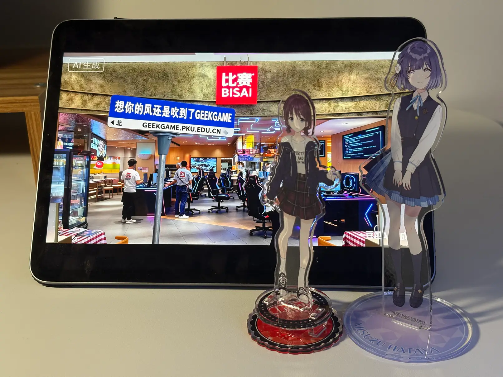

# [Tutorial] 签到

- 命题人：xmcp
- 题目分值：100 分

## 题目描述

    
     ↑ 家有宝贝，就打 GeekGame！带小孩的母亲正在前往比赛现场（用 iPhone 拍摄）（此图与解题无关）

欢迎参赛！随着比赛进行，我们会发布对题目的补充说明、提示及后续赛程安排，届时将在本平台和 QQ 群 614436236 通知选手。

如对题目有疑问，可以在群里私聊管理员或发邮件到 geekgame at pku.edu.cn。如发现简单错误可以通过上方题目名称旁边的 “反馈问题” 按钮提交。除通过上述方式与组委会联系外，所有选手在比赛结束前不得与他人讨论题目。

<strong>萌新教学：</strong>

本比赛的每道题目都对应着一个或多个被称为 Flag 的答案，其形如 <code>flag{...}</code>。Flag 区分大小写，所有字符均为可打印 ASCII 字符。将 Flag 输入到下面的文本框即可得分。

对于本题，请点击下方链接下载题目附件，然后<strong>找出附件中的 Flag</strong>。对于其他题目，你可能需要完成题目要求或者攻击题目指定的系统，<strong>在服务器中得到 Flag</strong>。

<a href="#/game">比赛主页</a> 的 “资料推荐” 栏目有一些让你快速了解常见解题方法的资料。
<a href="#/info/faq">选手常见问题</a> 的 “常用工具” 栏目列举了一些你可能会用到的工具。

<strong>第二阶段提示：</strong>

<ul>
<li>PhotoShop 等软件可以在此题的 GIF 帧中提取出一系列 <strong>很清晰的</strong> 二维码。顺序为在图片中从左到右、从上到下。</li>
<li>这种二维码叫 Data Matrix，广泛用于工业领域。一些手机软件可以扫码。</li>
<li>如果你问 AI 没问出来它是 Data Matrix，可能需要去掉图片背景再问，也可能是你问的 AI 不太行。</li>
</ul>
<table>
<thead>
<tr>
<th></th>
<th>ChatGPT</th>
<th>Gemini</th>
<th>Grok</th>
<th>豆包</th>
<th>文心</th>
<th>千问</th>
</tr>
</thead>
<tbody>
<tr>
<td>原始背景</td>
<td>❌ 错误</td>
<td>❌ 错误</td>
<td>❌ 错误</td>
<td>❌ 错误</td>
<td>❌ 错误</td>
<td>❌ 错误</td>
</tr>
<tr>
<td>透明背景</td>
<td>✅ 正确</td>
<td>✅ 正确</td>
<td>❌ 错误</td>
<td>❌ 错误</td>
<td>✅ 正确</td>
<td>❌ 错误</td>
</tr>
</tbody>
</table>

**[【附件：下载题目附件（tutorial-signin.gif）】](attachment/tutorial-signin.gif)**

## 预期解法

[上上回书说道](https://github.com/PKU-GeekGame/geekgame-3rd/tree/master/official_writeup/prob23-signin)，北大买了、清华也买了的PhotoShop可以查看GIF的每一帧。我们直接打开，看到从第二帧开始，各一闪而过一张二维码：

这里有个稍微有点奇怪的情况，就是第二帧的二维码是带背景的，但是第三帧以后都是透明背景的纯净二维码。这是此题的GIF生成逻辑造成的：GIF里的第一帧是背景图，从第二帧开始都是纯净二维码，且设置了 [disposal=3](https://pillow.readthedocs.io/en/stable/handbook/image-file-formats.html#gif-saving) 表示此帧绘制完成后应该清除。因此这就意味着一个合规的GIF解析器应该能解码出第二帧以后的二维码依次叠加到背景图上。具体的实现参见 [附件生成逻辑](src/gen.py)。

这里估计PhotoShop的处理不够完善，导致第一个 disposal=3 的帧正常叠加到了背景图，后续的并没有。如果你用其他工具提取出了纯净的二维码，说明它不会应用 disposal（并降低了题目难度）；如果你的工具提取出的每一帧都带背景图，说明这个工具可以正确应用 disposal（并增加了题目难度）。

其实就算有背景图，难度也没增加多少，因为直接跟第一帧相减即可得到纯净二维码，或者在PhotoShop里用魔棒选一下（记得把【容差】设为0，然后把【连续】关掉）：

然后ctrl+shift+I反选，delete删除，ctrl+D取消选择，得到美妙的透明背景二维码。接下来把后续7个纯净的透明背景二维码也显示出来：

得到并排的八个二维码：

好了，那么这究竟是什么二维码？首先排除QR Code，因为没有四个角落的定位点。也排除是QR Code拼图，因为每块拼图的左边和底边都是全黑色的，QR Code里并没有这样的结构。那么它究竟是什么呢？问问AI：

啊，原来是Data Matrix二维码。这是一种工业应用非常广泛的二维码格式，广泛应用于，比如说，这里：

以及，这里：

甚至iPhone的屏幕上（不懂事的小编还不知道Data Matrix是什么，把它叫作了QR Code，楽）：

等等所有比较小的地方。为什么这些地方不用QR Code呢？大概是因为QR Code的定位点太占空间了，导致最小的Level 1 QR Code就要占用21\*21像素，而最小的Data Matrix只占10\*10。[根据标准](https://www.gs1.org/docs/barcodes/GS1_DataMatrix_Guideline.pdf)，题目图片实际使用的16\*16 Data Matrix二维码可以编码16个ASCII字符，同时拥有50%的超强纠错率：

经常吃站点披萨的朋友们都知道，16寸和21寸在面积上相差有72%之多。所以，如果要在产品上印一些生产日期或者序列号之类的信息，Data Matrix可以印得比QR Code更小而且纠错率更高。就非常好。

好像跑题了。总之把这八个二维码按从左到右、从上到下的顺序扫一遍即可拼接成Flag。我用的Scandit，但显然别的软件也行。

好像比赛中有一些人没发现二维码的顺序其实跟它的位置（而不是时间顺序）有关，导致被拼了半天顺序。因为我是用 PhotoShop 做的，没意识到这里可能会卡住一些人。不过所幸 Flag 内容都是自然语言，因此猜出顺序也不算太难。