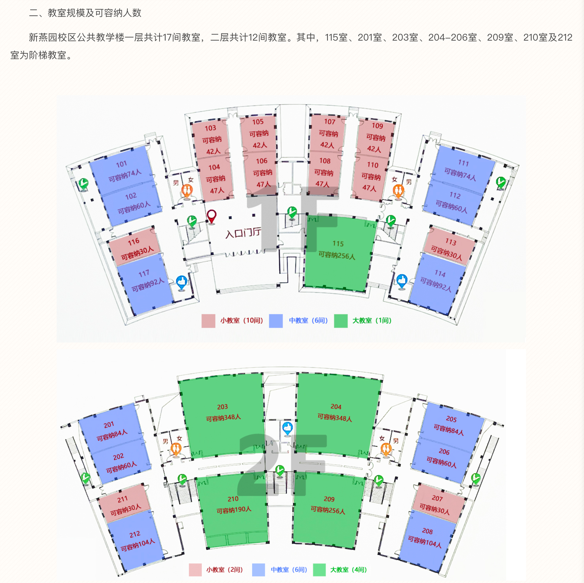
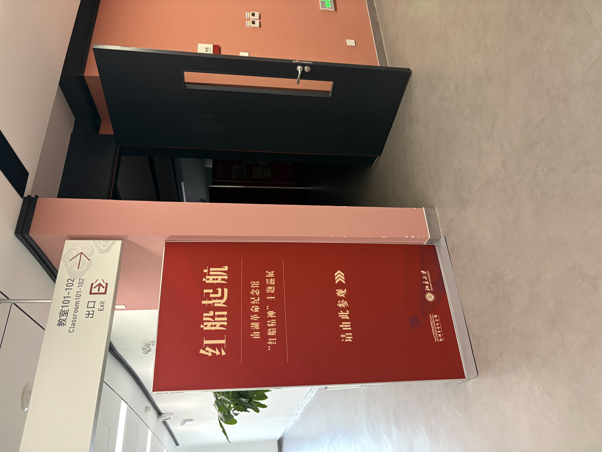

# 北京大学新燕园校区的教学楼在启用时，全部教室共有多少座位（不含讲桌）？

交给G指导：


虽然他说不知道，但给了一个网页。我们打开网页看到记录了每个教室的容量：



笑死，所以原来G指导不知道是因为不会看网页里的图片。

但是我们作为碳基大模型，是会看图片的。进行计算容易得到答案：

```python3
In [1]: (74+60+30+92)*2 + (42+47)*4 + (84+60+30+104)*2 + (348+348+190+256) + 256
Out[1]: 2822
```

顺带一提在出题的时候忘了加最后那个256（谁叫它跟别的教室都不对称），比赛开始15分钟我发现竟然一个算对的都没有，就很慌，赶紧检查一下修改了正确答案。

有人可能会对题面中“在启用时”这个定语产生疑问。这是因为在比赛前一周我实地考察了一下教学楼，发现有两间教室被改成了展览，拆除了所有座位：



因此特定加了一个定语来防杠。这下总不可能<del>有神秘伪证女魔女化之后穿越回几年前的时间来</del>抬杠了吧！

另外有人可能不确定网页图片写的“可容纳x人”是否包括讲桌。考虑到除了47人的教室以外所有数字都是偶数，可以合理推断不包含讲桌更合理。实地考察的结果也证实了这一点。
