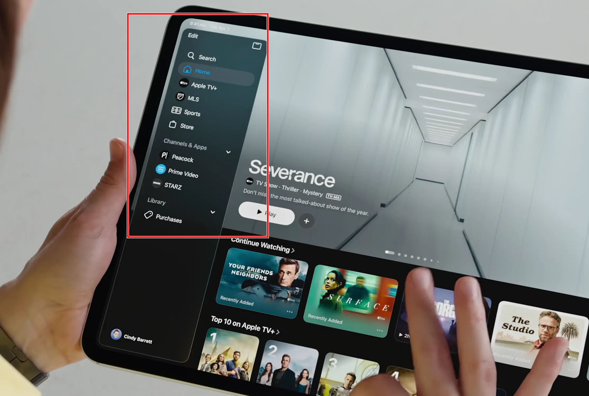
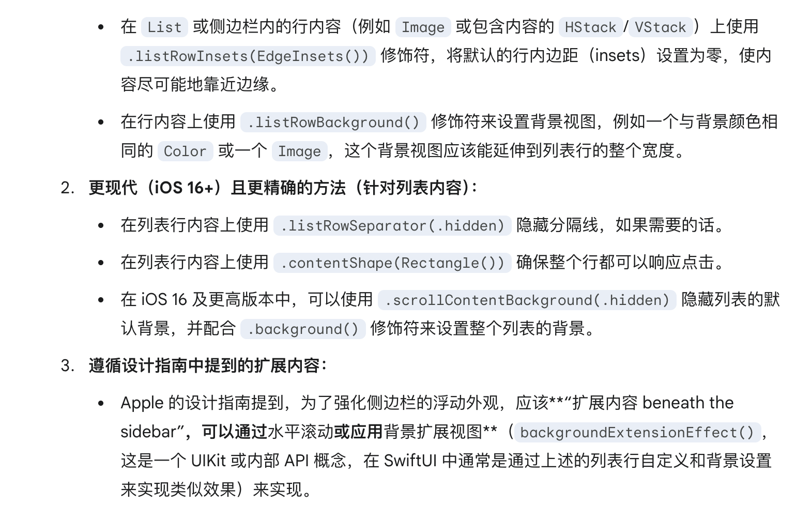
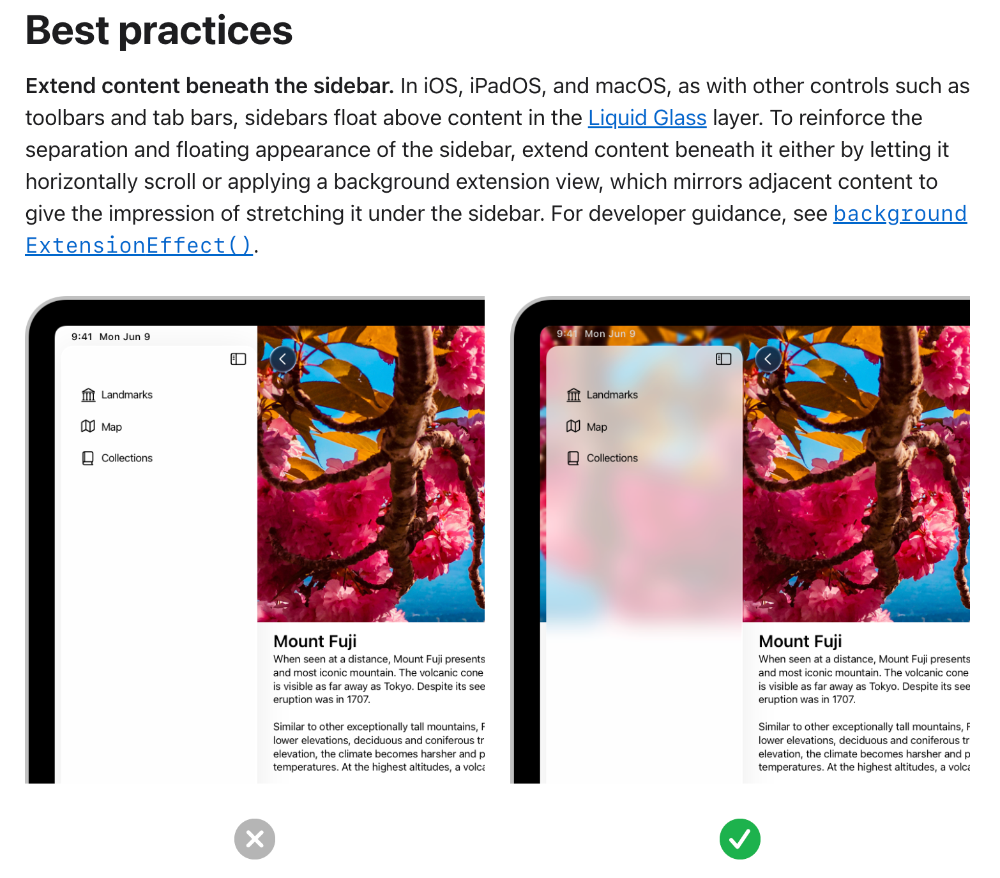
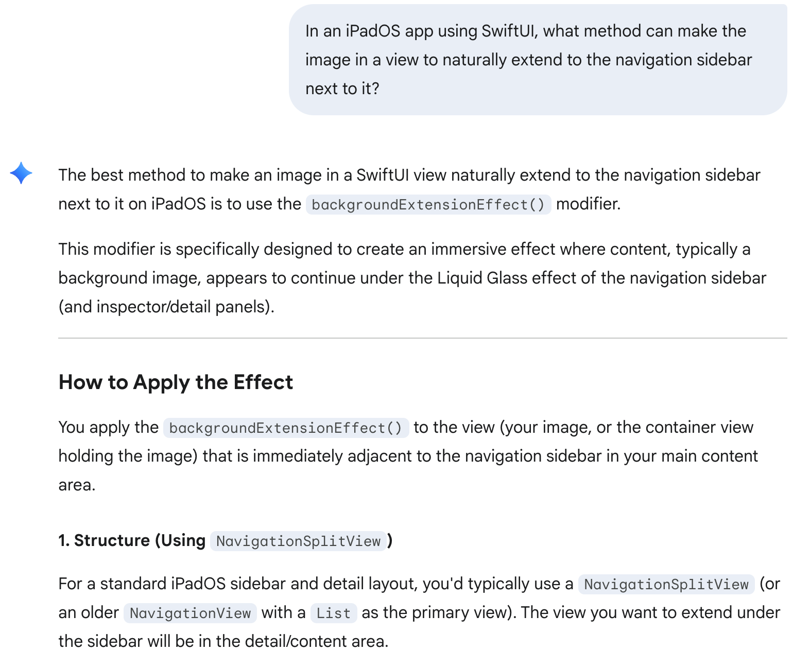

# 基于 SwiftUI 的 iPad App 要想让图片自然延伸到旁边的导航栏（如右图红框标出的效果），需要调用视图的什么方法？

交给G指导：

给了三个结果，逐个甄别一下，发现前两项都需要使用多个 API 来 hack，只有第三项通过唯一一个 API 就能实现。进一步打开提及的 HIG 页面，里面给的例子跟题目图片几乎一模一样：

因此第三项是正确答案。

另外，在 [Sidebar 文档的开头](https://developer.apple.com/design/human-interface-guidelines/sidebars) 和 [Liquid Glass 文档的开头](https://developer.apple.com/documentation/TechnologyOverviews/adopting-liquid-glass) 也有这张图片，挺好找的。不知道苹果为什么如此重视这个特性。

另外，如果用英文询问G指导，就算不给图片也能唯一给出精确答案：

 

这个prompt的重点似乎在于必须把导航栏翻译成”navigation sidebar“，不能叫 ”navigation bar“。或许是因为在 iOS 开发的语境下， [UINavigationBar](https://developer.apple.com/documentation/uikit/uinavigationbar) 指的是屏幕顶部的【＜返回　收件箱　＋新邮件】那个标题栏，而不是图中的侧边栏。