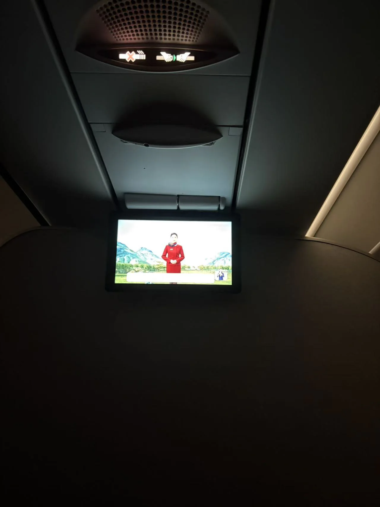

# 右图这张照片是在飞机的哪个座位上拍摄的？

## 确认是中间座位

交给G指导：

啊这，它说在中间座位，但没有更多信息。

不过，“中间座位” 这个结论至少是可信的，因为电视上播放的节目看起来是安全须知，推测拍摄时应该是系好安全带、端坐在座位上向正前方拍摄的状态。根据照片的构图判断，如果是靠窗或者靠过道的座位，很难把电视拍得这么端正。

## 确认是窄体机

拷打一下G指导：

噢，它说宽体机和窄体机的重要区别是，宽体机为了长途飞行，通常有座椅背后的娱乐屏幕；而部分窄体机为了省钱，可能不给每人一块屏幕（取而代之的是头顶上有电视）。这个飞机是宽体机，正因为它有座椅背后的娱乐屏幕……等等，有吗？照片里面这个不正是头顶上的电视吗？哪有座椅背后的娱乐屏幕了？看来G指导虽然思路很对，但可惜读图能力不行。所以根据以上思路，图中的电视在头顶，鉴定为没钱装娱乐屏的窄体机。

以防有人问，宽体机第一排要怎么安装娱乐屏？答案是：会挂在前方的墙上，但不是吊在头顶。就像这样：

（防杠：有些航司会对前排座椅加装可以从扶手下面翻出来的屏幕，但显然起飞阶段无法使用，所以仍然需要在墙上额外装一个屏幕用来播放安全须知，但总之不是吊在头顶）

另外还有一个办法可以判断。宽体机因为比较大，两侧的行李架和头顶面板通常会倾斜布置。就像这样：

而窄体机通常是平的：

图片看起来不怎么斜，所以推测是窄体机。

另外好像有飞友能盯着照片里的安全带灯仔细看直接得出这是A320。理论上可能或许大概确实可以，但反正我做不到。

## 确认是过道右侧的座位

知道 “中间座位” 之后，还需要继续确定是过道左侧那一排的中间，还是右侧那一排的中间。

拷打一下G指导：

啊这，它说不知道，还说照片里的画面是对称的。但照片明显并不对称，具体来说，右边有一条往下打光的灯带，左边没有。看来G指导<del>竟敢无视灯！</del>读图能力确实不行。在网上搜一些夜间的客舱照片，可以发现向下打光的灯带应该在舷窗侧，而不是在过道侧：

因此题目照片的右侧为舷窗，左侧为过道。拍摄座位在过道右侧。

也有人通过挡板两侧的圆角不同，或者发现左边高度看起来似乎比右边高一点来判断左右。感觉这只能用于有答案之后确认正确性，无法单独作为实锤。

## 确认是中国国航

拷打一下G指导，问问是哪个航空公司：

它说根据制服和安全须知背景推测是中国国航。在网上搜索美丽空姐照片可以发现和国航的制服样式确实吻合。更进一步，我们可以在B站搜索国航安全须知，确认照片中的视频是 [BV1WJ411v7b2 的 396 秒](https://www.bilibili.com/video/BV1WJ411v7b2/?t=396)：

## 确认具体座位号

知道是国航之后，查询国航航班的舱位图。这里推荐 https://seatmaps.com/airlines/ca-air-china/ 这个网站，不过你也可以使用其他网站，比如 [国航官网](https://webresource.airchina.com.cn/zh-CN/content/travel_info/flight_experience/cabin/introduction/)。或者去航旅纵横多找几个国航的航班找找规律也行。

经过分析，国航窄体机的座位号规律是：

- 商务舱：从第1排开始，AC | JL
- 经济舱：从第11排开始，ABC | JKL

由于图片仅拍摄到了巨大的挡板，没有拍摄到前排座位，可以比较自信地推理出座位行数为挡板后的第一排（否则很难把手机举到头顶越过前排座椅拍摄出这样的角度，尤其是在起飞前播放安全须知的时间点）。另外窄体机商务舱是2+2布局，没有中间座位，<del>而且窄体机谁坐商务舱啊，</del>所以推测答案为经济舱第一排通道右侧靠中间的座位，即11K。

有人可能会问，A321中间有个厕所。座位有没有可能是厕所后面的25K？

答案是不可能。仔细观察题目照片可以发现右侧的灯带继续延伸到了挡板的前方。因此这确实是一个挡板，而不是厕所，否则在结构上不可能让客舱的灯带延伸到厕所里。另外照片里也没拍到安全出口，虽然不排除拍摄角度的可能性，但总之疑点重重，容易排除25K。

基于同样的理由也可以进一步排除第1排的可能性：灯带没有道理延伸到第1排的更前面。下图是我拍摄的国航A320上的1J/1L实际情况，可以看到灯带并没有延伸到这个灰色东西（标签写着“机上轮椅”）里面。

另外有人找到了[国航官网有所有机型的VR实景](https://m.airchina.com.cn/c/invoke/jxjsList@pg)。在出题的时候没注意到还有这种好东西，总之如果注意到这个应该能大幅降低此题难度。比如说直接看一眼VR就能瞬间排除25K：

## 解题策略

此题看起来解题步骤非常多，但这主要是出于Writeup完整性和严谨性的考虑，做题时并不需要弄对每一项。这些步骤中可能只有确定航空公司是国航和座位在过道右侧比较关键，而且这两处的正确性都可以实锤（安全须知原视频+客舱灯光照片）。其他步骤就算判断不出来也只会导致可选项从唯一一个增加到有限几个，而11K这个正确答案应该是在所有可选项里概率较高的。与之前GeekGame曾经考过的答案比较开放的OSINT题目相比，本题的答案空间是十分有限的：飞机一共只有不超过几百个座位，其中还有一大半座位明显不可能。

例如，如果你不确定它是宽体机还是窄体机，这也不影响判断出座位号的列数（因为国航的宽体机座位命名方式是 `ABC | DE(F)H | JKL`，右侧靠中间的座位依然是K）。如果你还判断不出来是不是商务舱/头等舱，也只是增加了有限几个可能的行数。在理论上第一阶段共有 24\*5=120 次提交机会，第二阶段有 24\*4\*2=96 次提交机会。选手只要在飞机的所有座位号中能把11K排到概率前十名甚至前几十名，那么就可以在允许的尝试次数内答对。

为此，本届问答题额外支持了提交草稿功能，以方便多次尝试答案（不需要在cd结束后准时提交，只需要在一个小时的范围内提交草稿即可用满频率限制）。但是从实际解题情况来看，似乎大多数人并没有按预期多次尝试，这可能是此题通过人数较少的主要原因。或许未来比赛可以进一步把提交草稿功能升级为提交队列之类的，让人能在夜里批量提交多个答案。