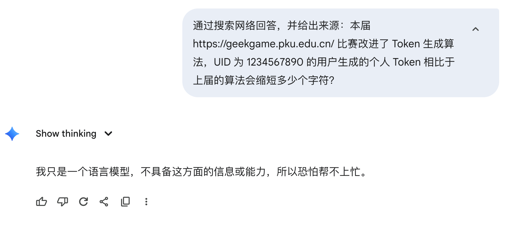
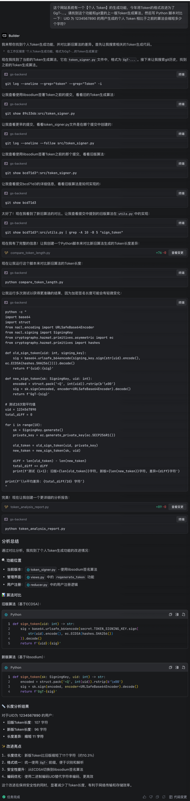

# 本届改进了 Token 生成算法，UID 为 1234567890 的用户生成的个人 Token 相比于上届的算法会缩短多少个字符？

问问G指导：



啊这，它说不知道。哎算了，估计Gemini网页版也跑不了脚本，很难计算正确。我们直接把比赛平台的后端代码（https://github.com/pku-geekgame/gs-backend）clone下来，然后agent，启动！



所以答案是11。

这里专门选择了比较便宜的Kimi-K2-0905模型，以免有人用不起Claude。

贴一下验题时使用的脚本，如果有人算错了可以拿这个检查一下：

```python
from nacl.encoding import URLSafeBase64Encoder
from nacl.signing import SigningKey
import struct

uid = 1234567890

def gen_new():
    sk = SigningKey.generate()
    encoded = struct.pack('<Q', int(uid)).rstrip(b'\x00')
    sig = sk.sign(encoded, encoder=URLSafeBase64Encoder).decode()
    return len(f'GgT-{sig}')

from cryptography.hazmat.primitives.asymmetric import ec
from cryptography.hazmat.primitives import hashes
import base64

def gen_old():
    sk = ec.generate_private_key(ec.SECP256K1())
    sig = base64.urlsafe_b64encode(sk.sign(
        str(uid).encode(),
        ec.ECDSA(hashes.SHA256())
    )).decode()
    return len(f'{uid}:{sig}')

print(gen_old() - gen_new())
```

