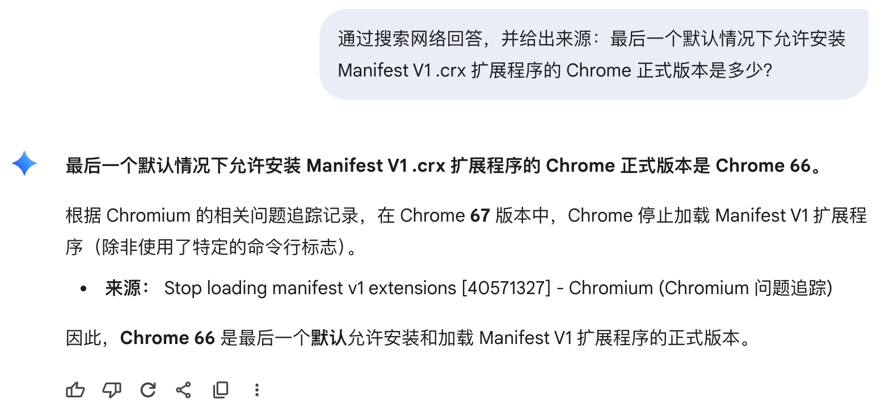

# 最后一个默认情况下允许安装 Manifest V1 .crx 扩展程序的 Chrome 正式版本是多少？

问问G指导：

6，不愧是谷歌亲儿子，对自家产品就是熟悉，直接就答对了。

仔细看看它指向的 issue，是 https://issues.chromium.org/issues/40571327 。可以看出这个更改确实是在 Milestone 67 进行的。

为了进一步验证，可以先下载一个很古老的 Chrome/Chromium（我用的 Chromium 18.0.1017.0，[在这下载](https://commondatastorage.googleapis.com/chromium-browser-snapshots/index.html?prefix=Win/118778/)），写一个 Hello World 打包成 .crx，然后再去下载正式版 Chrome 66 和 67（[在这下载](https://www.slimjet.com/chrome/google-chrome-old-version.php)），分别尝试能不能安装。可以看到，Chrome 66 可以正常安装（然后因为这个 .crx 没有被 Chrome Web Store 签名所以无法启用，但你就说装没装上吧），Chrome 67 安装报错。

你说为什么要下载 Chromium 18 打包？因为后面的版本就 [弃用并不允许打包 Manifest V1 扩展](https://web.archive.org/web/20150429192142/https://developer.chrome.com/extensions/manifestVersion) 了，但已经打包好的扩展并没有禁用，直到四年之后才被人想起来。

有人会犹豫答案是66还是67，这种时候需要注意一定要找**正式版**对应的branch，[ChromiumDash](https://chromiumdash.appspot.com/branches)上面有记录。在stable 66发布之后，dev的版本号会立刻加到67，所以dev 67会比stable 67提前一个大版本。