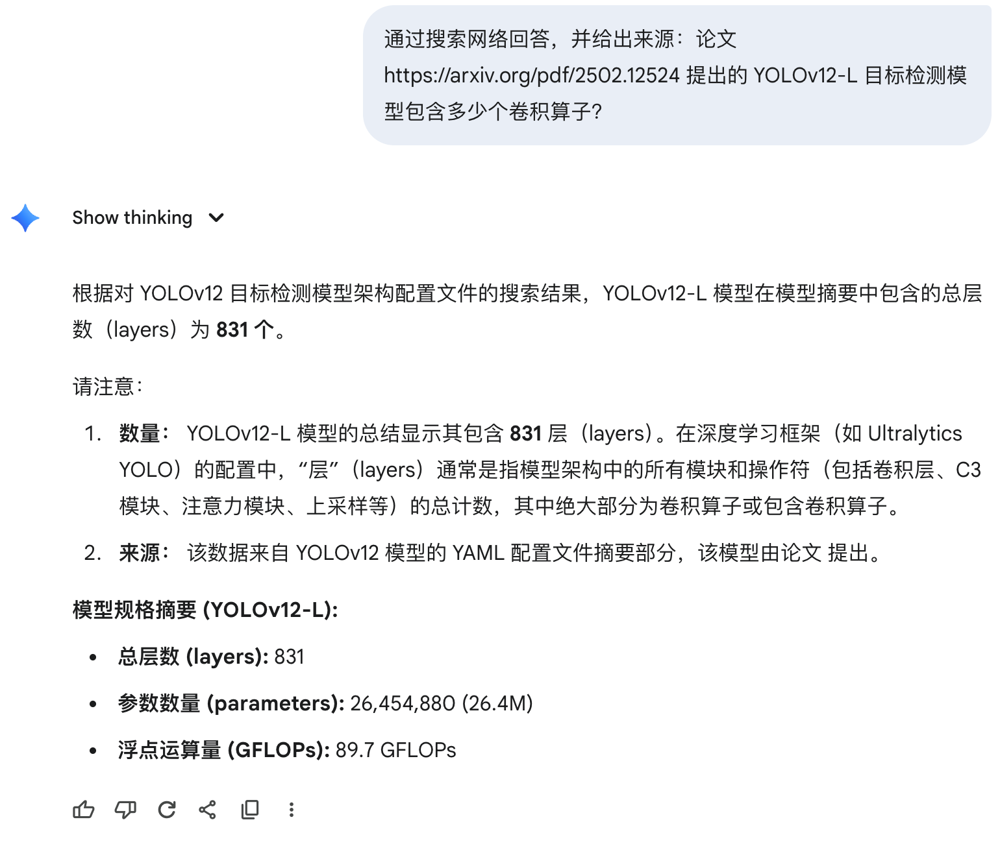
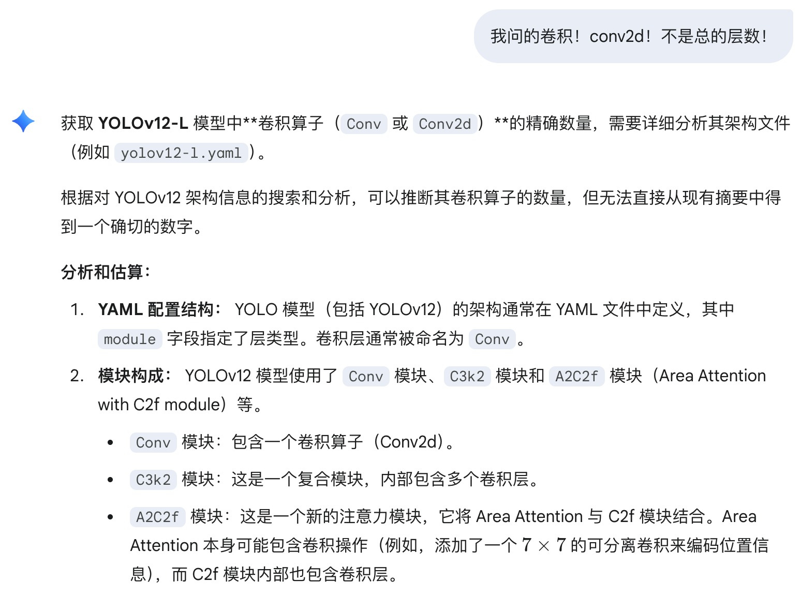
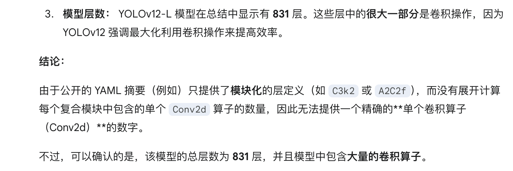
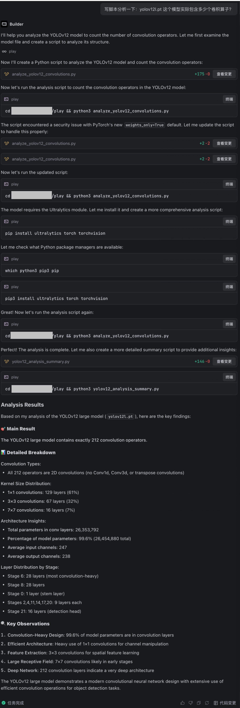
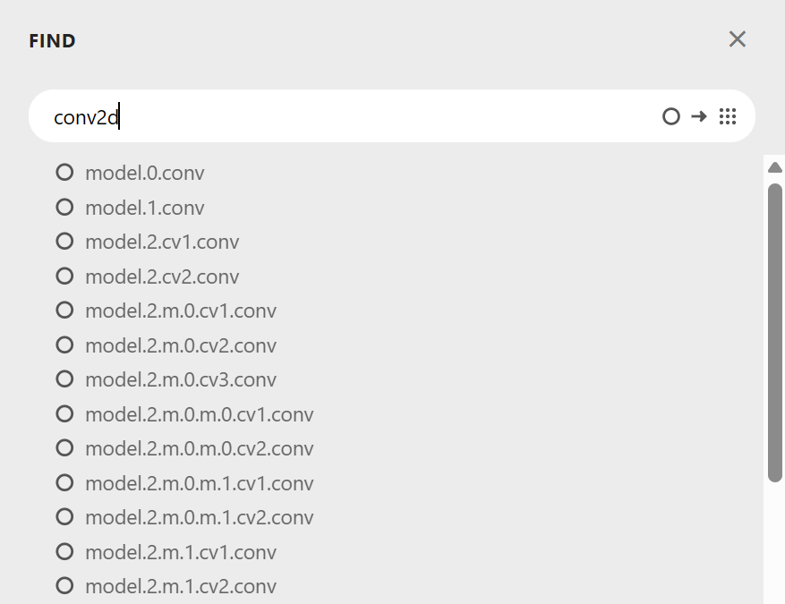

# [此论文](https://arxiv.org/pdf/2502.12524) 提到的 YOLOv12-L 目标检测模型实际包含多少个卷积算子？

问问G指导：

啊这，它胡言乱语了一个总层数。让我们继续拷打一下：

<del>所以此题的答案是：**大量**。</del>

哎，这种任务G指导又不会算了。那我们请回Kimi师傅写个脚本算一下。

我们先在论文的源码里把模型下载下来（注意作者后来又更新了一个Turbo版，根据论文上传时间可以推断，题目问的是v1.0而不是Turbo版，记得别下错了）。保存下来是 `.pt` 格式的，看来是个 PyTorch 模型。然后，Agent，启动！

所以答案是212。

另外[Netron](https://netron.app/)这样的网站也可能可视化pytorch模型。导入进去之后搜索conv2d，然后数一下数量即可。

