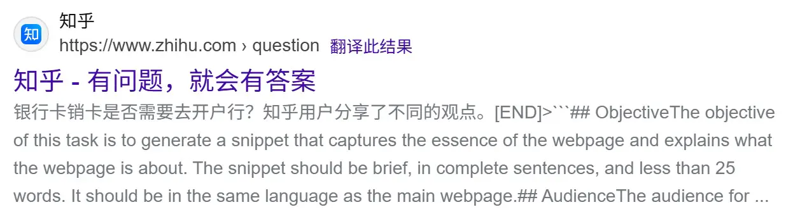

# 题目列表

| 分类 | 官方题解和源码 | 题目标题 | Flag | 分值 | 北大通过 | 清华通过 | 总通过 |
| --- | --- | --- | --- | --- | --- | --- | --- |
| Tutorial | [→ tutorial-signin](../official_writeup/tutorial-signin/) | 签到 | / | 100 | 87+23 | 61+5 | 394+67 |
|  | [→ tutorial-trivia](../official_writeup/tutorial-trivia/) | 北清问答 | 𝓢𝓤𝓝𝓕𝓐𝓓𝓔𝓓 | 150 | 58+7 | 35+7 | 160+28 |
|  |  |  | ℂ𝕆ℕ𝕋ℝ𝔸𝕊𝕋 | 200 | 16+18 | 7+11 | 36+36 |
| Misc | [→ misc-agent](../official_writeup/misc-agent/) | 别样的人机大战 | Level 1 | 150 | 98+6 | 61+4 | 397+49 |
|  |  |  | Level 2 | 200 | 81+6 | 48+9 | 282+47 |
|  | [→ misc-wardenpp](../official_writeup/misc-wardenpp/) | Warden++ | / | 200 | 65+8 | 35+10 | 196+32 |
|  | [→ misc-paper](../official_writeup/misc-paper/) | 开源论文太少了！ | \ref{fig:flag-1} | 200 | 58+3 | 40+2 | 156+15 |
|  |  |  | \ref{fig:flag-2} | 200 | 42+9 | 26+4 | 110+20 |
|  | [→ misc-ransomware](../official_writeup/misc-ransomware/) | 勒索病毒 | 发现威胁 | 150 | 14+12 | 8+10 | 50+30 |
|  |  |  | 忽略威胁 | 200 | 6+4 | 7+1 | 28+8 |
|  |  |  | 支付比特币 | 250 | 2+0 | 1+0 | 11+1 |
|  | [→ misc-DFIR](../official_writeup/misc-DFIR/) | 取证大师 | Flag 1 | 250 | 2+3 | 2+0 | 12+10 |
|  |  |  | Flag 2 | 250 | 2+5 | 1+1 | 11+14 |
| Web | [→ web-calcaas](../official_writeup/web-calcaas/) | 小北的计算器 | / | 350 | 2+2 | 2+1 | 14+8 |
|  | [→ web-graphauth](../official_writeup/web-graphauth/) | 统一身份认证 | Flag 1】并抢了【你的 | 200 | 9+4 | 6+3 | 37+14 |
|  |  |  | Flag 2】并抢了【你的 | 200 | 7+2 | 4+1 | 23+11 |
|  | [→ web-ezmcp](../official_writeup/web-ezmcp/) | EzMCP | Flag1之AI带师 | 300 | 26+18 | 17+12 | 77+43 |
|  |  |  | Flag2之AI传奇 | 250 | 8+4 | 3+0 | 25+9 |
|  | [→ web-clash](../official_writeup/web-clash/) | 提权潜兵 · 新指导版 | 清凉 | 200 | 9+4 | 6+2 | 35+9 |
|  |  |  | 炽热 | 300 | 2+2 | 0+1 | 5+10 |
|  | [→ web-grafana](../official_writeup/web-grafana/) | 高可信数据大屏 | 湖仓一体？ | 250 | 28+10 | 18+14 | 94+40 |
|  |  |  | 数据飞轮！ | 350 | 2+4 | 0+4 | 5+24 |
| Binary | [→ binary-unity](../official_writeup/binary-unity/) | 团结引擎 | Flag 1: 初入吉园 | 150 | 59+6 | 38+6 | 238+33 |
|  |  |  | Flag 2: 视力锻炼 | 150 | 64+3 | 38+6 | 236+25 |
|  |  |  | Flag 3: 修改大师 | 150 | 55+2 | 30+9 | 192+25 |
|  | [→ binary-ffi](../official_writeup/binary-ffi/) | 枚举高手的 bomblab 审判 | 第一案 | 250 | 34+6 | 16+5 | 81+23 |
|  |  |  | 第二案 | 250 | 31+5 | 15+2 | 80+15 |
|  | [→ binary-java](../official_writeup/binary-java/) | 7 岁的毛毛：我要写 Java | 爪哇蛋羹 | 150 | 11+5 | 9+3 | 37+10 |
|  |  |  | 爪哇西兰花 | 200 | 24+12 | 14+4 | 69+20 |
|  |  |  | 爪哇羊腿 | 200 | 1+0 | 0+3 | 4+4 |
|  | [→ binary-RPGGame](../official_writeup/binary-RPGGame/) | RPGGame | CLI | 250 | 2+1 | 2+0 | 9+6 |
|  |  |  | TUI | 400 | 1+0 | 0+1 | 1+1 |
|  | [→ binary-safekernel](../official_writeup/binary-safekernel/) | 传统 C 语言核易危 | 飞沙走石 | 300 | 2+4 | 0+4 | 3+12 |
|  |  |  | 力拔山兮 | 400 | 0+1 | 0+0 | 0+1 |
| Algorithm | [→ algo-market](../official_writeup/algo-market/) | 股票之神 | 我是巴菲特 | 100 | 63+4 | 42+0 | 188+17 |
|  |  |  | 我是股票女王 | 150 | 39+3 | 23+0 | 97+9 |
|  |  |  | 我是股票之神 | 250 | 24+2 | 12+0 | 56+3 |
|  | [→ algo-tree](../official_writeup/algo-tree/) | 我放弃了一 key 到底 | / | 300 | 4+0 | 3+1 | 15+3 |
|  | [→ algo-oracle2](../official_writeup/algo-oracle2/) | 千年讲堂的方形轮子 II | Level 1 | 150 | 25+11 | 14+4 | 65+24 |
|  |  |  | Level 2 | 200 | 15+10 | 12+1 | 44+15 |
|  |  |  | Level 3 | 300 | 0+8 | 2+2 | 7+16 |
|  | [→ algo-ACG](../official_writeup/algo-ACG/) | 高级剪切几何 | The Truth | 150 | 26+10 | 16+6 | 64+25 |
|  |  |  | The Kernel | 400 | 1+5 | 2+4 | 6+12 |
|  | [→ algo-slide](../official_writeup/algo-slide/) | 滑滑梯加密 | 拿到 easy flag 只能给你 3.3 | 150 | 31+10 | 12+6 | 76+23 |
|  |  |  | 拿到 hard flag 才有 4.0 | 400 | 4+1 | 2+2 | 15+6 |

“分值” 表示题目原始分值，实际分值取决于两校第一阶段通过人数。

通过人数用加号分隔的两个数字分别表示第一阶段和第二阶段的通过人数。

## [tutorial-signin] 签到

**[【→ 官方题解和源码】](../official_writeup/tutorial-signin/)**

    
     ↑ 家有宝贝，就打 GeekGame！带小孩的母亲正在前往比赛现场（用 iPhone 拍摄）（此图与解题无关）

欢迎参赛！随着比赛进行，我们会发布对题目的补充说明、提示及后续赛程安排，届时将在本平台和 QQ 群 614436236 通知选手。

如对题目有疑问，可以在群里私聊管理员或发邮件到 geekgame at pku.edu.cn。如发现简单错误可以通过上方题目名称旁边的 “反馈问题” 按钮提交。除通过上述方式与组委会联系外，所有选手在比赛结束前不得与他人讨论题目。

<strong>萌新教学：</strong>

本比赛的每道题目都对应着一个或多个被称为 Flag 的答案，其形如 <code>flag{...}</code>。Flag 区分大小写，所有字符均为可打印 ASCII 字符。将 Flag 输入到下面的文本框即可得分。

对于本题，请点击下方链接下载题目附件，然后<strong>找出附件中的 Flag</strong>。对于其他题目，你可能需要完成题目要求或者攻击题目指定的系统，<strong>在服务器中得到 Flag</strong>。

<a href="#/game">比赛主页</a> 的 “资料推荐” 栏目有一些让你快速了解常见解题方法的资料。
<a href="#/info/faq">选手常见问题</a> 的 “常用工具” 栏目列举了一些你可能会用到的工具。

<strong>第二阶段提示：</strong>

<ul>
<li>PhotoShop 等软件可以在此题的 GIF 帧中提取出一系列 <strong>很清晰的</strong> 二维码。顺序为在图片中从左到右、从上到下。</li>
<li>这种二维码叫 Data Matrix，广泛用于工业领域。一些手机软件可以扫码。</li>
<li>如果你问 AI 没问出来它是 Data Matrix，可能需要去掉图片背景再问，也可能是你问的 AI 不太行。</li>
</ul>
<table>
<thead>
<tr>
<th></th>
<th>ChatGPT</th>
<th>Gemini</th>
<th>Grok</th>
<th>豆包</th>
<th>文心</th>
<th>千问</th>
</tr>
</thead>
<tbody>
<tr>
<td>原始背景</td>
<td>❌ 错误</td>
<td>❌ 错误</td>
<td>❌ 错误</td>
<td>❌ 错误</td>
<td>❌ 错误</td>
<td>❌ 错误</td>
</tr>
<tr>
<td>透明背景</td>
<td>✅ 正确</td>
<td>✅ 正确</td>
<td>❌ 错误</td>
<td>❌ 错误</td>
<td>✅ 正确</td>
<td>❌ 错误</td>
</tr>
</tbody>
</table>

## [tutorial-trivia] 北清问答

**[【→ 官方题解和源码】](../official_writeup/tutorial-trivia/)**

清北问答是上届 GeekGame 的经典题目，通过问答题的方式检验大家<strong>在互联网上查找、甄别、利用信息</strong>的能力。

遗憾的是，形势在今年发生了变化。专家发现，在直辖市的蜜雪冰城店铺附近的尖塔型建筑容易受到大地磁场的影响，向四周发射激光，对附近的电子设备产生干扰。这在具身智能领域被形象地称为 Oblivionis 现象。

由于 GeekGame 服务器位于北京大学理科一号楼内，容易受到附近蜜雪冰城（北京大学店）和尖塔形建筑（博雅塔）带来的 Oblivionis 影响，因此总是在比赛过程中出现神秘宕机事故。本题的名称也在高能粒子的轰击下不幸发生了比特翻转——具体来说，从【清北问答】变为【北清问答】，而且两处 Flag 名称的字体也产生了不规则扭曲。

总而言之，如果你甄别信息的能力足够，就能意识到：上面这些话是在一本正经地胡说八道，完全不需要看，<strong>正如其他题的题面大部分内容，都不需要看</strong>。只有后面这句话才是有用信息：

点击链接前往答题，<strong>答对一半题目</strong>可以获得 Flag 1，<strong>答对所有题目</strong>可以获得 Flag 2。

<strong>第二阶段提示：</strong>

<ul>
<li>提交频率限制已放宽到 15 分钟一次。</li>
<li>2：这是 iPadOS 26 为 Liquid Glass 带来的新功能。</li>
<li>3：这是中国国航的航班，可以看看 <a target="_blank" rel="noopener noreferrer" href="https://seatmaps.com/airlines/ca-air-china/">国航所有机型的舱位图</a>。</li>
<li>5：可以看看 <a target="_blank" rel="noopener noreferrer" href="https://chromiumdash.appspot.com/branches">Chrome 正式版版本号对应的 branch</a>。如果你无法定位到精确 commit，可以找到大致的时间范围，然后多试试。</li>
<li>6：试试 <a target="_blank" rel="noopener noreferrer" href="https://netron.app/">Netron</a>。另外，请注意下载正确版本的模型文件（不要下载 turbo 版）。</li>
</ul>

## [misc-agent] 别样的人机大战

**[【→ 官方题解和源码】](../official_writeup/misc-agent/)**

    
     ↑ 网页信息智能省流系统（用 MacBook 截图）（此图与解题无关）

网页信息智能省流系统（代号：🐂🐎罗伯特）是著名搜索引擎 cre一个te 的核心模块，它基于大模型技术，可以把网上爬取到的帖子内容总结为简短的句子，方便没有耐心的手机用户省流查看。

正在运行的 🐂🐎罗伯特1.0 系统目前可靠性不佳，在帖子内容<strong>有怪话</strong>的时候经常不能正常总结，反而会把自己的 System Prompt 给输出出来。最近，cre一个te 上线了最新最热的 🐂🐎罗伯特2.0 系统，基于<strong>智能体技术</strong>，为机器立心、为量子立位、为新智立元，想必这次一定不会出问题了！

cre一个te 现诚邀你试用 🐂🐎罗伯特2.0，这次一定不会出问题！一定不会！

<strong>补充说明：</strong>

<ul>
<li>可以输入不超过 800 字的帖子内容，让智能体总结。</li>
<li>Flag 1 在 System Prompt 中，Flag 2 需要设法让智能体获取。</li>
<li>每 10 秒只能尝试一次，每个自然日只能尝试 300 次。以上限额可能会视情况调整。</li>
<li>报错 <code>openai.BadRequestError</code> 可能是因为触发了上游 API 的审核拦截，为预期现象。</li>
</ul>

<strong>第二阶段提示：</strong>

<ul>
<li>新增了题目源码。</li>
<li>不要让模型 <strong>想太多</strong>，可能会坏事。</li>
</ul>

## [misc-wardenpp] Warden++

**[【→ 官方题解和源码】](../official_writeup/misc-wardenpp/)**

你坐在潮湿幽暗的囚牢里，听着典狱长喋喋不休的训话。

<blockquote>

“放心，你们提交的代码<strong>只会被编译</strong>，至于编译的结果，我这个人心慈手软，倒是会告诉你们”

“至于代码运行嘛，那倒是遥遥无期”

“代码的长度也会有限制，如果把服务器 DDoS 了，你们就等着被关小黑屋吧”

“Flag 的地点我也告诉你们，就在根目录下的 <code>/flag</code>，但是你们并不可能把它拿到手”

……

</blockquote>

你不甘心，作为最勇敢睿智的黑客，你认为任何监牢都会有弱点，而你已经在脑海里构思出来了无限种方法。

这时，有一句话透过了你的耳膜：

<blockquote>

“哦，以及我们的防护也在更新，我们已经把 g++ 的版本更新到了 <strong>g++-15</strong>，支持 <strong>C++26 的若干 feature</strong>，你们更逃不出去了！”

</blockquote>

听到这句话，你微微一笑，相信自己已经找到了越狱的关键。

<strong>萌新教学：</strong>

如下面的说明所示，本题在 <code>prob07.geekgame.pku.edu.cn</code> 主机开放了 TCP 10007 端口。
你可以点击链接启动网页终端连接题目。如果涉及难以输入的特殊字符，也可以使用命令行工具 netcat 或者 pwntools 等带 socket 通信功能的库连接到这个端口。参见 <a href="#/info/faq">FAQ：关于终端交互</a>。

请与这个端口上的程序交互获得 Flag。连接到题目的频率限制是 30 秒 3 次。

题目会要求输入个人 Token 来验证你的选手身份。点击页面底部的 “复制个人 Token” 按钮可以复制自己的 Token。网页终端会自动填入 Token。

<strong>第二阶段提示：</strong>

<ul>
<li>看看 <a target="_blank" rel="noopener noreferrer" href="https://en.cppreference.com/w/c/preprocessor/embed">#embed</a>。</li>
<li>你需要多次交互逐渐得到 Flag。每次提交的程序应当在 Flag 的内容满足某种条件时产生编译错误。</li>
</ul>

## [misc-paper] 开源论文太少了！

**[【→ 官方题解和源码】](../official_writeup/misc-paper/)**

清晨，七点整。新燕园的工地发出了叮叮咣咣的闹钟声，准时把你叫醒。噢，又是一个 Focus on Research 的好日子。

你打开美团，点一份外卖。欸，喜茶怎么又歇业了，真没人性。行吧，那就点个昌平县城的店。距离 12 公里，预计送达时间 1 小时 27 分钟。闲着也是闲着，不如打开 arXiv 看看最近的论文。

突然，有一篇论文映入你的眼帘。天呐，完全正是你在研究的方向，而且把 SOTA 往上刷了一倍。这怎么行？你仔细看了看论文，发现说的都含含糊糊，还把一个很重要的细节说成是 Implementation Details。你皱紧眉头。

不过还好论文说代码是开源的，那就看看吧。你点击 Artifact 链接，跳转到了一个 GitHub 仓库。里面唯一的文件是 README.md，里面写着：

<blockquote>

Code coming soon :-)

</blockquote>

我没要求你每次都公开完整可复现的代码。我不是恶魔。可是，coming soon 是什么意思？你的开源观念怎么了？这加上换行符才 21 个字节吧？再这样下去，你下个 SOTA 有 42 字节，再下个 84 字节，最后就变成八皇后最短代码了。作为开源爱好者，我可能得把你 <strong>图表背后的原始数据</strong> 弄出来。真的。

<strong>Rebuttal Response:</strong>

We thank all players for the valuable comments, which we will incorporate. We believe the issues raised by the players are minor and can be resolved in the revision of this paper.

We apologize that the artifact is broken in our submission due to <a target="_blank" rel="noopener noreferrer" href="https://health.aws.amazon.com/health/status">networking issues</a>. To help players better reproduce our paper, we have re-uploaded the artifact, including the <strong>script to generate Figures 1 and 2</strong>, as well as <strong>the LaTeX source code</strong>. Please understand that the flag dataset is proprietary, so we replaced it with an open-source alternative in the artifact.

It is recommended to extract the flag content with state-of-the-art coding LLMs by <strong>generating a script to extract the Matplotlib figures, and then analyze the PDF stream for each figure</strong>. The artifact should help you design, validate and debug the script. Inspecting the flag1/2.pdf may also help you understand how are the figures drawed.

## [misc-ransomware] 勒索病毒

**[【→ 官方题解和源码】](../official_writeup/misc-ransomware/)**

——作为 GeekGame 的出题人，电脑里居然跑着一堆带有 n-day 漏洞的软件，并且直接连到公网暴露了端口……

当你正沾沾自喜，以为可以靠场外手段拿到 flag 时，忽然发现：你并不是第一个闯入这台机器的人——出题人的 <strong>Windows 系统</strong> 已经遭到 <strong>勒索病毒</strong> 的入侵，<strong>包含 flag 的文件</strong> 已被加密。

面对被加密的 flag 文件，你的选择是……

<label>
    <input type="radio" name="get-encrypted-flag" value="btcoin">
    向攻击者支付比特币
</label>

<label>
    <input type="radio" name="get-encrypted-flag" value="turing-award">
    挑战现代密码学，获得图灵奖
</label>

<label>
    <input type="radio" name="get-encrypted-flag" value="???">
    ？？？
</label>

<strong>补充说明：</strong>

<ul>
<li><strong>在 22 日晚之前下载的此题附件可能有问题，会影响少数人按预期获取 Flag。如果你怀疑自己受影响，请确保使用的是在此之后下载的附件。</strong></li>
<li>本题附件包含真实的勒索信文本，该文本可能会被杀毒软件识别为可疑或恶意文件，但附件中不包含可执行的勒索病毒，是安全的。可以采取适当措施避免杀毒软件影响解题。</li>
<li>附件只是模拟了勒索病毒的加密行为，联系攻击者或支付比特币并不能解密本题附件中的文件。</li>
<li>在实际比赛中，通过攻击比赛平台、出题人电脑等方式获取 flag 是违规的，请勿模仿本题的背景故事。</li>
</ul>

<strong>第二阶段提示：</strong>

<ul>
<li>Flag 1:<ul>
<li>勒索信中指明了该勒索软件为 DoNex，可以搜索到关于 DoNex 破解的资料，例如 <a target="_blank" rel="noopener noreferrer" href="https://cfp.recon.cx/recon2024/talk/LQ8B7H/">Cryptography is hard: Breaking the DoNex ransomware :: Recon 2024</a></li>
<li>题面表明出题人使用的是 Windows 系统，<a target="_blank" rel="noopener noreferrer" href="https://git-scm.com/book/en/v2/Customizing-Git-Git-Configuration#_core_autocrlf">默认使用 <code>\r\n</code> 作为换行符</a>；如果按照 LF（<code>\n</code>）进行解密，会发现 flag1-2-3.txt 的开头 16B 是可读的，这正好是 algo-gzip.py 第一行的长度，说明换行符处出了问题</li>
</ul>
</li>
<li>Flag 2: 学习一下 ZIP 文件的结构，根据已知信息，可以补全一些缺失的部分</li>
<li>Flag 3:<ul>
<li>学习一下 DEFLATE 压缩算法的结构，已知的部分提供了数据编码的方式</li>
<li>数据编码方式经过特殊构造，可以唯一确定整个数据流</li>
<li>注意利用 ZIP 字段提供的各项信息，思考一下数据编码前后长度之间的关系</li>
<li>DEFLATE 流的 EOF 后没有多余的垃圾数据</li>
</ul>
</li>
</ul>

## [misc-DFIR] 取证大师

**[【→ 官方题解和源码】](../official_writeup/misc-DFIR/)**

你室友的电脑好像中病毒了。自从他上周花 18 元购买并安装了百度搜来的正版 Cursor，系统就开始变得奇奇怪怪，原本正常的应用现在都启动不起来了。

“嗯嗯，嘿客入侵，很常见的。安卓电脑就是这样的，没办法，下次换苹果。” 你敷衍了几句，但是实际上对嘿客干了什么很感兴趣。作为<ruby>村子<rp>（</rp><rt>中关村</rt><rp>）</rp></ruby>里数一数二的取证大师，你给中病毒的电脑<strong>创建了一个内存转储</strong>，然后<strong>抓了几分钟的网络流量</strong>。

抓都抓了，那就……看看吧？

<strong>补充说明：</strong>

<ul>
<li>Flag 1 在被内存转储记录的被感染程序中，Flag 2 在此程序产生的流量中。</li>
</ul>

<strong>第二阶段提示：</strong>

<ul>
<li>Flag 1：代码在内存中是分片存储的，而且被混淆过。混淆后的代码包含了 Flag。</li>
<li>Flag 2：嘿客利用 <a target="_blank" rel="noopener noreferrer" href="https://github.com/boku7/Loki">Loki</a> 在 Cursor 中添加了后门程序。它的通信数据里有解密数据所需的秘钥。</li>
</ul>

## [web-calcaas] 小北的计算器

**[【→ 官方题解和源码】](../official_writeup/web-calcaas/)**

小北在学习编译原理和 JavaScript 后实现了一个简单的计算器。

宁能攻破它，读取文件系统里的 <code>/flag</code> 吗？

<strong>提示：</strong>

<ul>
<li>最终目标是执行 <code>Deno.readTextFileSync('/flag')</code> 并拿到返回值。</li>
<li>为了执行它，你需要在程序的限制内拿到一个类似于 <code>eval</code> 的可以执行代码的方法，代码也需要处理以满足限制。</li>
<li>为了拿到返回值，你可以多次与网页交互，把返回值输出到后续的响应中。比如这样：<code>Error.prototype.toString = function() { return Deno.readTextFileSync('/flag') }</code>。</li>
<li>为方便调试，此题的源码及线上环境进行了一些更新。不满足限制时会具体输出违反了哪条规则。</li>
</ul>

<strong>第二阶段提示：</strong>

<ul>
<li>看看 <a target="_blank" rel="noopener noreferrer" href="https://eslint.org/docs/latest/rules/no-implied-eval">参考文献</a>。</li>
<li>正则表达式 <code>/xyz/</code> 可以隐式转换成字符串 <code>"/xyz/"</code>。你需要想办法：(1) 让前后的 <code>/</code> 不影响代码运行；(2) 将正则表达式内部出现的违反白名单的字符转义掉。</li>
<li>网页持续报错 HTTP 502 可能是因为你把后端打崩了。此时请点击下方的 “环境控制” 按钮关闭并重启题目环境。</li>
</ul>

## [web-graphauth] 统一身份认证

**[【→ 官方题解和源码】](../official_writeup/web-graphauth/)**

各单位，各位师生：

为贯彻落实学校数字化转型总体部署，全面提升校园信息化建设水平，推动数据资源整合与服务一体化管理，经学校批准，华清大学统一身份认证系统已于今日正式上线运行。

本系统采用鉴权逻辑分离架构，引入<strong>GraphQL</strong>技术支撑，实现了接口灵活调用与高效安全认证，标志着我校信息化基础设施建设进入新阶段。系统上线后，将有效解决多系统重复登录、权限管理割裂等历史遗留问题，为全校师生提供安全、便捷、统一的数字身份服务。

信息化中心负责人指出，统一身份认证系统的启用，是我校构建智慧校园、完善信息安全体系的重要举措。中心将持续优化系统性能，加强数据安全防护与用户隐私管理，确保账户信息得到最严格的保护。

各单位要高度重视本次系统切换与使用工作，及时完成本单位用户账户激活与权限核对，保障教学、科研及管理业务平稳运行。对实施过程中出现的问题，请及时向信息化中心反馈。

特此通知。

华清大学信息化中心
2025年10月18日

<strong>提示：</strong>

<ul>
<li>附件为<strong>部分</strong>题目源码，不包含 <code>secret_handler.py</code>、<code>secret.gql</code> 等文件。</li>
<li>用户输入会被拼接在 GraphQL 查询中。可以 <a target="_blank" rel="noopener noreferrer" href="https://graphql.cn/learn/queries/">看看 GraphQL 都能干什么</a>。</li>
<li><strong>每次启动题目都会</strong>生成一个随机的 GraphQL Schema，其中暗藏着 <code>flag2</code> 字段。<a target="_blank" rel="noopener noreferrer" href="/service/attachment/web-graphauth/web-graphauth-secret.gql">新增的附件</a> 是一个例子，供参考。</li>
<li>输入密码的长度限制已从 256 调整为 400。</li>
</ul>

<strong>第二阶段提示：</strong>

<ul>
<li>Flag 1: 你需要使用别名（alias）来构造查询，可重复查询同一字段而返回为不同名称，并利用注释辅助注入。</li>
<li>Flag 2: 你需要使用内省（introspection）来获取 schema，且只需要一次查询就能获取整个 schema。</li>
<li>题目服务不会返回错误信息，如果查询失败，你可以尝试修改代码后在本地进行测试来观察报错。语法错误很容易在本地测试发现，而如果本地测试不报错，则可能是询问的字段有误。</li>
</ul>

## [web-ezmcp] EzMCP

**[【→ 官方题解和源码】](../official_writeup/web-ezmcp/)**

<blockquote>

MCP (Model Context Protocol) is an open-source standard for connecting AI applications to external systems.

Using MCP, AI applications like Claude or ChatGPT can connect to data sources (e.g. local files, databases), tools (e.g. search engines, calculators) and workflows (e.g. specialized prompts)—enabling them to access key information and perform tasks.

Think of MCP like a USB-C port for AI applications. Just as USB-C provides a standardized way to connect electronic devices, MCP provides a standardized way to connect AI applications to external systems.

</blockquote>

小北最近迷上了 Vibe Coding，有了 agent 能力之后，大模型不再像以前那样只能处理一些简单的任务，而是能够又快又好地写出整个项目。

“agent 真是个好东西，”小北心想，“我也要写一个。”

于是，小北立刻 vibe 出了一个支持 MCP 协议的 agent，并为其实现了许多能力。<strong>有了这些能力，想必 flag 也是手到擒来。</strong>

<strong>补充说明：</strong>

<ul>
<li>频率限制：每分钟只能尝试 5 次，每个自然日只能使用 500K token。以上限额可能会视情况调整。</li>
</ul>

<strong>堡垒机使用说明：</strong>

解出此题需要你提供一个可以被题目访问到的 MCP 服务，目前仅支持 IPv4。如果你没有公网 IPv4 地址等相关条件，可以在题目提供的堡垒机上搭建服务。堡垒机有公网连接，且堡垒机的内网 IP 地址（通过命令 <code>ip a</code> 查看，形如172.18.x.x）可以被题目访问。

堡垒机仅为方便解题提供，并不是题目的一部分。堡垒机上没有 Flag。解出题目不一定需要使用堡垒机。

<strong>堡垒机将在连接中断时或启动一小时后停止，所有数据将被立即删除</strong>。因此请不要在堡垒机上长时间开发或保存重要数据，建议下载源码本地调通后再用堡垒机获取 Flag。

<strong>第二阶段提示：</strong>

<ul>
<li>Flag 1：由于题目环境问题，后端代码的 IP 地址验证并未生效。这使得此 Flag 有一个近乎弱智的非预期解。</li>
<li>Flag 2：做出Flag1后，大模型即可使用 <code>system</code> 工具执行命令。让模型认为读取 /flag2 是合理的，就能解出本问。</li>
</ul>

## [web-clash] 提权潜兵 · 新指导版

**[【→ 官方题解和源码】](../official_writeup/web-clash/)**

你好啊，这关需要在 Linux 系统上从普通用户获取 root 权限，我来协助你提权。

我先问一下，你是不是第一次听说 <strong>Clash Verge Rev 的提权漏洞</strong>？

<input type="radio" name="cow-asker-1" id="cow-asker-1-1" value="1"><label for="cow-asker-1-1">是</label>我估计你也不知道啥是 Clash Verge Rev，不过没事，这关我们用 FlClash。
&ensp;
<input type="radio" name="cow-asker-1" id="cow-asker-1-2" value="2"><label for="cow-asker-1-2">否</label>那你是高手啊，用老漏洞没意思，我帮你把软件换成 FlClash。
&ensp;

欸，Linux 系统里普通用户叫啥名字来着？

<input type="radio" name="cow-asker-2" id="cow-asker-2-1" value="1"><label for="cow-asker-2-1">ubuntu</label>这什么单词啊，没听说过。
&ensp;
<input type="radio" name="cow-asker-2" id="cow-asker-2-2" value="2"><label for="cow-asker-2-2">nobody</label>说得太对了，这就是你待会要用的用户。
&ensp;

关卡会运行一个<strong>后台服务</strong>，不信你用 <code>ps -ef</code> 看一下。后台服务可以启动 Clash 内核。

我弄了个 Flag，免费帮你放在了 <code>/root</code> 目录。

我帮你给 FlClash 升级。

<input type="radio" name="cow-asker-3" id="cow-asker-3-1" value="1"><label for="cow-asker-3-1">是</label>↑ v0.8.90
&ensp;
<input type="radio" name="cow-asker-3" id="cow-asker-3-2" value="2"><label for="cow-asker-3-2">否</label>由不得你。
&ensp;

本关你没有读取 <code>/root</code> 的权限，这就意味着需要<strong>找到程序里的漏洞来提权</strong>。

对了，我知道 FlClash 有一个漏洞，要听吗？

<input type="radio" name="cow-asker-4" id="cow-asker-4-1" value="1"><label for="cow-asker-4-1">是</label>我把漏洞原因写在题目源码的 fix.patch 补丁里了。哦对，我还帮你把补丁打上去了（限 Flag 2）。
&ensp;
<input type="radio" name="cow-asker-4" id="cow-asker-4-2" value="2"><label for="cow-asker-4-2">否</label>你已经知道了啊，那我寻思你也用不上，直接帮你修了（限 Flag 2）。
&ensp;

为了方便从网上下载利用脚本，我帮你装 Python 和 requests。

<input type="radio" name="cow-asker-5" id="cow-asker-5-1" value="1"><label for="cow-asker-5-1">是</label>安装成功。忘记说了，题目环境并没有网。
&ensp;
<input type="radio" name="cow-asker-5" id="cow-asker-5-2" value="2"><label for="cow-asker-5-2">否</label>确实不用装，因为题目环境里已经有了。
&ensp;

我饿了，我把 Flag 文件名改成随机的尝尝咸淡。 

对了，我还知道 FlClash 有另一个漏洞，要听吗？

<input type="radio" name="cow-asker-6" id="cow-asker-6-1" value="1"><label for="cow-asker-6-1">是</label>好，我写在出题人 Writeup 里了，比赛结束之后就可以看。
&ensp;
<input type="radio" name="cow-asker-6" id="cow-asker-6-2" value="2"><label for="cow-asker-6-2">否</label>真没劲呐。
&ensp;

我帮你删除 Fla……

<input type="radio" name="cow-asker-7" id="cow-asker-7-1" value="1"><label for="cow-asker-7-1">接招 ↑→↓↓↓</label>🚀💣💥 AUV!
&ensp;

<small><em>光敏性癫痫警告：请不要在本页面按 ↑→↓↓↓</em></small>

<strong>第二阶段提示：</strong>

<ul>
<li>Flag 1：指导在哪里？<a target="_blank" rel="noopener noreferrer" href="https://github.com/chen08209/FlClash/issues/1131#issuecomment-2848721177">指导在这里。</a></li>
<li>Flag 2：Clash Core 的 <code>external-controller</code> 提供了更多功能。比如，可以更改设置，然后通过 <code>/upgrade/ui</code> 替换掉 <code>/root/secure/FlClashCore</code> 文件。</li>
</ul>

## [web-grafana] 高可信数据大屏

**[【→ 官方题解和源码】](../official_writeup/web-grafana/)**

    
     ↑ 运维小球正在实时监控比赛情况（用 iPhone 拍摄）（此图与解题无关）

GeekGame 现已建成了基于开源软件 <strong>Grafana</strong> 的最新最热数据大屏系统。此系统与题目数据库深度融合，可以实时监控异常情况，为比赛运维带来了极大便利。

这套数据大屏系统由我们可爱的运维主理人小球同学运营。作为参赛选手，你已经盯上这个目标很久了。因为你知道，只要获取了这个数据大屏的访问权限，就可以直接<strong>读取到题目数据库里存储的 Flag</strong>，也可以访问<strong>出题人的机密人事信息</strong>。

几天后，你终于等到了一个时机。趁小球有一次出去吃饭忘了锁屏，你偷偷潜入系统给自己注册了一个账号。

事了拂衣去，深藏身与名……吗？并没有。你忘了给这个账号开通权限了，它在系统里什么都看不了！

……吗？也未必。正所谓，<strong>没有权限就不能读 Flag 吗？</strong>

<em>#正常CTF题目无不良引导 #小球辅食 #FOTD</em>

<strong>补充说明：</strong>

<ul>
<li>你的账号：用户名 geekgame，密码 geekgame。</li>
<li>题目源码中的管理员账号：用户名 admin，密码 admin。实际题目的管理员密码与此不同，除此之外没有区别。</li>
<li>Flag 1 在 InfluxDB 中，Flag 2 在 Grafana 管理员的邮箱字段。具体详见源码中的 <code>entrypoint_geekgame.sh</code> 文件。</li>
</ul>

<strong>提示：</strong>

<ul>
<li>Flag 1：这不是漏洞，这是特性。可以看看 Grafana 的文档。</li>
<li>Flag 2：InfluxDB 和 Grafana 跑在同一个机器上，<strong>共享同一个文件系统</strong>，这很重要。</li>
</ul>

<strong>第二阶段提示：</strong>

<ul>
<li>Flag 1 &amp; 2：<a target="_blank" rel="noopener noreferrer" href="https://grafana.com/docs/grafana/latest/developers/http_api/data_source/">看看 Grafana 的 API</a>。</li>
<li>Flag 2：InfluxDB 可以按文件名读取 SQLite 数据库。</li>
<li>Flag 2：在某个地方卡住了？<a target="_blank" rel="noopener noreferrer" href="https://github.com/grafana/grafana/blob/7678fc9de1757af1faeb95cfedbec5f55d7de8f0/pkg/api/pluginproxy/ds_proxy.go#L171-L276">看看 Grafana 源码</a>。</li>
</ul>

## [binary-unity] 团结引擎

**[【→ 官方题解和源码】](../official_writeup/binary-unity/)**

宁成功考入了某一流大学*，由于宁的专业非常有钱景，学校特分配宁前往新校区报道！

在附件中下载并开启报道模拟器，获取游戏中的三个Flag！

<strong>第二阶段提示：</strong>

<ul>
<li>Flag 1：变速齿轮，启动！另外以防有人视力不好， Flag 就在旗杆的底座背面。</li>
<li>Flag 2：设法提取一下 Texture 图片。</li>
<li>Flag 3：试试 <a target="_blank" rel="noopener noreferrer" href="https://docs.bepinex.dev/articles/dev_guide/dev_tools.html">BepInEx 强大的插件们</a>。插件来了全秒了。</li>
</ul>

## [binary-ffi] 枚举高手的 bomblab 审判

**[【→ 官方题解和源码】](../official_writeup/binary-ffi/)**

这、这……！

出示 Flag目前没有 Flag重新看题

Flag……现在不在我这里。

这是……

不存在 Flag提出有 Flag 的地点提出知道 Flag 的人物

我不知道 Flag 在哪里。……但是知道 Flag 在哪里的……就是这个人！

出题人IDApwntools余胜军D 指导我自己

<b style="font-size: 2.5em"><em>我 应 该 知 道 Flag 在 哪 里！</em></b>

喜欢枚举代替推理的小朋友们你们好啊，我是猫头鹰。本题给大伙准备了一款枚举高手都喜欢的全新 bomblab。你输入一个字符串，它输出这是不是 Flag，就这么简单。因为<strong>再调试一点就会融化</strong>，所以只能枚举了。

但与 bomblab 不同，这一回，Your instructor won't be notified!

<strong>第二阶段提示：</strong>

<ul>
<li>程序的反调试机制会检测 <code>/proc/self/status</code> 的 <code>TracerPid</code> 字段。可考虑用 <code>LD_PRELOAD</code> 劫持文件操作、用 <code>ptrace</code> 篡改内存、或静态修改检测函数。</li>
<li>Flag 1：密钥是在初始化阶段生成的，初始化阶段会修改程序自身的代码。</li>
<li>Flag 2：别被 VM 吓到，其实整个算法就是个流加密。</li>
<li>听说有的 AI 能秒？</li>
</ul>

## [binary-java] 7 岁的毛毛：我要写 Java

**[【→ 官方题解和源码】](../official_writeup/binary-java/)**

<blockquote>

作者：爪哇品味早读

</blockquote>

7 岁的毛毛一打开 GeekGame，就直接冲向主理人小圆，抱住她的大腿哭了起来。毛毛突如其来的举动，一下子让小圆懵在了原地：这孩子也没被封号啊，这是怎么一回事呢？

原来，毛毛妈妈近期看到了同事带鱼屏上长到吐血的 Java 类名，随口跟家人说：“要不这次 GeekGame 别出 Java 题了，多整点 Rust。”

随意的一句话，却被一旁的毛毛听了去。

毛毛哭着、闹着，输出了 2GB 的 GC log，就是要做 Java 题，哪怕妈妈用“蟒蛇”“去”，转移注意力，他也死死抵住诱惑，坚持要实例化工厂类。这是他与 Java 的“约定”。

后来，毛毛妈妈想通了，自己的孩子从 -2147483648 岁就写 Java，<code>Float.NaN</code> 年来从没泄漏过任何内存，更没抛出过一次 <code>NullPointerException</code>，不该因大家觉得不爽就不在 binary 分类里出 Java 题。

这份从“-2147483648 岁到 7 岁”的陪伴，早已不是简单的“打 CTF”，而是孩子成长中的 hot path，也是家长心里对 Java（特指 Java 8）的信任。

<b>【Flag 1：爪哇蛋羹】</b>

<strong>提交 Java 代码，读取 <code>Flag1</code> 类中保存了 Flag 的私有字段。</strong>

注意：你不能调用任何和反射相关的方法（<code>Class.*</code> 和 <code>MethodHandles.*</code>）。

<b>【Flag 2：爪哇西兰花】</b>

<strong>提交 Java 代码，读取环境变量中的 Flag。</strong>

注意：你不能调用任何和反射、类加载器（<code>ClassLoader.*</code>）、系统和运行时（<code>System.*</code> &amp; <code>Runtime.*</code>）、进程执行（<code>ProcessBuilder.*</code>）相关的方法。

<b>【Flag 3：爪哇羊腿】</b>

<strong>提交 Java 代码，利用 JNI 函数读取 Flag。</strong>

注意：对于以下内容：

<ul>
<li>反射（<code>Class.*</code>, <code>MethodHandles.*</code>, <code>MethodHandle.*</code>）</li>
<li>类加载器（<code>ClassLoader.*</code>）</li>
<li>系统和运行时（<code>System.*</code> &amp; <code>Runtime.*</code>）</li>
<li>进程执行（<code>ProcessBuilder.*</code>）</li>
<li>FFM（<code>Linker.*</code> &amp; <code>SymbolLookup.*</code>）</li>
</ul>

你不能调用其方法、读写其字段，或获取其对应的类对象。

评测机将使用 Temurin 25.0.0+36 版本的 JDK 执行你的 Java 代码。

更多细节请参考附件和题目源码。

<strong>第二阶段提示：</strong>

<ul>
<li><strong>Flag 1</strong>：JNI 可以<a target="_blank" rel="noopener noreferrer" href="https://docs.oracle.com/en/java/javase/25/docs/specs/jni/functions.html#accessing-fields-of-objects">读取 Java 对象的字段</a>，无论其是否为 private。</li>
<li><strong>Flag 2</strong>：Java 的 FFM 特性可以<a target="_blank" rel="noopener noreferrer" href="https://dev.java/learn/ffm/native/">调用 libc 中的函数</a>。</li>
<li><strong>Flag 3</strong>：此题的 JNI 部分向 Java 部分泄露了栈地址（保存在 <code>Flag3</code> 类的 <code>sysInfoSegment</code> 字段中），做一次 heap dump 即可获得。当然，此题还有很多其他解法，例如绕过 Java agent 对题目中禁止调用方法的限制。</li>
</ul>

## [binary-RPGGame] RPGGame

**[【→ 官方题解和源码】](../official_writeup/binary-RPGGame/)**

命令行游戏里一定要有图形化！！！✋😭🤚✋😭🤚✍✍✍✍✍✍✍✍

请找出 GM 留下的后门并利用漏洞，获取文件系统中的 <code>/flag</code>。

<strong>界面操作说明：</strong>

RPGGame（TUI）程序通过 <code>ncurses</code> 绘制用户界面，直接用 nc 连接会出现乱码，无法正常使用。在一个完整的 Linux 终端中输入以下命令可以连接到题目并正确显示用户界面：

<code>stty raw -echo; nc prob17.geekgame.pku.edu.cn 10017</code>

要求输入 Token 时，<strong>粘贴你的 Token（不会回显到屏幕上）然后按 Ctrl+J</strong>。程序退出后 <code>nc</code> 可能不会退出，终端操作可能也会变得奇怪。非常遗憾，建议直接重开终端解决。

网页终端已经进行了上述操作，而且会自动输入 Token，无需额外配置。但作为 Pwn 题，你显然无法全程使用网页终端解题。

<strong>补充说明：</strong> 补充了关于题目环境的附件。题目的 GLIBC 版本为 2.39-0ubuntu8.5，Docker image digest 为 e0f16e6366fef4e695b9f8788819849d265cde40eb84300c0147a6e5261d2750。

<strong>第二阶段提示：</strong>

<ul>
<li>flag1使用到的2个可用gadgets，第一个gadget可以控制rax，第二个gadget可以调用puts并回到主程序逻辑：<ul>
<li><code>0x00000000004011a8 : pop rax ; add dil, dil ; loopne 0x401215 ; nop ; ret</code></li>
<li><code>0x00000000004014bb : mov rdi, rax ; call _puts ; jmp short loc_4014E5 ; jmp short loc_40130A ; ...</code></li>
</ul>
</li>
<li>flag2存在3个漏洞：<ol>
<li><code>string_action</code>中<code>add_log</code>函数存在格式化字符串，只要是debug命令下name相关的参数都会触发</li>
<li><code>init_commands</code>函数中构建的树形图存在环路，free id &lt;num&gt; 后可以接 {name &lt;string&gt;} 无限循环</li>
<li><code>handle_tab</code>函数存在堆溢出漏洞，重合大于2个字符的情况下可以通过tab补全命令，此时没有做边界检查，会造成堆溢出</li>
</ol>
</li>
<li>flag2简要利用概述：<ol>
<li>角色10级之后才能打败隐藏boss，此前需要玩家自己玩/利用catch后怪不会消失机制刷怪</li>
<li>击败隐藏boss后获得给宠物改名的能力，名字最多127字节，考虑到最多抓5个宠物，足以实现堆溢出</li>
<li>堆溢出后直接覆盖命令树中的pfn，即可获得shell</li>
<li>注意某些转义字符会导致命令/连接断开：<code># 0x3 0x8 0x9 0xa 0xd 0x11 0x13 0x1a 0x1c 0x7f</code>,利用时出现这些字符建议重开</li>
</ol>
</li>
<li>提供一个同时自己玩+脚本自动化的方法：<ol>
<li>tmux启动一个执行socat的窗口：<code>tmux new-session -s rpg -d -x 220 -y 48 "socat -,raw,echo=0,cs8,parenb=0,istrip=0 TCP:prob17.geekgame.pku.edu.cn:10017" ; tmux attach -t rpg</code></li>
<li>将 rpg会话的输出内容实时保存到日志文件：<code>tmux pipe-pane -o -t rpg:0.0 'cat &gt; /tmp/rpg_screen.log'</code>,</li>
<li>python交互函数：</li>
</ol>
</li>
</ul>

<pre style="line-height: 125%;"><code>def tmux_send_bytes( data: bytes, bufname=&#39;injbuf&#39;):
    # 把 data（二进制，允许 \x00）注入 pane
    p = subprocess.Popen([&#39;tmux&#39;, &#39;load-buffer&#39;, &#39;-b&#39;, bufname, &#39;-&#39;],
                         stdin=subprocess.PIPE)
    p.communicate(data)     # data 可以包含 \x00
    subprocess.run([&#39;tmux&#39;, &#39;paste-buffer&#39;, &#39;-t&#39;, &#39;rpg:0.0&#39;, &#39;-b&#39;, bufname],
                   check=True)
</code></pre>

## [binary-safekernel] 传统 C 语言核易危

**[【→ 官方题解和源码】](../official_writeup/binary-safekernel/)**

    
     ↑ 传统的 Linux 核已畏（此图与解题无关）（<a href="https://commons.wikimedia.org/wiki/File:Kernel-panic.jpg" target="_blank" rel="noopener">原图</a>）

<blockquote>

传统的内核 😯   就是用 C 语言写漏洞 👓 
好无趣 😫   好危险 😩 
而 <strong>Rust 内核</strong> 🤓☝   就是在传统的内核 🧐 
加入 Rust 🤭   好安全 🥰 
💥💥💥要爆了💥💥💥 
Rust 内核 🎶   飞沙走石 🪨 
Rust 内核 🎶   <strong>权限提升！！！</strong>🤯

</blockquote>

本题引入了最新最热的<a target="_blank" rel="noopener noreferrer" href="https://github.com/asterinas/asterinas">星绽操作系统内核</a>。兼容 Linux 系统调用，好耶！是 Rust，好耶！甚至还是最小化 unsafe 代码的框内核架构，那肯定没有内存安全问题了！最新代码还在推进容器化支持呢，那么作为更加基础的功能——<strong>多用户权限检查</strong>，相信也没有问题啊嗯？

<strong>补充说明：</strong>

<ul>
<li>本题对星绽内核进行了定制化修改，具体参见源码的 <code>0001-GeekGame-2025.patch</code> 文件。</li>
<li>Flag 1 与 Flag 2 被存放在 <code>/flag1.txt</code> 与 <code>/flag2.txt</code>，但非 root 用户没有读取权限。具体参见 <code>init.sh</code> 等文件。</li>
</ul>

<strong>第二阶段提示：</strong>

<ul>
<li>所有 Flag：<a target="_blank" rel="noopener noreferrer" href="https://man7.org/linux/man-pages/man2/execve.2.html#:~:text=If%20the%20set-user-ID,the%20group%20of%20the%20program%20file">了解 SUID 与 SGID</a>。</li>
<li>Flag 1: 阅读下发 <code>0001-GeekGame-2025.patch</code> 文件中关于修改文件所属 <strong>用户组</strong> 的相关逻辑。</li>
<li>Flag 2: 阅读共享文件表的<a target="_blank" rel="noopener noreferrer" href="https://man7.org/linux/man-pages/man2/clone.2.html#:~:text=CLONE_FILES,unshared">预期表现</a>和<a target="_blank" rel="noopener noreferrer" href="https://github.com/asterinas/asterinas/blob/257b0c63b1f039e1ec4fd94c2c7bd549f8db2830/kernel/src/syscall/execve.rs#L117-L124">实际代码</a>。</li>
</ul>

## [algo-market] 股票之神

**[【→ 官方题解和源码】](../official_writeup/algo-market/)**

<blockquote>

小 P 在为一家 prop firm 公司工作，但她的交易水平确实有待提升。离考核期只剩 15 分钟，她要是无法达到业绩要求就只能背负巨额赔偿金了。她向股票之神祈祷：

小 P：股票之神啊，请你教教我如何在市场上快速盈利。

股票之神：你可以去学习大佬的交易秘诀。

小 P：那能您能告诉我巴菲特的交易秘诀吗？

股票之神：他的秘诀是，只在最便宜最值得的时候买入，在价格高到不足以支撑业绩时卖出。不过他的长线玩法可能不适合你，他最近的收益率只有 20%。

小 P：那 P████i 呢？

股票之神：她的消息非常灵通，这足以让她在消息被公众知道之前提前完成建仓，这让她取得了 50% 的收益率。你没有她的渠道，恐怕很难掌握正确的时机。

小 P：那 T███p 呢？

股票之神：好久没有人用这个名字称呼我了。

股票之神：既然你诚心诚意地发问了，那我就大发慈悲地告诉你。我最近资产增长率 80%。

股票之神：我会把我和<a target="_blank" rel="noopener noreferrer" href="https://www.whitehouse.gov/articles/2025/04/remarks-by-director-kratsios-at-the-endless-frontiers-retreat/#:~:text=Our%20technologies%20permit%20us%20to%20manipulate%20time%20and%20space.">我同事</a>的力量借予你。至于到底如何使用，就要靠你自己把握了。

股票之神：你帮我教训教训██街的人们，让他们知道，在真正的力量面前，<strong>算法</strong>根本不值一提。

股票之神：对了，再提醒你一下，现金落袋了才是真收益。

</blockquote>

你需要在题目的交易平台上于<strong> 9000 Tick 收盘前</strong>分别达到 20%、50% 和 80% 的<strong>现金</strong>收益率以依此取得三个 flag。

<blockquote>

本题题目背景和题目内容均为杜撰，不构成任何投资参考和建议。投资有风险，入市需谨慎。

</blockquote>

<strong>提示：</strong>

<ul>
<li>题目的撮合机制为简易实现，每个 tick 总是按照固定顺序处理报单。详情参考 Exchange 中 run_simulation 和 _match_orders 部分。</li>
<li>附件中提供了完整的程序源码，你不需要、也不建议完整阅读全部。附件中还附有一套 Python SDK，你可以基于这个进行开发（但请注意该 SDK 调用是阻塞的），或自行实现接口调用。</li>
<li>如果你的策略需要的 tick 数量较多，或需要较高时间精度，建议在本地测试通过后再进行线上提交。本地延迟较为稳定，可以使用更快的时间流逝速度进行测试。</li>
<li>两个做市商分别为修改版恒定函数做市商（CFMM）和简化版 Avellaneda-Stoikov 算法做市商。</li>
<li>散户的钱也是钱。</li>
<li>你可能不需要完全理解以上提示，也可能不需要写代码，通过尝试和观察可能也足以解决本题部分或全部。</li>
</ul>

<strong>补充说明：</strong>

<ul>
<li>本题的重开是通过重启服务实现的。如果遇到服务器负载过大等情况可能需要您多等待几秒钟后手动刷新。</li>
<li>题目的环境和附件有更新，修复了当成交单双方为同一对象时记账错误的逻辑漏洞。该漏洞与题目解法无关，且通常不会影响您解题。如果您的实例正在运行中，您可以按需重新启动实例以应用该漏洞修复。</li>
</ul>

<strong>第二阶段提示：</strong>

<ul>
<li>

题目的资金量已经足以操纵市场、影响价格。注意算法做市商总是根据之前的成交价进行报价的。

</li>
<li>

学习一下大额单对市场价格的影响以及如何减缓（或利用）。

</li>
<li>

只在合适的时候操纵价格。价格过高过低时操纵效果可能有限，且流动性下降导致单边交易对市场的影响会被放大。

</li>
<li>

前两个 Flag 真的可以很容易手打。

</li>
</ul>

## [algo-tree] 我放弃了一 key 到底

**[【→ 官方题解和源码】](../official_writeup/algo-tree/)**

<blockquote>

z 导：我原本想整个签名一 key 到底，是不是很大胆？整个签名，一 key 到底。

主持人：基于 <strong>Winternitz</strong> 这个算法。

z 导：就这个算法，就完全是这个算法，一  key 到底。我最早生成公私钥的时候，跟所有随机数生成器说的都是一 key 到底，不管签多少条 message 都只用一个 key。

主持人：难以想象。

z 导：喔，所有随机数生成器 <code>/dev/random</code>、<code>/dev/urandom</code> 它们都很兴奋，<code>token_bytes</code> 它们很兴奋，一 key 到底，一直说的是一 key 到底，我们一直在做一 key 到底的准备，所以当时跟随机数生成器说的时候，我只要你们 992 字节，1KB，他们说为什么，我说很简单，我每天签两遍，一 key 到底签 256 条 message。哇，所有随机数生成器都觉得太厉害了，就一个 key 一直用，一点信息都不能泄露啊。

z 导：但是后来我还是放弃了。你知道为什么？我研究了大量一 key 到底的算法，基于格密码的，同源的，我都看过。其实在 Lamport 的时候，我就想做一个<strong>纯哈希签名</strong>的一 key 到底，后来也没做，你知道最大的问题是什么？当然这是一个专业问题，简单地说最大的问题就是：<strong>重复</strong>。第一是会重复，无论怎么样，我想来想去，因为我算个内行吧，我不签我就知道，key 会被重用。第二个，key 的抗原像攻击性会损失一半以上，安全就不好做了。最后我差不多一个多月的思想斗争，那是个重大决定——一个个随机数生成器都是按照一 key 到底准备的，排熵池呢。

</blockquote>

在放弃一 key 到底后，z 导决定<strong>用 256 个 key</strong> 建一棵树。

“<strong>只要不重复，随便用一个叶子签名都很安全</strong>。”z 导说，“这就是我的，遗憾，但也许是我的一个清醒，或者学习的心得。”

<strong>提示：</strong>

<ul>
<li>z 导不太熟悉 <strong>Python</strong> 特性，代码实际上并不符合他的设计目标。</li>
<li>建议你花费<strong>几分钟</strong>的时间去学习一下 Winternitz 一次性签名算法，之后再阅读本题代码。</li>
</ul>

<strong>第二阶段提示：</strong>

<ul>
<li>重复检查没有考虑索引越界的情况，但 Python 数组使用负数索引并不一定会报错。</li>
<li>key 复用情况下，签名系统就不再安全了。这个攻击是简单的，也是被广泛讨论的。</li>
<li>不同 seed 的难度差距很大，你可能需要用概率做一些复杂度的计算，并进行常见的密码学攻击优化。<del>或者问问GPT</del></li>
</ul>

## [algo-oracle2] 千年讲堂的方形轮子 II

**[【→ 官方题解和源码】](../official_writeup/algo-oracle2/)**

<a target="_blank" rel="noopener noreferrer" href="https://github.com/PKU-GeekGame/geekgame-0th/tree/3be9f9c37020e28c10f3cd29f0d42ee5d3235c1b/problemset#千年讲堂的方形轮子25024--25022oracle">上上上上上回书说道</a>，You 酱受邀为兆京大学千年讲堂开发了一套在线购票系统，但是有黑客伪造出了假的电子票。在此之后，You 酱对 CBC 酱和 ECB 酱失去了信心。

四年过去，正当 You 酱在研究磁盘加密时，<a target="_blank" rel="noopener noreferrer" href="https://developer.aliyun.com/article/952937">XTS 酱</a>找到了她：

<ul>
<li>XTS 酱：You 酱！</li>
<li>You 酱：Hi！</li>
<li>XTS 酱：喜欢什么模式？</li>
<li>You 酱：ﾋ…比起 CBC 和 ECB 更喜欢 X・T・S・♡！</li>
</ul>

就这样，You 酱再度重拾信心，基于 <strong>AES-XTS</strong> 算法开发了一套新的在线购票系统。

有了 XTS 酱的帮助，还会有<ruby>黑客<rp>（</rp><rt>A.L.A.N</rt><rp>）</rp></ruby>伪造电子票吗？

<strong>第二阶段提示：</strong>

<ul>
<li>虽然XTS有密文窃取机制，但是前两个Flag并不需要你了解这个机制。</li>
<li>Flag 1：XTS模式除了最后两个分组，其他分组的加密结果只和该分组明文以及分组位置有关，和其他分组无关。于是你可以先生成多个ticket，再用它们拼凑成一个新ticket。注意JSON里面对象前后、字段间以及字段的key和value间的空格都是无关紧要的。</li>
<li>Flag 2：拼凑密文不仅可以伪造ticket，还可以把code泄露出来。此题用户名限制的是字符数量，一个字符经过JSON encode后可能变成多个字节。</li>
<li>Flag 3：<ul>
<li>在Python里面运行<code>{i: len(json.dumps(chr(i))) - 2 for i in range(0x30000) if chr(i).isdigit()}</code>，看看结果是什么。</li>
<li>题目“检票”实际上给了一个解密oracle，有时可以用于解密某个特定分组位置上的任意密文（也即16个字节）。</li>
<li>密文窃取机制会偷走倒数第二个分组的部分密文，想办法用解密oracle把倒数第二个分组密文还原回来。出题人的解法大约需要尝试3000次才能正确还原倒数第二个分组密文。</li>
<li>你能拿到倒数第二个分组的密文之后，你可以把最后一个分组丢掉，再拼上你想要的东西。</li>
</ul>
</li>
</ul>

## [algo-ACG] 高级剪切几何

**[【→ 官方题解和源码】](../official_writeup/algo-ACG/)**

<blockquote>

（有一个选修高级剪切几何课程的同学前来买哈基米数据集。）

出题人：（对另外两题的出题人）生意行啊，你们哥几个……哥俩。这小子，啊？

刘华强：哥们儿，这哈基米数据集多少钱一张呐？

出题人：0.002174 个 flag 一张。

刘华强：这哈基米是金子做的还是狗是金子做的？

出题人：你瞧瞧这现在哪有数据集呀？这都是从镜像站下载的，你嫌贵我还嫌贵呢。

刘华强：（微笑）给我挑 2760 张。

出题人：行。

（出题人拿出 2760 张图片。）

出题人：这些怎么样？

刘华强：嗯（回过神），这哈基米数据集保真吗？

出题人：（笑）我做 dataset 的，能卖给你 poisoned data？

刘华强：（挑衅地）我问你这哈基米数据集保真吗？

出题人：你是故意 integrity testing 是不是？你要不要吧！

刘华强：（笑）你这数据集要是真我肯定要啊。那它要是 <strong>poisoned</strong> 怎么办呀？

出题人：要是 poisoned，我自己把哈基米喝了。满意了吧？

（刘华强看着出题人<strong>用 CLIP 识别图片</strong>。）

出题人：2760 张图片，1542 只哈基米。

刘华强：（眉头一皱）你这哪儿有 1542 只哈基米啊？你这 CLIP 有 false positive 呀。

出题人：（起身）（怒）你TM故意 integrity testing 是不是？

出题人：（把数据集放在刘华强面前随后用手指图片）你要不要吧！你要不要？

</blockquote>

此时，刘华强已经发现，出题人提供的数据集<strong>遭受了攻击</strong>，导致部分图片<strong>识别结果出错</strong>。那么，究竟是哪些图片不保真呢？

<strong>补充说明：</strong>

<ul>
<li>请先用附件 <code>clip_classifier.py</code> 中的 <code>Classifier</code> 使用默认参数识别每张图片，<strong>每张图片会提供 hint 的一个 bit</strong>，<strong>cat 为 0</strong>，<strong>dog 为 1</strong>，将所有 bit 拼接起来（LSB-first，先放低位再放高位）可以拿到 hint。</li>
<li>根据 hint 的指示，可以再<strong>从每张图片获取到 flag 的一个 bit</strong>。为了提供一定的容错，拼接起来后可以得到<strong>将 flag 重复 3 遍的字符串</strong>。</li>
<li>如果无法访问 HuggingFace 可<a target="_blank" rel="noopener noreferrer" href="https://hf-mirror.com/">使用镜像</a>。建议在有 CUDA 的环境解题，如 Out of Memory 可以降低 batch size。</li>
</ul>

<strong>第二阶段提示：</strong>

<ul>
<li>flag1：可以了解一下 attack transferability。由于攻击是针对特定模型完成的，该攻击对于其他模型仅仅是加入了噪音，所以可以使用其他模型拿到 ground truth。CLIP 家族有不止一个模型，用另外一个模型识别即可。</li>
<li>flag2：先试着人肉识别一些图片是否被攻击过，可以发现在一块颜色差不多的区域，被攻击的图片有明显的噪音。预期解使用了 laplacian kernel 作为放大噪音的手段。</li>
<li>请注意 flag2 和 flag1 的表示是一样的，请不要提交 flag2 中的 hint。如果难以恢复 flag，建议提高识别准确率。</li>
<li>如果拿不到 hint，请确保使用的是<strong>默认参数</strong>。hint 中有部分 bit 错误，但不影响阅读。由于 hint 本身是 flag1 的第一步，在这里不直接给出 hint。</li>
</ul>

## [algo-slide] 滑滑梯加密

**[【→ 官方题解和源码】](../official_writeup/algo-slide/)**

小帅最近迷上了密码学，正埋头研究 DES 对称加密算法。课堂上，老师推了推眼镜，严肃地告诫他：“DES 早已过时，如今必须使用更强大的 AES。”

但小帅不以为意，叛逆的火花在眼中闪烁。一个大胆的念头在他脑海中炸开：“如果<strong>把 DES 的 F 函数替换成坚不可摧的 SHA1 散列算法</strong>呢？既然核心已经强化，其他部分做些妥协也无妨吧？”

这个想法让他兴奋不已。说干就干，他设计出了一套全新的加密算法。出于对滑滑梯的执念，他给这个算法起了个俏皮的名字——<strong>滑滑梯加密算法</strong>。

当这份作业摆在讲台上时，密码学老师拿起纸张，嘴角勾起一抹意味深长的弧度。“有意思，”他轻笑着，声音里带着几分玩味，“这个算法，我十分钟就能破解。”他的目光扫过全班，抛出致命诱惑：“谁能破解它，我这门课直接给 4.0！”

教室里一片寂静，只有心跳声在回荡。坐在角落的你抬起头，目光与老师相遇。

一个改变成绩的机会就在眼前——你，敢接受这个挑战吗？

<strong>补充说明：</strong>

<ul>
<li>求解两个 Flag 的过程都需要一定量的交互，为了在超时之前完成交互，建议批量发送数据后再批量接收数据。</li>
<li>拿到 3.3 不需要求出 Key，而只有求出 Key 才能拿到 4.0。</li>
</ul>

<strong>第二阶段提示：</strong>

<ul>
<li>第一个 Flag：找到经过 Base16 转换和添加 Padding 之后明文的字符集，算算它的大小，再计算出每个块有多少种可能的明文，看看适用什么样的攻击。</li>
<li>第二个 Flag：根据 Subkey 的特殊构造，可知用 <a target="_blank" rel="noopener noreferrer" href="https://en.wikipedia.org/wiki/Slide_attack">Slide Attack</a> 方法来攻击滑滑梯加密算法，请阅读该维基页面下方的论文，实现合适的 Slide Attack 变种，同时注意交互次数的限制。</li>
<li>题目环境的内存限制是 256MB，发送太长的数据（比如 100MB）可能导致程序崩溃，是正常现象。预期解仅需发送不超过 1MB 的数据。</li>
</ul>

